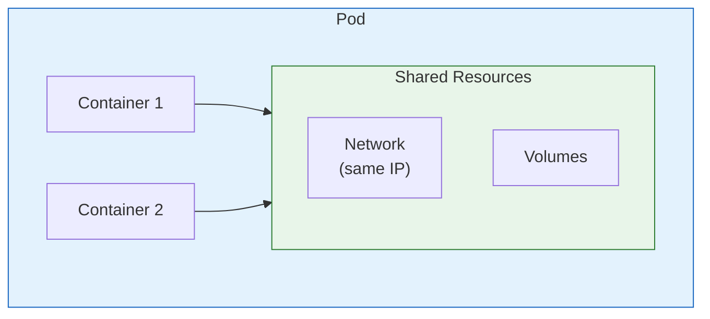
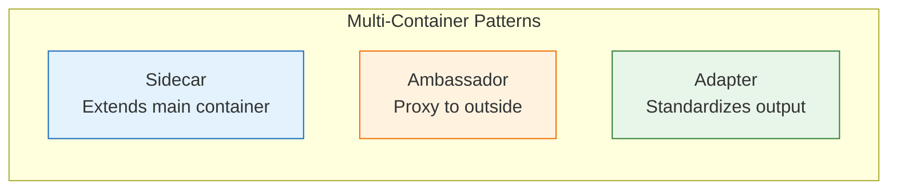
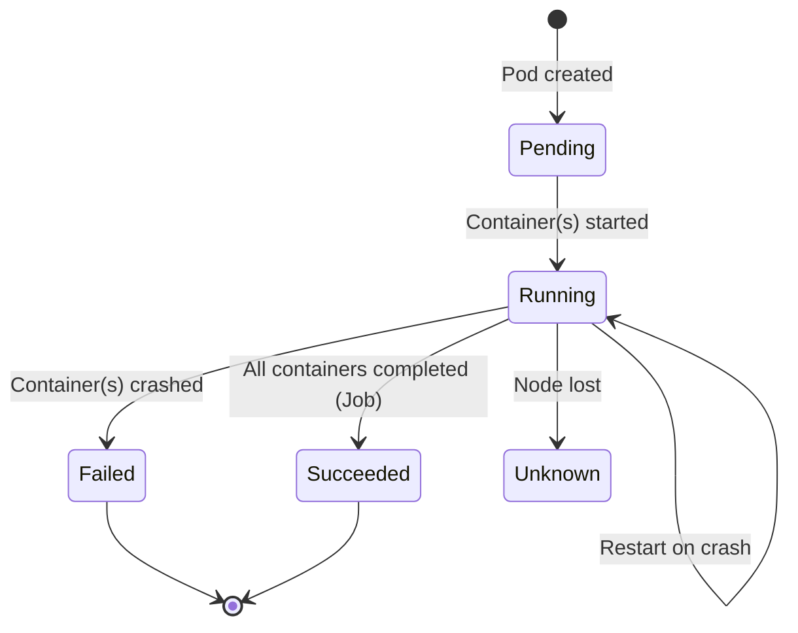

# Lesson 15.6: Pods

> **"The atom of Kubernetes."**

## 📍 Learning Objectives

By the end of this lesson, you will:
1. Understand what a Pod is
2. Know when to use multi-container pods
3. Create and manage pods
4. Understand pod lifecycle

## 🔥 What is a Pod?



A **Pod** is:
- The smallest deployable unit in K8s
- One or more containers that share:
  - Network (same IP address)
  - Storage volumes
  - Lifecycle (start/stop together)

Think of it as a "logical host" for tightly coupled containers.

---

## 🤔 Pod vs Container

| Docker | Kubernetes |
|--------|-----------|
| Container | Pod → Container(s) |
| `docker run nginx` | Pod with nginx container |
| Standalone | Part of larger system |

**Key insight**: Kubernetes doesn't schedule containers directly. It schedules **pods**.

---

## 📦 Single-Container Pods (Most Common)

99% of the time, you'll have one container per pod:

```yaml
apiVersion: v1
kind: Pod
metadata:
  name: nginx
  labels:
    app: nginx
spec:
  containers:
  - name: nginx
    image: nginx:latest
    ports:
    - containerPort: 80
```

```bash
# Create the pod
kubectl apply -f pod.yaml

# Check status
kubectl get pods
# NAME    READY   STATUS    RESTARTS   AGE
# nginx   1/1     Running   0          30s
```

---

## 🔄 Multi-Container Pods (Special Cases)

### When to Use Multiple Containers



### 1. Sidecar Pattern

Main container + helper container:

```yaml
apiVersion: v1
kind: Pod
metadata:
  name: web-with-logging
spec:
  containers:
  # Main application
  - name: web
    image: my-web-app
    volumeMounts:
    - name: logs
      mountPath: /var/log/app
  
  # Sidecar: ships logs
  - name: log-shipper
    image: fluentd
    volumeMounts:
    - name: logs
      mountPath: /var/log/app
  
  volumes:
  - name: logs
    emptyDir: {}
```

**Use cases**:
- Log collection (Fluentd, Filebeat)
- Service mesh (Envoy, Istio)
- Monitoring agents

### 2. Ambassador Pattern

Proxy network traffic:

```yaml
apiVersion: v1
kind: Pod
metadata:
  name: app-with-proxy
spec:
  containers:
  - name: app
    image: my-app
    # App connects to localhost:5432
  
  - name: cloudsql-proxy
    image: gcr.io/cloudsql-docker/gce-proxy
    # Proxies to Cloud SQL
```

### 3. Init Containers

Run before main containers:

```yaml
apiVersion: v1
kind: Pod
metadata:
  name: app-with-init
spec:
  initContainers:
  - name: wait-for-db
    image: busybox
    command: ['sh', '-c', 'until nc -z db 5432; do sleep 2; done']
  
  containers:
  - name: app
    image: my-app
    # Starts only after init completes
```

**Use cases**:
- Wait for dependencies
- Database migrations
- Config file generation

---

## 📝 Pod Specification Deep Dive

```yaml
apiVersion: v1
kind: Pod
metadata:
  name: my-pod
  namespace: default
  labels:
    app: myapp
    version: v1
  annotations:
    description: "My application pod"
    
spec:
  containers:
  - name: app
    image: myapp:1.0
    
    # Port configuration
    ports:
    - containerPort: 8080
      name: http
    
    # Environment variables
    env:
    - name: DATABASE_URL
      value: "postgres://localhost/db"
    - name: SECRET_KEY
      valueFrom:
        secretKeyRef:
          name: app-secrets
          key: secret-key
    
    # Resource limits
    resources:
      requests:
        memory: "128Mi"
        cpu: "100m"
      limits:
        memory: "256Mi"
        cpu: "500m"
    
    # Health checks
    livenessProbe:
      httpGet:
        path: /health
        port: 8080
      initialDelaySeconds: 5
      periodSeconds: 10
    
    readinessProbe:
      httpGet:
        path: /ready
        port: 8080
      initialDelaySeconds: 5
      periodSeconds: 5
    
    # Volume mounts
    volumeMounts:
    - name: data
      mountPath: /app/data
  
  # Volumes
  volumes:
  - name: data
    emptyDir: {}
  
  # Restart policy
  restartPolicy: Always
```

---

## 🏥 Health Checks

### Liveness Probe

"Is the container alive?"

```yaml
livenessProbe:
  httpGet:
    path: /health
    port: 8080
  initialDelaySeconds: 15
  periodSeconds: 10
  failureThreshold: 3
```

**If fails**: Container is killed and restarted.

### Readiness Probe

"Is the container ready to receive traffic?"

```yaml
readinessProbe:
  httpGet:
    path: /ready
    port: 8080
  initialDelaySeconds: 5
  periodSeconds: 5
```

**If fails**: Pod removed from Service endpoints (no traffic).

### Startup Probe

"Is the container still starting up?"

```yaml
startupProbe:
  httpGet:
    path: /health
    port: 8080
  failureThreshold: 30
  periodSeconds: 10
```

**Use for**: Slow-starting applications.

### Probe Types

```yaml
# HTTP
httpGet:
  path: /health
  port: 8080

# TCP
tcpSocket:
  port: 5432

# Command
exec:
  command:
  - cat
  - /tmp/healthy
```

---

## 📊 Pod Lifecycle



### Pod Phases

| Phase | Meaning |
|-------|---------|
| **Pending** | Accepted but not running (scheduling, pulling image) |
| **Running** | At least one container running |
| **Succeeded** | All containers exited successfully |
| **Failed** | All containers terminated, one with error |
| **Unknown** | Node communication lost |

### Container States

```bash
kubectl describe pod my-pod
# Container states: Waiting, Running, Terminated
```

---

## 🎮 Pod Commands

### Create and View

```bash
# Create from YAML
kubectl apply -f pod.yaml

# Quick creation (imperative)
kubectl run nginx --image=nginx

# List pods
kubectl get pods
kubectl get pods -o wide  # More details

# Describe pod
kubectl describe pod nginx
```

### Interact

```bash
# View logs
kubectl logs nginx
kubectl logs nginx -f  # Follow

# Execute command
kubectl exec nginx -- ls /
kubectl exec -it nginx -- /bin/sh  # Interactive shell

# Port forward
kubectl port-forward nginx 8080:80
```

### Delete

```bash
# Delete pod
kubectl delete pod nginx

# Delete from file
kubectl delete -f pod.yaml

# Force delete
kubectl delete pod nginx --force --grace-period=0
```

---

## ⚠️ Why You Don't Create Pods Directly

Pods are **ephemeral**. They:
- Don't survive node failures
- Don't reschedule themselves
- Don't scale

```bash
# Create a pod
kubectl run nginx --image=nginx

# Delete the node (simulated)
# Pod is GONE forever

# vs. Deployment
kubectl create deployment nginx --image=nginx

# Delete the node
# Deployment creates NEW pod on another node
```

**Use Deployments** to manage pods (next lesson).

---

## 🧪 Practice: Create a Pod

```yaml
# practice-pod.yaml
apiVersion: v1
kind: Pod
metadata:
  name: practice-pod
  labels:
    app: practice
spec:
  containers:
  - name: nginx
    image: nginx:alpine
    ports:
    - containerPort: 80
    resources:
      limits:
        memory: "128Mi"
        cpu: "100m"
    readinessProbe:
      httpGet:
        path: /
        port: 80
      initialDelaySeconds: 5
    livenessProbe:
      httpGet:
        path: /
        port: 80
      initialDelaySeconds: 10
```

```bash
# Apply
kubectl apply -f practice-pod.yaml

# Verify
kubectl get pods
kubectl describe pod practice-pod

# Test
kubectl port-forward practice-pod 8080:80
# Open http://localhost:8080

# Clean up
kubectl delete pod practice-pod
```

---

## 🔑 Key Takeaways

1. **Pod = smallest unit** in K8s (1+ containers)
2. **Containers share** network and storage
3. **Single container pods** are most common
4. **Multi-container** for sidecar patterns
5. **Health probes** keep containers healthy
6. **Don't create pods directly** - use Deployments

---

**Next**: 15.7 - Deployments: Managing replicas and rolling updates
