# Lesson 15.7: Deployments

> **"Run N replicas of this pod, and keep them running."**

## 📍 Learning Objectives

By the end of this lesson, you will:
1. Understand what Deployments manage
2. Create and update Deployments
3. Perform rolling updates
4. Roll back failed deployments

## 🔥 The Problem: Pods Are Fragile

Pods alone have issues:

```mermaid
flowchart TD
    P1["Pod crashes"] -->|"Nobody restarts it"| GONE["❌ Gone forever"]
    P2["Node dies"] -->|"Pod goes with it"| GONE
    P3["Need 5 copies"] -->|"Create 5 pods manually"| TEDIOUS["😫 Tedious"]
    P4["New version"] -->|"Delete old, create new"| DOWNTIME["⏸️ Downtime"]
    
    style GONE fill:#FFEBEE,stroke:#C62828
    style TEDIOUS fill:#FFEBEE,stroke:#C62828
    style DOWNTIME fill:#FFEBEE,stroke:#C62828
```



**Deployments solve all of this.**

---

## 💡 What is a Deployment?


A **Deployment**:
- Manages a **ReplicaSet** (which manages Pods)
- Ensures desired number of replicas
- Handles updates and rollbacks
- Self-heals on failures

---

## 📝 Creating a Deployment

### Basic Deployment

```yaml
# deployment.yaml
apiVersion: apps/v1
kind: Deployment
metadata:
  name: nginx
  labels:
    app: nginx
spec:
  replicas: 3
  selector:
    matchLabels:
      app: nginx
  template:
    metadata:
      labels:
        app: nginx
    spec:
      containers:
      - name: nginx
        image: nginx:1.24
        ports:
        - containerPort: 80
        resources:
          limits:
            memory: "128Mi"
            cpu: "100m"
```

```bash
# Apply deployment
kubectl apply -f deployment.yaml

# Check status
kubectl get deployments
# NAME    READY   UP-TO-DATE   AVAILABLE   AGE
# nginx   3/3     3            3           30s

kubectl get pods
# NAME                     READY   STATUS    RESTARTS   AGE
# nginx-7c5ddbdf54-abc12   1/1     Running   0          30s
# nginx-7c5ddbdf54-def34   1/1     Running   0          30s
# nginx-7c5ddbdf54-ghi56   1/1     Running   0          30s
```

### Understanding the YAML

```yaml
spec:
  replicas: 3              # How many pods
  selector:
    matchLabels:
      app: nginx           # How to find pods (MUST match template labels)
  template:                # Pod template
    metadata:
      labels:
        app: nginx         # Pod labels (MUST match selector)
    spec:
      containers:          # Same as Pod spec
      - name: nginx
        image: nginx:1.24
```

**Key rule**: `selector.matchLabels` MUST match `template.metadata.labels`

---

## 🔄 Self-Healing in Action

```mermaid
sequenceDiagram
    participant You
    participant Deploy as Deployment
    participant RS as ReplicaSet
    participant Pods
    
    Note over Deploy,RS: Desired: 3 replicas
    Pods->>RS: Pod 2 crashed!
    RS->>RS: Current: 2, Desired: 3
    RS->>Pods: Create new pod
    Note over Pods: 3 pods running again
    You->>You: 😴 (didn't even notice)
```



```bash
# Watch pods
kubectl get pods -w

# In another terminal, delete a pod
kubectl delete pod nginx-7c5ddbdf54-abc12

# Watch output shows:
# nginx-7c5ddbdf54-abc12   1/1   Terminating   0   5m
# nginx-7c5ddbdf54-xyz99   0/1   Pending       0   0s
# nginx-7c5ddbdf54-xyz99   1/1   Running       0   2s
```

The Deployment noticed one pod died and created a new one.

---

## 📈 Scaling

### Imperative Scaling

```bash
# Scale up
kubectl scale deployment nginx --replicas=5

# Scale down
kubectl scale deployment nginx --replicas=2

# Check
kubectl get pods
```

### Declarative Scaling

```yaml
# Update deployment.yaml
spec:
  replicas: 5
```

```bash
kubectl apply -f deployment.yaml
```

### Auto-Scaling (HPA)

```bash
# Auto-scale based on CPU
kubectl autoscale deployment nginx --min=2 --max=10 --cpu-percent=50

# Check HPA
kubectl get hpa
```

---

## 🔄 Rolling Updates

When you change the image, Deployment does a **rolling update**:

```mermaid
sequenceDiagram
    participant Deploy as Deployment
    participant Old as Old Pods (v1)
    participant New as New Pods (v2)
    
    Note over Old: v1: 3 pods running
    Deploy->>New: Create pod 1 (v2)
    New-->>Deploy: v2 pod 1 ready
    Deploy->>Old: Terminate pod 1 (v1)
    Deploy->>New: Create pod 2 (v2)
    New-->>Deploy: v2 pod 2 ready
    Deploy->>Old: Terminate pod 2 (v1)
    Deploy->>New: Create pod 3 (v2)
    New-->>Deploy: v2 pod 3 ready
    Deploy->>Old: Terminate pod 3 (v1)
    Note over New: v2: 3 pods running
    Note over Deploy: Zero downtime! ✅
```



### Trigger an Update

```bash
# Option 1: Change image directly
kubectl set image deployment/nginx nginx=nginx:1.25

# Option 2: Edit deployment
kubectl edit deployment nginx

# Option 3: Update YAML and apply
# (change image in deployment.yaml)
kubectl apply -f deployment.yaml
```

### Watch the Rollout

```bash
# Watch rollout status
kubectl rollout status deployment/nginx
# Waiting for deployment "nginx" rollout to finish: 1 out of 3 new replicas updated...
# Waiting for deployment "nginx" rollout to finish: 2 out of 3 new replicas updated...
# deployment "nginx" successfully rolled out

# See rollout history
kubectl rollout history deployment/nginx
# REVISION  CHANGE-CAUSE
# 1         <none>
# 2         <none>
```

---

## ⏮️ Rollbacks

Something went wrong? Roll back!

```bash
# Rollback to previous version
kubectl rollout undo deployment/nginx

# Rollback to specific revision
kubectl rollout undo deployment/nginx --to-revision=1

# Check which revision you're on
kubectl rollout history deployment/nginx
```

### What Happens During Rollback


Kubernetes keeps old ReplicaSets around for rollbacks (default: 10 revisions).

---

## ⚙️ Deployment Strategies

### RollingUpdate (Default)

```yaml
spec:
  strategy:
    type: RollingUpdate
    rollingUpdate:
      maxSurge: 1        # Extra pods during update
      maxUnavailable: 0  # Pods that can be unavailable
```

| Setting | Meaning |
|---------|---------|
| `maxSurge: 1` | Can have 4 pods during update (3 + 1) |
| `maxUnavailable: 0` | Must always have 3 pods available |

### Recreate

```yaml
spec:
  strategy:
    type: Recreate
```

Kills all old pods, then creates new ones. **Causes downtime** but simpler.

---

## 📊 Complete Deployment Example

```yaml
apiVersion: apps/v1
kind: Deployment
metadata:
  name: rag-api
  labels:
    app: rag-api
spec:
  replicas: 3
  
  # Rolling update strategy
  strategy:
    type: RollingUpdate
    rollingUpdate:
      maxSurge: 1
      maxUnavailable: 0
  
  selector:
    matchLabels:
      app: rag-api
  
  template:
    metadata:
      labels:
        app: rag-api
    spec:
      containers:
      - name: api
        image: myregistry/rag-api:v1.2.3
        ports:
        - containerPort: 8000
        
        # Environment from ConfigMap
        envFrom:
        - configMapRef:
            name: rag-config
        
        # Secrets
        env:
        - name: OPENAI_API_KEY
          valueFrom:
            secretKeyRef:
              name: rag-secrets
              key: openai-api-key
        
        # Resources
        resources:
          requests:
            memory: "256Mi"
            cpu: "250m"
          limits:
            memory: "512Mi"
            cpu: "500m"
        
        # Health checks
        readinessProbe:
          httpGet:
            path: /health
            port: 8000
          initialDelaySeconds: 10
          periodSeconds: 5
        
        livenessProbe:
          httpGet:
            path: /health
            port: 8000
          initialDelaySeconds: 15
          periodSeconds: 10
```

---

## 🎮 Deployment Commands

```bash
# Create
kubectl apply -f deployment.yaml
kubectl create deployment nginx --image=nginx

# View
kubectl get deployments
kubectl describe deployment nginx

# Scale
kubectl scale deployment nginx --replicas=5

# Update image
kubectl set image deployment/nginx nginx=nginx:1.25

# Rollout status
kubectl rollout status deployment/nginx
kubectl rollout history deployment/nginx

# Rollback
kubectl rollout undo deployment/nginx
kubectl rollout undo deployment/nginx --to-revision=1

# Pause/Resume rollout
kubectl rollout pause deployment/nginx
kubectl rollout resume deployment/nginx

# Delete
kubectl delete deployment nginx
```

---

## 🔍 Deployment vs ReplicaSet vs Pod


| Resource | Use Case |
|----------|----------|
| **Pod** | Never create directly (except debugging) |
| **ReplicaSet** | Rarely create directly |
| **Deployment** | Always use for stateless apps |

---

## 🧪 Practice: Deploy and Update

```bash
# 1. Create deployment
kubectl create deployment web --image=nginx:1.24 --replicas=3

# 2. Watch pods
kubectl get pods -w

# 3. Update image (triggers rolling update)
kubectl set image deployment/web nginx=nginx:1.25

# 4. Watch the rollout
kubectl rollout status deployment/web

# 5. Check history
kubectl rollout history deployment/web

# 6. Rollback
kubectl rollout undo deployment/web

# 7. Clean up
kubectl delete deployment web
```

---

## 🔑 Key Takeaways

1. **Deployments** manage pods through ReplicaSets
2. **Self-healing**: Crashed pods are recreated
3. **Scaling**: Change replicas declaratively or imperatively
4. **Rolling updates**: Zero-downtime deployments
5. **Rollbacks**: Easy revert with `rollout undo`
6. **Always use Deployments** for stateless applications

---

**Next**: 15.8 - Services: Stable networking for your pods
