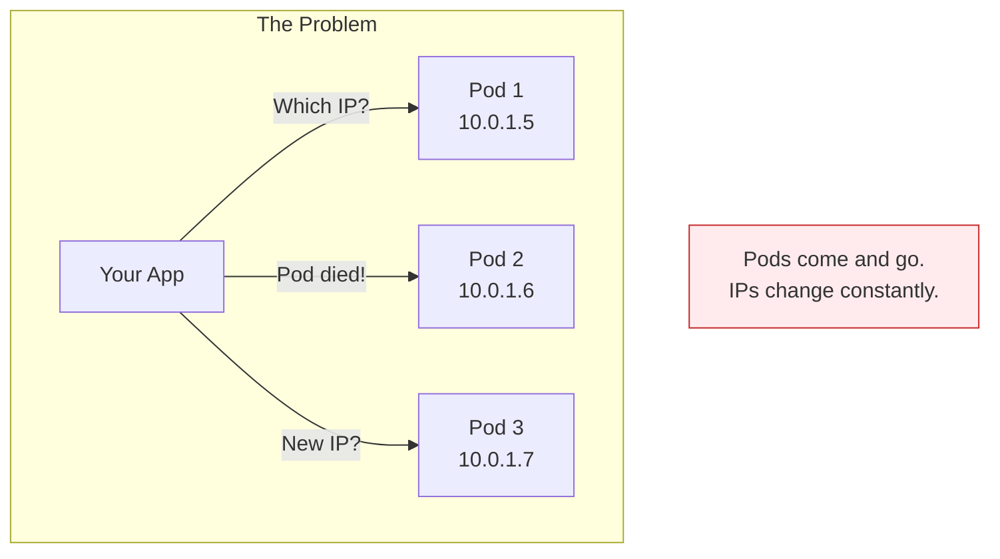
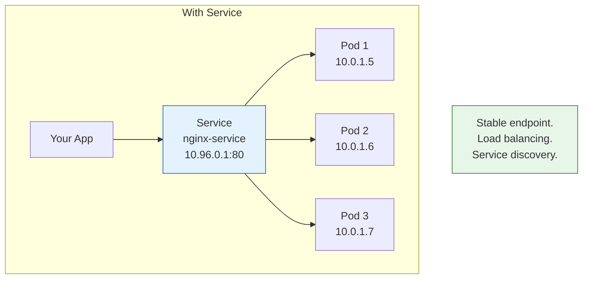
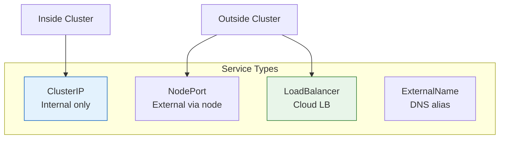
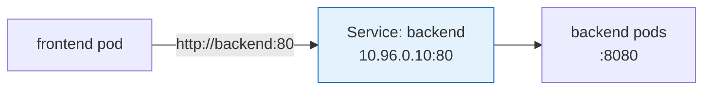
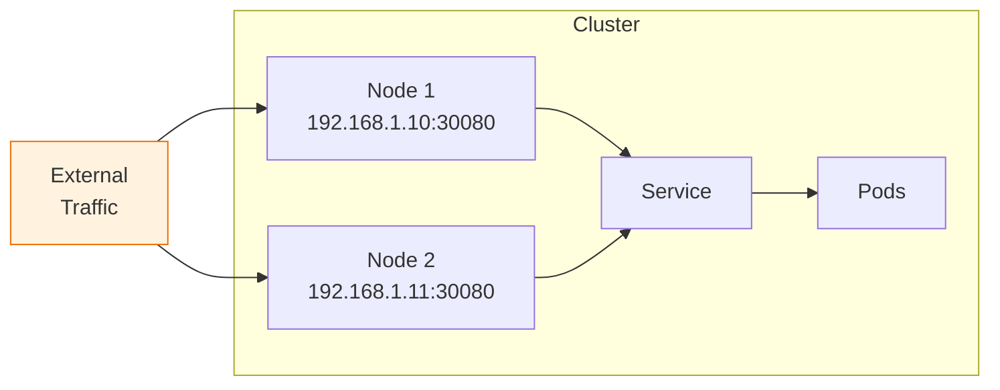
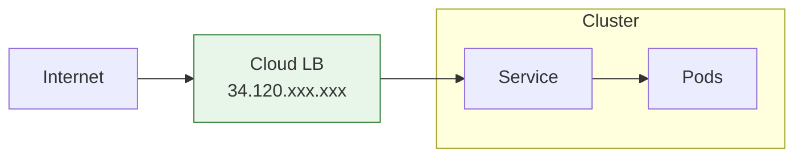
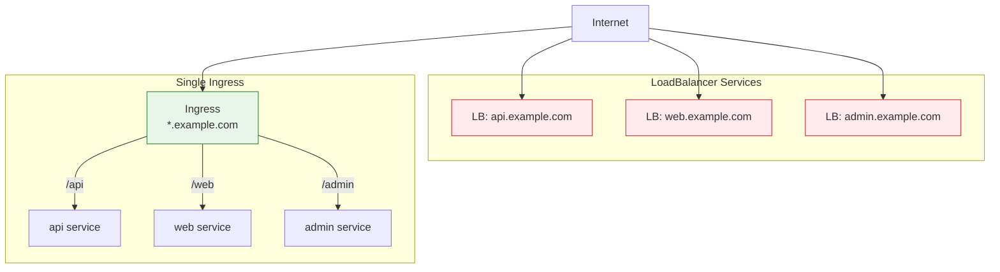

# Lesson 15.8: Services

> **"A stable address for your ever-changing pods."**

## 📍 Learning Objectives

By the end of this lesson, you will:
1. Understand why Services exist
2. Know the Service types (ClusterIP, NodePort, LoadBalancer)
3. Create and configure Services
4. Debug service connectivity

## 🔥 The Problem: Pods Are Ephemeral



**Problems**:
- Pod IPs change when they restart
- How do you reach 1 of 5 replicas?
- How do you load balance?

---

## 💡 Services: The Solution



A **Service**:
- Provides stable IP and DNS name
- Load balances across pods
- Automatically updates when pods change
- Enables service discovery

---

## 📊 Service Types



| Type | Accessibility | Use Case |
|------|--------------|----------|
| **ClusterIP** | Inside cluster only | Service-to-service |
| **NodePort** | Via any node IP | Development, testing |
| **LoadBalancer** | External via cloud LB | Production, public |
| **ExternalName** | DNS alias | External services |

---

## 🎯 ClusterIP (Default)

Internal cluster communication:

```yaml
apiVersion: v1
kind: Service
metadata:
  name: backend
spec:
  type: ClusterIP  # Default, can omit
  selector:
    app: backend   # Find pods with this label
  ports:
  - port: 80       # Service port
    targetPort: 8080  # Pod port
```



### DNS Resolution

Inside the cluster:
```bash
# Same namespace
curl http://backend:80

# Different namespace
curl http://backend.other-namespace:80

# Fully qualified
curl http://backend.default.svc.cluster.local:80
```

---

## 🌐 NodePort

Exposes service on each node's IP:

```yaml
apiVersion: v1
kind: Service
metadata:
  name: web
spec:
  type: NodePort
  selector:
    app: web
  ports:
  - port: 80
    targetPort: 8080
    nodePort: 30080  # Optional, K8s assigns if omitted (30000-32767)
```



Access: `http://NODE_IP:30080`

**Use cases**: Development, bare-metal clusters

---

## ⚖️ LoadBalancer

Provisions a cloud load balancer:

```yaml
apiVersion: v1
kind: Service
metadata:
  name: api
spec:
  type: LoadBalancer
  selector:
    app: api
  ports:
  - port: 80
    targetPort: 8000
```



```bash
kubectl get svc api
# NAME   TYPE           CLUSTER-IP     EXTERNAL-IP     PORT(S)
# api    LoadBalancer   10.96.0.50     34.120.5.123    80:31234/TCP
```

**Use cases**: Production services needing public access

---

## 🔗 How Services Find Pods

**Selectors** match pods by labels:

```yaml
# Service
spec:
  selector:
    app: api
    version: v2

# Matching Pod (found by service)
metadata:
  labels:
    app: api
    version: v2
    environment: production  # Extra labels OK

# Non-matching Pod (NOT found)
metadata:
  labels:
    app: api
    version: v1  # Different version!
```

### View Endpoints

```bash
# See which pods a service is routing to
kubectl get endpoints api

# Output:
# NAME   ENDPOINTS                                   AGE
# api    10.0.1.5:8000,10.0.1.6:8000,10.0.1.7:8000   5m
```

---

## 📝 Complete Example

```yaml
# deployment.yaml
apiVersion: apps/v1
kind: Deployment
metadata:
  name: api
spec:
  replicas: 3
  selector:
    matchLabels:
      app: api
  template:
    metadata:
      labels:
        app: api
    spec:
      containers:
      - name: api
        image: my-api:v1
        ports:
        - containerPort: 8000
---
# service.yaml
apiVersion: v1
kind: Service
metadata:
  name: api
spec:
  type: ClusterIP
  selector:
    app: api
  ports:
  - name: http
    port: 80
    targetPort: 8000
```

```bash
# Apply both
kubectl apply -f deployment.yaml
kubectl apply -f service.yaml

# Check
kubectl get svc
kubectl get endpoints

# Test from another pod
kubectl run debug --image=busybox -it --rm -- wget -qO- http://api:80
```

---

## 🔧 Multi-Port Services

```yaml
apiVersion: v1
kind: Service
metadata:
  name: web-app
spec:
  selector:
    app: web
  ports:
  - name: http
    port: 80
    targetPort: 8080
  - name: https
    port: 443
    targetPort: 8443
  - name: metrics
    port: 9090
    targetPort: 9090
```

---

## 🎯 Headless Services

For direct pod access (no load balancing):

```yaml
apiVersion: v1
kind: Service
metadata:
  name: database
spec:
  clusterIP: None  # Makes it headless
  selector:
    app: postgres
  ports:
  - port: 5432
```

DNS returns all pod IPs:
```bash
nslookup database
# Returns: 10.0.1.5, 10.0.1.6, 10.0.1.7
```

**Use cases**: StatefulSets, databases where you need specific pods.

---

## 🐛 Debugging Services

### 1. Check Service Exists

```bash
kubectl get svc
kubectl describe svc my-service
```

### 2. Check Endpoints

```bash
kubectl get endpoints my-service
# ENDPOINTS column should show pod IPs

# If empty, selector doesn't match any pods!
```

### 3. Check Pod Labels

```bash
kubectl get pods --show-labels

# Compare with service selector
kubectl describe svc my-service | grep Selector
```

### 4. Test Connectivity

```bash
# From inside cluster
kubectl run debug --image=busybox -it --rm -- sh

# Then:
wget -qO- http://my-service:80
nslookup my-service
```

### 5. Common Issues

| Issue | Cause | Fix |
|-------|-------|-----|
| No endpoints | Selector mismatch | Fix labels |
| Connection refused | Wrong targetPort | Match container port |
| DNS not resolving | Service name wrong | Check namespace |
| External IP pending | No cloud LB | Use NodePort instead |

---

## 🔄 Service vs Ingress



| Approach | Use Case |
|----------|----------|
| **LoadBalancer per service** | Simple, but costly |
| **Ingress** | Multiple services, one entry point |

---

## 🎮 Service Commands

```bash
# Create service
kubectl expose deployment web --port=80 --target-port=8080
kubectl apply -f service.yaml

# View services
kubectl get services
kubectl get svc  # Short form
kubectl describe svc my-service

# View endpoints
kubectl get endpoints

# Delete service
kubectl delete svc my-service
```

---

## 🔑 Key Takeaways

1. **Services** provide stable endpoints for pods
2. **ClusterIP** = internal, **LoadBalancer** = external
3. **Selectors** connect services to pods via labels
4. **DNS** resolves service names automatically
5. **Endpoints** show which pods receive traffic
6. **Debug** with `get endpoints` and test pods

---

**Next**: 15.9 - ConfigMaps & Secrets: Configuration without rebuilding images
