# Lesson 15.9: ConfigMaps & Secrets

> **"Configuration without rebuilding images."**

## 📍 Learning Objectives

By the end of this lesson, you will:
1. Understand ConfigMaps and Secrets
2. Create and use both resource types
3. Mount configurations as files or environment variables
4. Update configurations safely

## 🔥 The Problem: Hardcoded Configuration

```dockerfile
# ❌ Bad: Hardcoded in image
ENV DATABASE_URL=postgres://prod-db:5432/app
ENV API_KEY=sk-xxx123...
```

**Problems**:
- Different values per environment
- Secrets visible in image layers
- Must rebuild image to change config
- Same image can't run in dev and prod

---

## 💡 The Solution: External Configuration


| Resource | Use For |
|----------|---------|
| **ConfigMap** | Non-sensitive config (URLs, feature flags) |
| **Secret** | Sensitive data (API keys, passwords) |

---

## 📋 ConfigMaps

### Creating ConfigMaps

**From literal values**:
```bash
kubectl create configmap app-config \
  --from-literal=DATABASE_HOST=postgres \
  --from-literal=LOG_LEVEL=info \
  --from-literal=FEATURE_FLAG=true
```

**From YAML**:
```yaml
apiVersion: v1
kind: ConfigMap
metadata:
  name: app-config
data:
  DATABASE_HOST: "postgres"
  LOG_LEVEL: "info"
  FEATURE_FLAG: "true"
  # Multi-line value
  config.json: |
    {
      "debug": false,
      "maxConnections": 100
    }
```

**From file**:
```bash
kubectl create configmap nginx-config --from-file=nginx.conf
kubectl create configmap app-config --from-file=config/
```

### Using ConfigMaps

**As environment variables (specific keys)**:
```yaml
apiVersion: v1
kind: Pod
metadata:
  name: my-app
spec:
  containers:
  - name: app
    image: my-app
    env:
    - name: DB_HOST
      valueFrom:
        configMapKeyRef:
          name: app-config
          key: DATABASE_HOST
    - name: LOG_LEVEL
      valueFrom:
        configMapKeyRef:
          name: app-config
          key: LOG_LEVEL
```

**As environment variables (all keys)**:
```yaml
spec:
  containers:
  - name: app
    image: my-app
    envFrom:
    - configMapRef:
        name: app-config
```

**As mounted files**:
```yaml
spec:
  containers:
  - name: app
    image: my-app
    volumeMounts:
    - name: config
      mountPath: /etc/app/config
      readOnly: true
  volumes:
  - name: config
    configMap:
      name: app-config
```

Files created:
```
/etc/app/config/DATABASE_HOST
/etc/app/config/LOG_LEVEL
/etc/app/config/config.json
```

---

## 🔐 Secrets

### Creating Secrets

**From literal values**:
```bash
kubectl create secret generic app-secrets \
  --from-literal=API_KEY=sk-xxx123 \
  --from-literal=DB_PASSWORD=supersecret
```

**From YAML** (values must be base64 encoded):
```yaml
apiVersion: v1
kind: Secret
metadata:
  name: app-secrets
type: Opaque
data:
  API_KEY: c2steHh4MTIz      # base64 of "sk-xxx123"
  DB_PASSWORD: c3VwZXJzZWNyZXQ=  # base64 of "supersecret"
```

```bash
# Encode value
echo -n "sk-xxx123" | base64
# c2steHh4MTIz

# Decode value
echo "c2steHh4MTIz" | base64 -d
# sk-xxx123
```

**Using stringData (plain text, K8s encodes)**:
```yaml
apiVersion: v1
kind: Secret
metadata:
  name: app-secrets
type: Opaque
stringData:  # K8s encodes automatically
  API_KEY: "sk-xxx123"
  DB_PASSWORD: "supersecret"
```

### Using Secrets

**As environment variables**:
```yaml
spec:
  containers:
  - name: app
    image: my-app
    env:
    - name: API_KEY
      valueFrom:
        secretKeyRef:
          name: app-secrets
          key: API_KEY
```

**All secrets as environment variables**:
```yaml
spec:
  containers:
  - name: app
    image: my-app
    envFrom:
    - secretRef:
        name: app-secrets
```

**As mounted files**:
```yaml
spec:
  containers:
  - name: app
    image: my-app
    volumeMounts:
    - name: secrets
      mountPath: /etc/secrets
      readOnly: true
  volumes:
  - name: secrets
    secret:
      secretName: app-secrets
```

---

## 📝 Complete Example

```yaml
# configmap.yaml
apiVersion: v1
kind: ConfigMap
metadata:
  name: rag-config
data:
  LOG_LEVEL: "info"
  EMBEDDING_MODEL: "text-embedding-3-small"
  MAX_TOKENS: "4096"
  CHUNK_SIZE: "500"
---
# secret.yaml
apiVersion: v1
kind: Secret
metadata:
  name: rag-secrets
type: Opaque
stringData:
  OPENAI_API_KEY: "sk-xxx..."
  DATABASE_URL: "postgres://user:pass@db:5432/rag"
---
# deployment.yaml
apiVersion: apps/v1
kind: Deployment
metadata:
  name: rag-api
spec:
  replicas: 3
  selector:
    matchLabels:
      app: rag-api
  template:
    metadata:
      labels:
        app: rag-api
    spec:
      containers:
      - name: api
        image: rag-api:latest
        ports:
        - containerPort: 8000
        
        # All config as env vars
        envFrom:
        - configMapRef:
            name: rag-config
        - secretRef:
            name: rag-secrets
        
        # Or specific values
        env:
        - name: OPENAI_API_KEY
          valueFrom:
            secretKeyRef:
              name: rag-secrets
              key: OPENAI_API_KEY
```

---

## 🔄 Updating ConfigMaps and Secrets

### Option 1: Edit Directly

```bash
kubectl edit configmap app-config
kubectl edit secret app-secrets
```

### Option 2: Replace

```bash
kubectl create configmap app-config \
  --from-literal=LOG_LEVEL=debug \
  --dry-run=client -o yaml | kubectl apply -f -
```

### Important: Pods Don't Auto-Restart

```mermaid
flowchart LR
    UPDATE["Update ConfigMap"]
    POD["Running Pod"]
    
    UPDATE -->|"ENV vars"| NO["❌ Not updated<br/>until pod restart"]
    UPDATE -->|"Mounted files"| YES["✅ Files update<br/>(~1 min delay)"]
    
    style NO fill:#FFEBEE,stroke:#C62828
    style YES fill:#E8F5E9,stroke:#2E7D32
```



**To apply env var changes**:
```bash
# Trigger rollout
kubectl rollout restart deployment/rag-api
```

---

## 🛡️ Secret Types

| Type | Use For |
|------|---------|
| `Opaque` | Generic secret (default) |
| `kubernetes.io/tls` | TLS certificates |
| `kubernetes.io/dockerconfigjson` | Docker registry auth |
| `kubernetes.io/basic-auth` | Username/password |

### Docker Registry Secret

```bash
kubectl create secret docker-registry regcred \
  --docker-server=registry.example.com \
  --docker-username=user \
  --docker-password=pass

# Use in pod
spec:
  imagePullSecrets:
  - name: regcred
  containers:
  - name: app
    image: registry.example.com/my-app
```

### TLS Secret

```bash
kubectl create secret tls my-tls \
  --cert=server.crt \
  --key=server.key
```

---

## ⚠️ Security Considerations

### Secrets Are Not Encrypted by Default

```bash
# Secrets are base64 encoded, NOT encrypted
kubectl get secret app-secrets -o yaml
# data:
#   API_KEY: c2steHh4MTIz  # Anyone can decode!
```

### Best Practices

1. **Enable encryption at rest**
```yaml
# In kube-apiserver config
apiVersion: apiserver.config.k8s.io/v1
kind: EncryptionConfiguration
resources:
  - resources:
    - secrets
    providers:
    - aescbc:
        keys:
        - name: key1
          secret: <base64-encoded-key>
```

2. **Use external secret managers**
   - AWS Secrets Manager + External Secrets Operator
   - HashiCorp Vault
   - Google Secret Manager

3. **RBAC for secrets**
```yaml
apiVersion: rbac.authorization.k8s.io/v1
kind: Role
metadata:
  name: secret-reader
rules:
- apiGroups: [""]
  resources: ["secrets"]
  verbs: ["get"]
  resourceNames: ["specific-secret"]  # Limit access
```

4. **Don't commit secrets to Git**
   - Use sealed-secrets or external secret managers
   - Use CI/CD to inject secrets

---

## 🎮 Commands Reference

### ConfigMaps

```bash
# Create
kubectl create configmap name --from-literal=KEY=value
kubectl create configmap name --from-file=config.json
kubectl apply -f configmap.yaml

# View
kubectl get configmaps
kubectl describe configmap name
kubectl get configmap name -o yaml

# Edit
kubectl edit configmap name

# Delete
kubectl delete configmap name
```

### Secrets

```bash
# Create
kubectl create secret generic name --from-literal=KEY=value
kubectl create secret generic name --from-file=secret.txt
kubectl apply -f secret.yaml

# View
kubectl get secrets
kubectl describe secret name
kubectl get secret name -o yaml

# Decode secret value
kubectl get secret name -o jsonpath='{.data.KEY}' | base64 -d

# Delete
kubectl delete secret name
```

---

## 🧪 Practice Exercise

1. Create a ConfigMap:
```bash
kubectl create configmap my-config \
  --from-literal=APP_NAME=MyApp \
  --from-literal=DEBUG=true
```

2. Create a Secret:
```bash
kubectl create secret generic my-secret \
  --from-literal=PASSWORD=secret123
```

3. Create a Pod using both:
```yaml
apiVersion: v1
kind: Pod
metadata:
  name: config-demo
spec:
  containers:
  - name: app
    image: busybox
    command: ["sh", "-c", "env && sleep 3600"]
    envFrom:
    - configMapRef:
        name: my-config
    - secretRef:
        name: my-secret
```

4. Verify:
```bash
kubectl apply -f pod.yaml
kubectl logs config-demo | grep -E "APP_NAME|DEBUG|PASSWORD"
```

---

## 🔑 Key Takeaways

1. **ConfigMaps** = non-sensitive configuration
2. **Secrets** = sensitive data (API keys, passwords)
3. **Mount as env vars** or **files**
4. **envFrom** injects all keys as environment variables
5. **Secrets aren't encrypted** by default - use external managers for production
6. **Pods don't auto-restart** on config changes (except file mounts)

---

**Next**: 15.10 - Resources Q&A: Ingress, namespaces, and more
