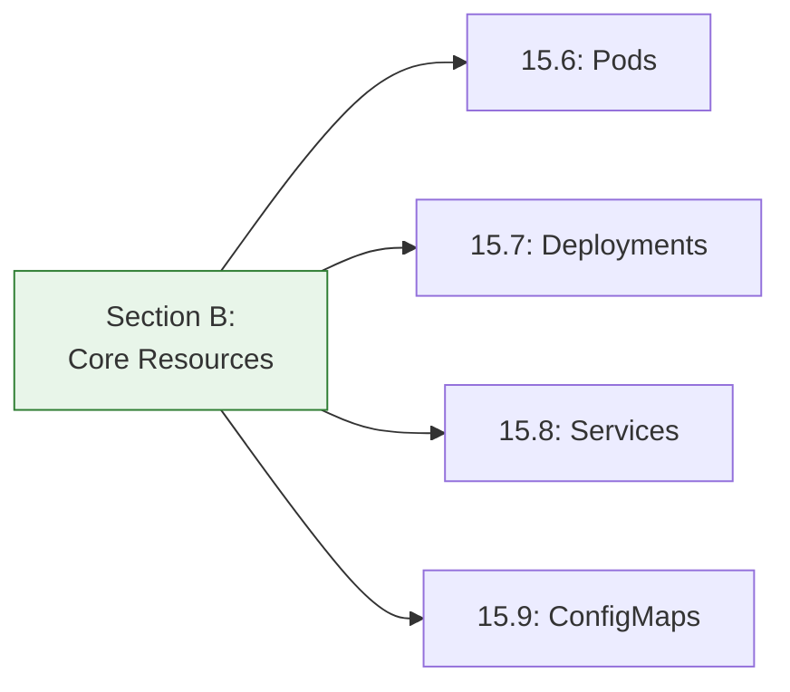
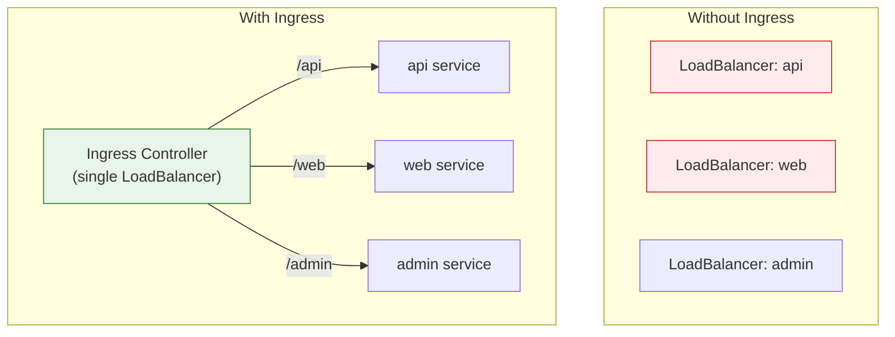
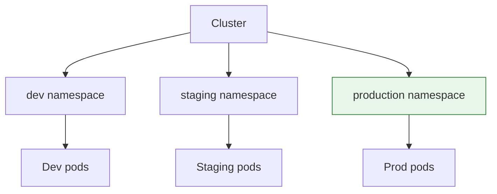
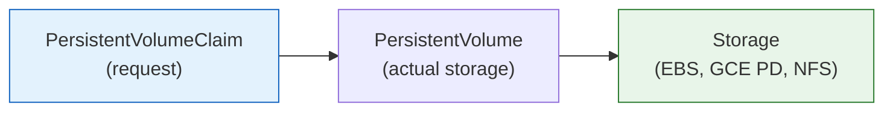
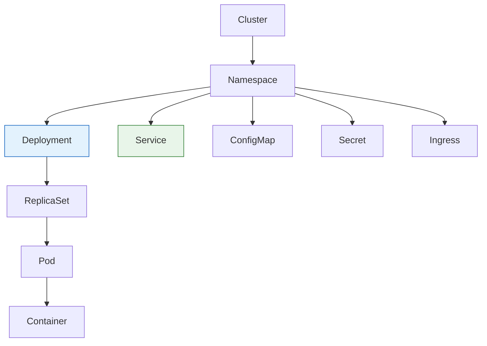

# Lesson 15.10: Resources Q&A

> **Duration**: 10 min | **Section**: B - Core Resources Recap

## 🔍 Section B: What We Learned



### Core Concepts Summary

| Lesson | Key Concept |
|--------|-------------|
| 15.6 | Pods = smallest unit, 1+ containers sharing network/storage |
| 15.7 | Deployments = replica management + rolling updates |
| 15.8 | Services = stable endpoints, load balancing |
| 15.9 | ConfigMaps/Secrets = external configuration |

---

## ❓ Frequently Asked Questions

### Ingress Questions

**Q: What is Ingress and when do I need it?**



| Without Ingress | With Ingress |
|-----------------|--------------|
| One LoadBalancer per service | One LoadBalancer for all |
| $$$$ in cloud costs | $ cheaper |
| No path-based routing | Path/host routing |

**Basic Ingress example**:
```yaml
apiVersion: networking.k8s.io/v1
kind: Ingress
metadata:
  name: app-ingress
spec:
  rules:
  - host: myapp.example.com
    http:
      paths:
      - path: /api
        pathType: Prefix
        backend:
          service:
            name: api
            port:
              number: 80
      - path: /
        pathType: Prefix
        backend:
          service:
            name: web
            port:
              number: 80
```

**Requires**: An Ingress Controller (nginx-ingress, traefik, etc.)

---

**Q: Which Ingress Controller should I use?**

| Controller | Best For |
|------------|----------|
| **NGINX Ingress** | General purpose, most popular |
| **Traefik** | Automatic HTTPS, Docker-native |
| **AWS ALB Ingress** | AWS integration |
| **GKE Ingress** | GCP integration |
| **Kong** | API Gateway features |

---

### Namespace Questions

**Q: When should I use namespaces?**



**Use namespaces for**:
- Environment separation (dev/staging/prod)
- Team separation
- Resource quotas
- Network policies

**Don't overuse**: Start with 2-3 namespaces, not 50.

---

**Q: How do I manage resources across namespaces?**

```bash
# Set default namespace
kubectl config set-context --current --namespace=production

# Or use -n flag
kubectl get pods -n dev
kubectl get pods -n staging
kubectl get pods -n production

# All namespaces
kubectl get pods -A
```

---

### StatefulSet Questions

**Q: What's the difference between Deployment and StatefulSet?**

| Deployment | StatefulSet |
|------------|-------------|
| Stateless apps | Stateful apps |
| Pods are interchangeable | Pods have stable identity |
| Random pod names | Ordered names (app-0, app-1) |
| Any storage | Persistent storage per pod |
| Use for: APIs, web servers | Use for: databases, Kafka |

```yaml
apiVersion: apps/v1
kind: StatefulSet
metadata:
  name: postgres
spec:
  serviceName: postgres
  replicas: 3
  # Pods: postgres-0, postgres-1, postgres-2
```

---

### Resource Management Questions

**Q: How do I set resource requests and limits?**

```yaml
resources:
  requests:    # Minimum guaranteed
    memory: "256Mi"
    cpu: "100m"    # 100 millicores = 0.1 CPU
  limits:      # Maximum allowed
    memory: "512Mi"
    cpu: "500m"
```

| Setting | What Happens |
|---------|--------------|
| **requests** | Scheduler uses for placement |
| **limits** | Container killed if exceeded (memory) |
| No limits | Container can use all node resources |

**Best practice**: Always set both requests and limits.

---

**Q: What are Resource Quotas?**

Limit resources per namespace:

```yaml
apiVersion: v1
kind: ResourceQuota
metadata:
  name: dev-quota
  namespace: dev
spec:
  hard:
    pods: "10"
    requests.cpu: "4"
    requests.memory: "8Gi"
    limits.cpu: "8"
    limits.memory: "16Gi"
```

---

### Storage Questions

**Q: How do I persist data in Kubernetes?**



```yaml
# Request storage
apiVersion: v1
kind: PersistentVolumeClaim
metadata:
  name: data-pvc
spec:
  accessModes:
    - ReadWriteOnce
  resources:
    requests:
      storage: 10Gi
---
# Use in pod
spec:
  volumes:
  - name: data
    persistentVolumeClaim:
      claimName: data-pvc
  containers:
  - name: app
    volumeMounts:
    - name: data
      mountPath: /data
```

---

### Networking Questions

**Q: How do I limit network access between pods?**

Use **Network Policies**:

```yaml
apiVersion: networking.k8s.io/v1
kind: NetworkPolicy
metadata:
  name: api-network-policy
spec:
  podSelector:
    matchLabels:
      app: api
  policyTypes:
  - Ingress
  ingress:
  - from:
    - podSelector:
        matchLabels:
          app: frontend
    ports:
    - port: 8000
```

This policy: Only pods with label `app: frontend` can reach `app: api` on port 8000.

---

### Debugging Questions

**Q: My pod is stuck in Pending. Why?**

| Cause | How to Find |
|-------|-------------|
| Insufficient resources | `kubectl describe pod` → Events |
| No matching node | Check node taints/labels |
| PVC not bound | `kubectl get pvc` |
| Image pull error | Check Events section |

```bash
kubectl describe pod my-pod
# Look at "Events" section at bottom
```

---

**Q: How do I see what's using resources?**

```bash
# Requires metrics-server
kubectl top nodes
kubectl top pods
kubectl top pods -n kube-system
```

---

**Q: How do I debug networking?**

```bash
# Run a debug pod
kubectl run debug --image=busybox -it --rm -- sh

# Inside the pod:
nslookup my-service
wget -qO- http://my-service:80
nc -zv my-service 80
```

---

## 🎯 Resource Hierarchy Cheatsheet



---

## 📋 Quick Decision Guide

| Need | Resource |
|------|----------|
| Run containers | Deployment |
| Internal networking | Service (ClusterIP) |
| External access | Service (LoadBalancer) or Ingress |
| HTTP routing | Ingress |
| Configuration | ConfigMap |
| Secrets | Secret |
| Persistent data | PVC + StatefulSet |
| Resource limits | ResourceQuota |
| Network isolation | NetworkPolicy |

---

## 🔑 Key Takeaways

1. **Ingress** = HTTP routing, one LB for many services
2. **Namespaces** = logical separation (env, team)
3. **StatefulSets** = for databases, ordered pods
4. **ResourceQuotas** = limit resources per namespace
5. **PVCs** = request persistent storage
6. **NetworkPolicies** = firewall for pods

---

**Next**: 15.11 - Module Review: Kubernetes Mental Model
