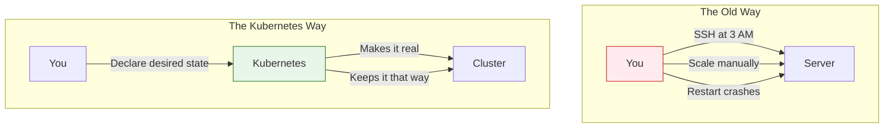
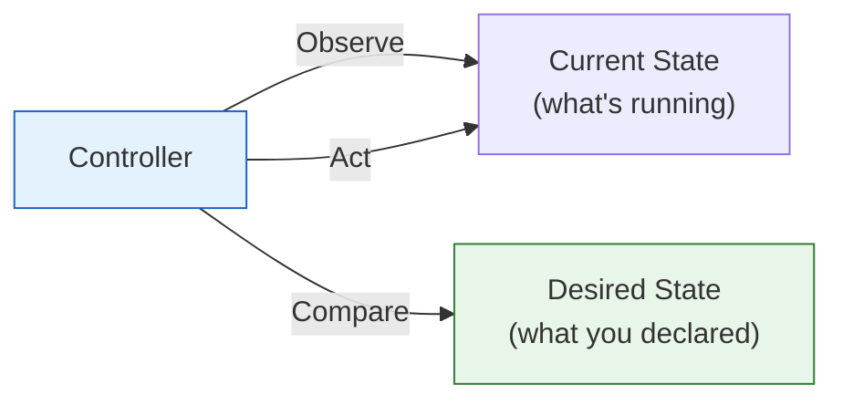
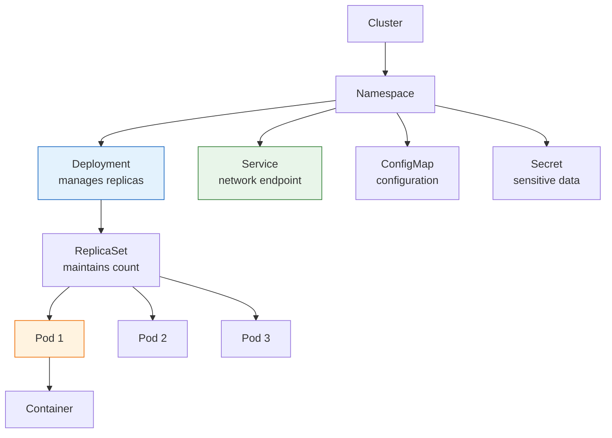
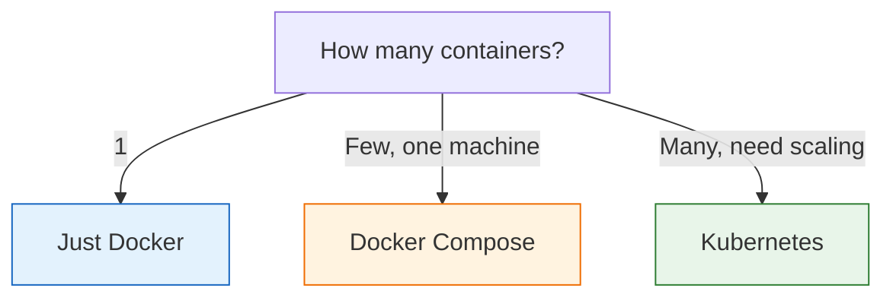

# Lesson 15.11: Module Review - Kubernetes Mental Model

> **"Declare what you want, K8s makes it happen."**

## 🎯 The Big Picture



**Kubernetes = Container operating system that automates deployment, scaling, and management.**

---

## 🧠 Core Mental Model

### The Reconciliation Loop



**You declare**: "I want 5 pods, each with 256MB RAM, running my-app:v2"

**K8s continuously**:
1. Observes current state
2. Compares to desired state
3. Takes action to close the gap
4. Repeats forever

---

## 📊 Module Summary

### Section A: K8s Under the Hood

| Lesson | Concept | Key Insight |
|--------|---------|-------------|
| 15.0 | Scale Problem | Docker Compose doesn't scale, orchestration does |
| 15.1 | What IS K8s | Container OS, declarative model |
| 15.2 | Architecture | Control plane (brain) + workers (muscles) |
| 15.3 | Local K8s | minikube/k3d for development |
| 15.4 | kubectl | CLI for all K8s operations |
| 15.5 | Q&A | K8s vs ECS, when overkill |

### Section B: Core Resources

| Lesson | Concept | Key Insight |
|--------|---------|-------------|
| 15.6 | Pods | Smallest unit, 1+ containers |
| 15.7 | Deployments | Replicas + rolling updates |
| 15.8 | Services | Stable endpoints + load balancing |
| 15.9 | ConfigMaps/Secrets | External configuration |
| 15.10 | Q&A | Ingress, namespaces, storage |

---

## 🏗️ Resource Hierarchy



---

## 🔑 Core Resources Cheatsheet

### Deployment

```yaml
apiVersion: apps/v1
kind: Deployment
metadata:
  name: my-app
spec:
  replicas: 3
  selector:
    matchLabels:
      app: my-app
  template:
    metadata:
      labels:
        app: my-app
    spec:
      containers:
      - name: app
        image: my-app:v1
        ports:
        - containerPort: 8000
```

### Service

```yaml
apiVersion: v1
kind: Service
metadata:
  name: my-app
spec:
  type: ClusterIP  # or LoadBalancer
  selector:
    app: my-app
  ports:
  - port: 80
    targetPort: 8000
```

### ConfigMap

```yaml
apiVersion: v1
kind: ConfigMap
metadata:
  name: my-config
data:
  LOG_LEVEL: "info"
  MAX_CONNECTIONS: "100"
```

### Secret

```yaml
apiVersion: v1
kind: Secret
metadata:
  name: my-secret
type: Opaque
stringData:
  API_KEY: "sk-xxx..."
```

---

## ⌨️ Essential kubectl Commands

```bash
# View resources
kubectl get pods
kubectl get deployments
kubectl get services
kubectl get all

# Details
kubectl describe pod <name>
kubectl describe deployment <name>

# Logs
kubectl logs <pod-name>
kubectl logs -f <pod-name>  # Follow

# Debug
kubectl exec -it <pod> -- /bin/sh
kubectl port-forward <pod> 8080:80

# Apply changes
kubectl apply -f manifest.yaml

# Scale
kubectl scale deployment <name> --replicas=5

# Updates
kubectl rollout status deployment/<name>
kubectl rollout undo deployment/<name>
```

---

## 🎯 Decision Framework

### When to Use What



### K8s is Worth It When

- ❌ Traffic spikes unpredictably
- ❌ Downtime costs money
- ❌ Need 99.9%+ uptime
- ❌ Multiple services to manage
- ❌ Team has K8s experience

### K8s is Overkill When

- ✅ Single simple service
- ✅ Predictable traffic
- ✅ Small team, no K8s skills
- ✅ Can tolerate some downtime

---

## 🎯 Independence Check

### Know (Definition)
- [ ] What is Kubernetes?
- [ ] What are Pods, Deployments, Services?
- [ ] What do ConfigMaps and Secrets store?

### Understand (Why)
- [ ] Why use Kubernetes instead of Docker Compose?
- [ ] Why do Services exist?
- [ ] Why separate ConfigMaps from container images?

### Apply (How)
- [ ] How do you create a Deployment?
- [ ] How do you expose it with a Service?
- [ ] How do you scale up and down?

### Analyze (Limitations)
- [ ] When is Kubernetes overkill?
- [ ] What are the trade-offs of different Service types?
- [ ] What happens when a node fails?

### Create
- [ ] Can you deploy a multi-tier app to K8s?
- [ ] Can you write YAML manifests from scratch?
- [ ] Can you debug a failing deployment?

---

## 📋 Deployment Checklist

For any new K8s deployment:

- [ ] **Deployment** with appropriate replicas
- [ ] **Service** (ClusterIP for internal, LoadBalancer for external)
- [ ] **ConfigMap** for non-sensitive config
- [ ] **Secrets** for sensitive data
- [ ] **Resource limits** (CPU, memory)
- [ ] **Health checks** (liveness, readiness probes)
- [ ] **Namespace** for isolation

---

## 🚀 Complete RAG App Deployment

```yaml
# namespace.yaml
apiVersion: v1
kind: Namespace
metadata:
  name: rag-app
---
# configmap.yaml
apiVersion: v1
kind: ConfigMap
metadata:
  name: rag-config
  namespace: rag-app
data:
  LOG_LEVEL: "info"
  EMBEDDING_MODEL: "text-embedding-3-small"
---
# secret.yaml
apiVersion: v1
kind: Secret
metadata:
  name: rag-secrets
  namespace: rag-app
type: Opaque
stringData:
  OPENAI_API_KEY: "sk-xxx..."
---
# deployment.yaml
apiVersion: apps/v1
kind: Deployment
metadata:
  name: rag-api
  namespace: rag-app
spec:
  replicas: 3
  selector:
    matchLabels:
      app: rag-api
  template:
    metadata:
      labels:
        app: rag-api
    spec:
      containers:
      - name: api
        image: rag-api:v1
        ports:
        - containerPort: 8000
        envFrom:
        - configMapRef:
            name: rag-config
        - secretRef:
            name: rag-secrets
        resources:
          requests:
            memory: "256Mi"
            cpu: "250m"
          limits:
            memory: "512Mi"
            cpu: "500m"
        readinessProbe:
          httpGet:
            path: /health
            port: 8000
          initialDelaySeconds: 10
        livenessProbe:
          httpGet:
            path: /health
            port: 8000
          initialDelaySeconds: 15
---
# service.yaml
apiVersion: v1
kind: Service
metadata:
  name: rag-api
  namespace: rag-app
spec:
  type: LoadBalancer
  selector:
    app: rag-api
  ports:
  - port: 80
    targetPort: 8000
```

```bash
# Deploy everything
kubectl apply -f namespace.yaml
kubectl apply -f configmap.yaml
kubectl apply -f secret.yaml
kubectl apply -f deployment.yaml
kubectl apply -f service.yaml

# Verify
kubectl get all -n rag-app
```

---

## 🔑 Module Takeaways

1. **Kubernetes = container OS** - manages containers at scale
2. **Declarative model** - describe what you want, K8s makes it real
3. **Self-healing** - crashed pods are replaced automatically
4. **Rolling updates** - zero-downtime deployments
5. **Services** - stable endpoints for dynamic pods
6. **ConfigMaps/Secrets** - configuration without image rebuilds
7. **kubectl** - your Swiss army knife for K8s

---

## 🎓 You Can Now...

✅ Explain what Kubernetes is and why it exists  
✅ Set up local K8s with minikube or k3d  
✅ Use kubectl for all cluster operations  
✅ Create Deployments with replicas  
✅ Expose services with different types  
✅ Manage configuration with ConfigMaps and Secrets  
✅ Perform rolling updates and rollbacks  
✅ Debug common K8s issues  

---

## 🔗 External Resources

- [Kubernetes Official Docs](https://kubernetes.io/docs/)
- [kubectl Cheat Sheet](https://kubernetes.io/docs/reference/kubectl/cheatsheet/)
- [CNCF Landscape](https://landscape.cncf.io/)
- [Kubernetes the Hard Way](https://github.com/kelseyhightower/kubernetes-the-hard-way)

---

**Part VII: Advanced Topics Complete!**

You've completed all optional advanced modules covering Redis, Celery, pgvector, and Kubernetes.
