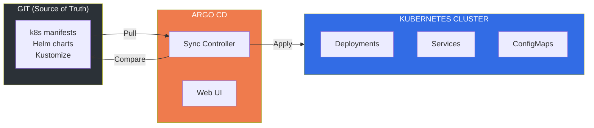
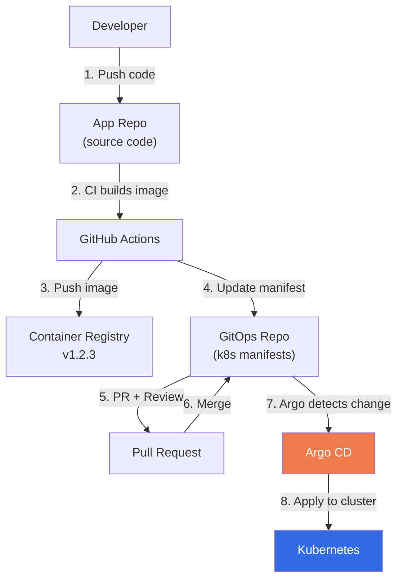

# Lesson 15.12: GitOps with Argo CD

> **Duration**: 40 min | **Section**: D - Advanced Kubernetes

## 🎯 The Problem

Your team deploys by:
1. SSH into the server
2. Run `kubectl apply -f deployment.yaml`
3. Hope it works
4. If not, frantically run `kubectl rollout undo`

No audit trail. No approval process. "Who deployed that broken version at 3 AM?"

> **Scenario**: A junior developer accidentally deploys to production instead of staging. They ran `kubectl apply` in the wrong context. The app crashes. You only find out when users complain. "Wait, I thought I was on staging..."

## 🧪 Try It: The Naive Approach

```bash
# "Manual kubectl" deployment
git pull
kubectl apply -f k8s/

# Problems:
# - No audit trail (who deployed what when?)
# - No approval process
# - Easy to deploy to wrong cluster
# - Drift: cluster state differs from Git
# - Rollback = "uhhh, git log, find the old version..."

# "CI/CD pushes to cluster" approach
# .github/workflows/deploy.yml
# - kubectl apply directly from CI
# Problem: CI has cluster credentials = security risk
```

## 🔍 Under the Hood: GitOps Principles



**GitOps Core Principles**:
1. **Git is the source of truth** - Desired state lives in Git
2. **Changes via Pull Requests** - No direct cluster access
3. **Automated sync** - Cluster matches Git automatically
4. **Observable** - See what's deployed, what's drifted

---

## ✅ The Fix: Argo CD Setup

### Step 1: Install Argo CD

```bash
# Create namespace
kubectl create namespace argocd

# Install Argo CD
kubectl apply -n argocd -f https://raw.githubusercontent.com/argoproj/argo-cd/stable/manifests/install.yaml

# Wait for pods
kubectl wait --for=condition=ready pod -l app.kubernetes.io/name=argocd-server -n argocd --timeout=300s

# Get initial admin password
kubectl -n argocd get secret argocd-initial-admin-secret -o jsonpath="{.data.password}" | base64 -d

# Port-forward to access UI
kubectl port-forward svc/argocd-server -n argocd 8080:443

# Access: https://localhost:8080
# Username: admin
# Password: (from above command)
```

### Step 2: Install Argo CD CLI

```bash
# macOS
brew install argocd

# Linux
curl -sSL -o argocd https://github.com/argoproj/argo-cd/releases/latest/download/argocd-linux-amd64
chmod +x argocd
sudo mv argocd /usr/local/bin/

# Login
argocd login localhost:8080 --username admin --password <password> --insecure
```

### Step 3: Create Your GitOps Repository

```
# Repository structure
rag-app-gitops/
├── apps/
│   ├── rag-api/
│   │   ├── deployment.yaml
│   │   ├── service.yaml
│   │   ├── configmap.yaml
│   │   └── kustomization.yaml
│   └── redis/
│       ├── deployment.yaml
│       ├── service.yaml
│       └── kustomization.yaml
├── overlays/
│   ├── staging/
│   │   └── kustomization.yaml
│   └── production/
│       └── kustomization.yaml
└── README.md
```

```yaml
# apps/rag-api/deployment.yaml
apiVersion: apps/v1
kind: Deployment
metadata:
  name: rag-api
  labels:
    app: rag-api
spec:
  replicas: 2
  selector:
    matchLabels:
      app: rag-api
  template:
    metadata:
      labels:
        app: rag-api
    spec:
      containers:
      - name: rag-api
        image: your-registry/rag-api:v1.0.0  # Version controlled!
        ports:
        - containerPort: 8000
        envFrom:
        - configMapRef:
            name: rag-api-config
        resources:
          requests:
            memory: "512Mi"
            cpu: "250m"
          limits:
            memory: "1Gi"
            cpu: "500m"
```

```yaml
# apps/rag-api/kustomization.yaml
apiVersion: kustomize.config.k8s.io/v1beta1
kind: Kustomization

resources:
  - deployment.yaml
  - service.yaml
  - configmap.yaml
```

```yaml
# overlays/staging/kustomization.yaml
apiVersion: kustomize.config.k8s.io/v1beta1
kind: Kustomization

namespace: staging

resources:
  - ../../apps/rag-api
  - ../../apps/redis

replicas:
  - name: rag-api
    count: 1

images:
  - name: your-registry/rag-api
    newTag: staging-latest

configMapGenerator:
  - name: rag-api-config
    behavior: merge
    literals:
      - LOG_LEVEL=debug
      - ENVIRONMENT=staging
```

---

### Step 4: Create Argo CD Application

```yaml
# argocd-application.yaml
apiVersion: argoproj.io/v1alpha1
kind: Application
metadata:
  name: rag-app-staging
  namespace: argocd
spec:
  project: default
  
  source:
    repoURL: https://github.com/yourorg/rag-app-gitops.git
    targetRevision: main
    path: overlays/staging
  
  destination:
    server: https://kubernetes.default.svc
    namespace: staging
  
  syncPolicy:
    automated:
      prune: true        # Delete resources removed from Git
      selfHeal: true     # Revert manual changes
    syncOptions:
      - CreateNamespace=true
```

```bash
# Apply the application
kubectl apply -f argocd-application.yaml

# Or via CLI
argocd app create rag-app-staging \
  --repo https://github.com/yourorg/rag-app-gitops.git \
  --path overlays/staging \
  --dest-server https://kubernetes.default.svc \
  --dest-namespace staging \
  --sync-policy automated
```

---

## 🔄 GitOps Workflow



### CI Pipeline Updates GitOps Repo

```yaml
# .github/workflows/build.yml (in your app repo)
name: Build and Update GitOps

on:
  push:
    branches: [main]

jobs:
  build:
    runs-on: ubuntu-latest
    steps:
      - uses: actions/checkout@v4
      
      - name: Build and push Docker image
        run: |
          docker build -t ${{ vars.REGISTRY }}/rag-api:${{ github.sha }} .
          docker push ${{ vars.REGISTRY }}/rag-api:${{ github.sha }}
      
      - name: Update GitOps repo
        run: |
          git clone https://x-access-token:${{ secrets.GITOPS_TOKEN }}@github.com/yourorg/rag-app-gitops.git
          cd rag-app-gitops
          
          # Update image tag in kustomization
          cd overlays/staging
          kustomize edit set image your-registry/rag-api=${{ vars.REGISTRY }}/rag-api:${{ github.sha }}
          
          git config user.name "GitHub Actions"
          git config user.email "actions@github.com"
          git add .
          git commit -m "Update rag-api to ${{ github.sha }}"
          git push
```

---

## 📊 Argo CD Features

### Sync Status and Health

```bash
# Check application status
argocd app get rag-app-staging

# Force sync
argocd app sync rag-app-staging

# Rollback to previous version
argocd app rollback rag-app-staging 1

# View sync history
argocd app history rag-app-staging
```

### Application Sets (Multi-Cluster)

```yaml
# applicationset.yaml - Deploy to multiple environments
apiVersion: argoproj.io/v1alpha1
kind: ApplicationSet
metadata:
  name: rag-app
  namespace: argocd
spec:
  generators:
    - list:
        elements:
          - cluster: staging
            url: https://staging-cluster.example.com
          - cluster: production
            url: https://production-cluster.example.com
  template:
    metadata:
      name: 'rag-app-{{cluster}}'
    spec:
      project: default
      source:
        repoURL: https://github.com/yourorg/rag-app-gitops.git
        targetRevision: main
        path: 'overlays/{{cluster}}'
      destination:
        server: '{{url}}'
        namespace: '{{cluster}}'
```

---

## 🔒 Production Considerations

### Separate Environments

```
rag-app-gitops/
├── overlays/
│   ├── dev/           # Auto-sync enabled
│   ├── staging/       # Auto-sync enabled
│   └── production/    # Manual sync + approval required
```

```yaml
# Production app - manual sync only
apiVersion: argoproj.io/v1alpha1
kind: Application
metadata:
  name: rag-app-production
spec:
  # ... 
  syncPolicy:
    # No 'automated' block = manual sync required
    syncOptions:
      - CreateNamespace=true
```

### Notifications

```yaml
# argocd-notifications-cm.yaml
apiVersion: v1
kind: ConfigMap
metadata:
  name: argocd-notifications-cm
data:
  service.slack: |
    token: $slack-token
  trigger.on-sync-failed: |
    - send: [app-sync-failed]
  template.app-sync-failed: |
    message: |
      Application {{.app.metadata.name}} sync failed!
      Error: {{.app.status.operationState.message}}
```

---

## 🎯 Practice

1. **Install Argo CD** in your local cluster (minikube/kind)
2. **Create a GitOps repository** with Kustomize structure
3. **Create an Application** pointing to your repo
4. **Make a change** in Git and watch Argo sync
5. **Try manual change** in cluster - watch Argo revert it
6. **Set up CI** to update GitOps repo on code push

```bash
# Quick start with kind
kind create cluster --name argocd-test

kubectl create namespace argocd
kubectl apply -n argocd -f https://raw.githubusercontent.com/argoproj/argo-cd/stable/manifests/install.yaml

# Wait and get password
kubectl wait --for=condition=ready pod -l app.kubernetes.io/name=argocd-server -n argocd --timeout=300s
kubectl -n argocd get secret argocd-initial-admin-secret -o jsonpath="{.data.password}" | base64 -d

# Access UI
kubectl port-forward svc/argocd-server -n argocd 8080:443
```

## 🔑 Key Takeaways

- **Git is the source of truth** - all changes via commits
- **No direct kubectl access** needed for deployments
- **Audit trail** - every change is a git commit
- **Self-healing** - Argo reverts manual cluster changes
- **Multi-environment** - same tool, different overlays
- **Rollback** - just revert the git commit

## ❓ Common Questions

| Question | Answer |
|----------|--------|
| Argo CD vs Flux? | Both are great. Argo has better UI, Flux is lighter |
| Can I use Helm? | Yes, Argo CD supports Helm charts natively |
| Secrets in Git? | No! Use Sealed Secrets or External Secrets Operator |
| Multiple clusters? | Yes, register clusters with `argocd cluster add` |

## 🔗 Further Reading

- [Argo CD Documentation](https://argo-cd.readthedocs.io/)
- [GitOps Principles](https://opengitops.dev/)
- [Kustomize Documentation](https://kustomize.io/)
- [Sealed Secrets](https://github.com/bitnami-labs/sealed-secrets)
- [Argo CD Best Practices](https://argo-cd.readthedocs.io/en/stable/user-guide/best_practices/)

---

**Previous**: [Lesson 11 - Module Review](Lesson-11-Module-Review.md) | **Up**: [Module 15 README](README.md)
