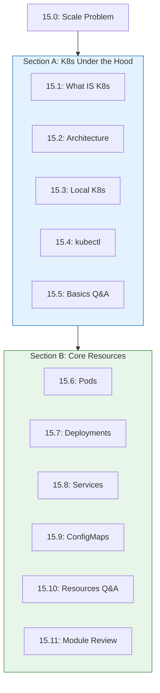
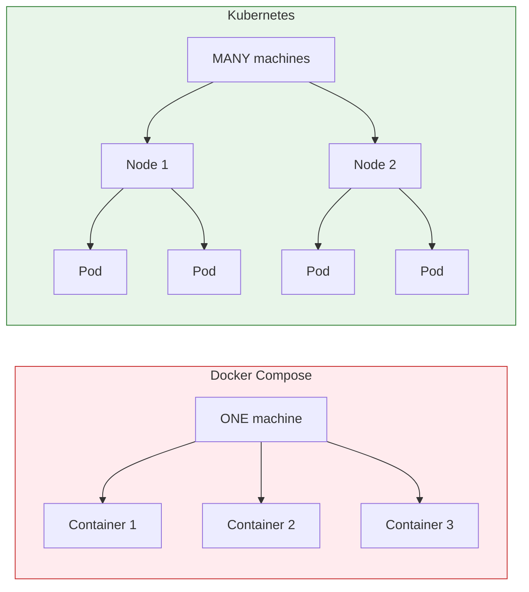
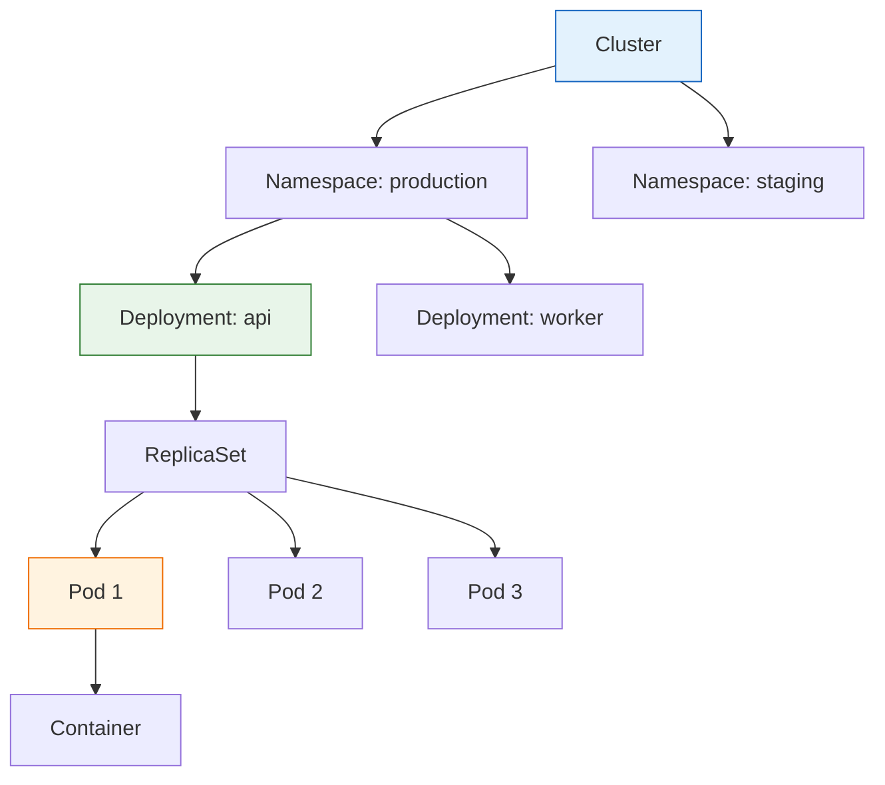

# Module 15: Kubernetes

> **"Container orchestration for AI applications at scale."**

## The Scale Problem

Your ECS service runs 3 containers. Black Friday hits. You need 30. Then 3 again. Manually changing task count? At 3 AM? Also, one container crashes. Who restarts it? You?

**Kubernetes (K8s)** orchestrates containers automatically:
- **Auto-scaling**: Scale up/down based on demand
- **Self-healing**: Restart crashed containers
- **Rolling updates**: Deploy without downtime
- **Load balancing**: Distribute traffic evenly

---

## What You'll Learn



---

## Lessons

### Section A: Kubernetes Under the Hood

| # | Lesson | Topic | Duration |
|:-:|:-------|:------|:--------:|
| 15.0 | [The Scale Problem](Lesson-00-The-Scale-Problem.md) | Why container orchestration | 10 min |
| 15.1 | [What IS Kubernetes](Lesson-01-What-IS-Kubernetes.md) | The container OS | 25 min |
| 15.2 | [K8s Architecture](Lesson-02-K8s-Architecture.md) | Control plane, nodes, API | 30 min |
| 15.3 | [Local Kubernetes](Lesson-03-Local-Kubernetes.md) | minikube, k3d setup | 25 min |
| 15.4 | [kubectl Basics](Lesson-04-kubectl-Basics.md) | The K8s CLI | 25 min |
| 15.5 | [Basics Q&A](Lesson-05-K8s-Basics-QA.md) | K8s vs ECS, when overkill | 10 min |

### Section B: Core Resources

| # | Lesson | Topic | Duration |
|:-:|:-------|:------|:--------:|
| 15.6 | [Pods](Lesson-06-Pods.md) | Smallest deployable unit | 25 min |
| 15.7 | [Deployments](Lesson-07-Deployments.md) | Replica management | 30 min |
| 15.8 | [Services](Lesson-08-Services.md) | Network abstraction | 30 min |
| 15.9 | [ConfigMaps & Secrets](Lesson-09-ConfigMaps-Secrets.md) | Configuration management | 25 min |
| 15.10 | [Resources Q&A](Lesson-10-Resources-QA.md) | Ingress, namespaces | 10 min |
| 15.11 | [Module Review](Lesson-11-Module-Review.md) | K8s mental model | 15 min |

---

## Docker Compose vs Kubernetes



| Feature | Docker Compose | Kubernetes |
|---------|---------------|------------|
| Scaling | Manual | Automatic |
| Restart | Manual | Self-healing |
| Updates | Downtime | Rolling updates |
| Machines | Single | Cluster |

---

## Core Concepts

### The K8s Philosophy

```
DECLARE what you want → K8s MAKES it happen
```

```yaml
# You declare:
spec:
  replicas: 5
  resources:
    requests:
      cpu: "500m"
      memory: "256Mi"
```

Kubernetes continuously:
1. Observes current state
2. Compares to desired state
3. Takes action to reconcile

---

### Resource Hierarchy



| Resource | What It Does |
|----------|-------------|
| **Cluster** | All your machines |
| **Namespace** | Virtual separation (like folders) |
| **Deployment** | "Run N copies of this app" |
| **ReplicaSet** | Ensures correct pod count |
| **Pod** | One or more containers |
| **Service** | Stable network endpoint |

---

## Project: Deploy RAG App to K8s

By the end of this module, you'll deploy your RAG app with:

```yaml
# deployment.yaml
apiVersion: apps/v1
kind: Deployment
metadata:
  name: rag-api
spec:
  replicas: 3
  selector:
    matchLabels:
      app: rag-api
  template:
    metadata:
      labels:
        app: rag-api
    spec:
      containers:
      - name: rag-api
        image: your-registry/rag-api:latest
        ports:
        - containerPort: 8000
        envFrom:
        - configMapRef:
            name: rag-config
        - secretRef:
            name: rag-secrets
---
apiVersion: v1
kind: Service
metadata:
  name: rag-api
spec:
  selector:
    app: rag-api
  ports:
  - port: 80
    targetPort: 8000
  type: LoadBalancer
```

---

## Prerequisites

- Docker knowledge (Module 5)
- Container images and registries
- Basic YAML understanding
- Command line proficiency

---

## Key Commands Preview

```bash
# Cluster info
kubectl cluster-info
kubectl get nodes

# Deploy resources
kubectl apply -f deployment.yaml
kubectl get pods
kubectl get services

# Inspect
kubectl describe pod <name>
kubectl logs <pod-name>

# Scale
kubectl scale deployment rag-api --replicas=5

# Debug
kubectl exec -it <pod-name> -- /bin/sh
```

---

## External Resources

- [Kubernetes Official Docs](https://kubernetes.io/docs/)
- [kubectl Cheat Sheet](https://kubernetes.io/docs/reference/kubectl/cheatsheet/)
- [Kubernetes Patterns](https://k8spatterns.io/)
- [CNCF Landscape](https://landscape.cncf.io/)

---

**Ready?** Start with [Lesson 15.0: The Scale Problem](Lesson-00-The-Scale-Problem.md)
