# Lesson 16.0: The Password Problem

> **Duration**: 10 min | **Section**: A - OAuth2 Under the Hood

## 🎯 The Problem

You're building a GenAI application. Users need accounts. So you add authentication:

```python
# Your first attempt at auth
@app.post("/register")
async def register(email: str, password: str):
    # Store user with password
    hashed = hash_password(password)
    db.execute("INSERT INTO users (email, password) VALUES (?, ?)", email, hashed)
    return {"message": "Registered!"}

@app.post("/login")
async def login(email: str, password: str):
    user = db.query("SELECT * FROM users WHERE email = ?", email)
    if verify_password(password, user.password):
        return {"token": create_jwt(user.id)}
    raise HTTPException(401, "Invalid credentials")
```

Looks simple, right? Now you need to implement:

| Feature | Complexity |
|---------|------------|
| Password hashing | bcrypt, argon2, salt |
| Password reset | Tokens, email, expiry |
| Account recovery | Security questions, backup codes |
| Email verification | Token generation, expiry |
| Password requirements | Length, complexity, no reuse |
| Rate limiting | Brute force protection |
| MFA | TOTP, SMS, backup codes |
| Session management | Token refresh, revocation |

> **Scenario**: You implement all of this. 6 months later: a security researcher finds a flaw in your password reset flow. User data is exposed. You're on the news.

## 🧪 Try It: The Naive Approach

"I'll just use bcrypt and be careful!"

```python
import bcrypt
from datetime import datetime, timedelta
import secrets

# Password hashing
def hash_password(password: str) -> str:
    salt = bcrypt.gensalt(rounds=12)
    return bcrypt.hashpw(password.encode(), salt).decode()

def verify_password(password: str, hashed: str) -> bool:
    return bcrypt.checkpw(password.encode(), hashed.encode())

# Password reset
@app.post("/forgot-password")
async def forgot_password(email: str):
    user = get_user_by_email(email)
    if user:
        # Generate reset token
        token = secrets.token_urlsafe(32)
        expiry = datetime.utcnow() + timedelta(hours=1)
        
        # Store token
        db.execute(
            "INSERT INTO password_resets (user_id, token, expires_at) VALUES (?, ?, ?)",
            user.id, hash_password(token), expiry  # Hash the token too!
        )
        
        # Send email
        send_email(email, f"Reset link: https://myapp.com/reset?token={token}")
    
    # Always return same response (prevent email enumeration)
    return {"message": "If email exists, reset link sent"}

@app.post("/reset-password")
async def reset_password(token: str, new_password: str):
    # Find valid reset token
    resets = db.query("SELECT * FROM password_resets WHERE expires_at > ?", datetime.utcnow())
    
    valid_reset = None
    for reset in resets:
        if verify_password(token, reset.token):  # Compare hashes
            valid_reset = reset
            break
    
    if not valid_reset:
        raise HTTPException(400, "Invalid or expired token")
    
    # Check password requirements
    if len(new_password) < 12:
        raise HTTPException(400, "Password too short")
    if not any(c.isupper() for c in new_password):
        raise HTTPException(400, "Need uppercase")
    if not any(c.isdigit() for c in new_password):
        raise HTTPException(400, "Need number")
    # ... more rules
    
    # Check password not reused
    old_passwords = db.query("SELECT hash FROM password_history WHERE user_id = ?", valid_reset.user_id)
    for old in old_passwords:
        if verify_password(new_password, old.hash):
            raise HTTPException(400, "Cannot reuse password")
    
    # Update password
    db.execute("UPDATE users SET password = ? WHERE id = ?", hash_password(new_password), valid_reset.user_id)
    
    # Delete used reset token
    db.execute("DELETE FROM password_resets WHERE id = ?", valid_reset.id)
    
    # Invalidate all sessions (security best practice)
    db.execute("DELETE FROM sessions WHERE user_id = ?", valid_reset.user_id)
    
    return {"message": "Password updated"}
```

That's 70+ lines just for password reset. And we haven't even covered:
- Account lockout after failed attempts
- Timing attacks on password comparison
- Token entropy requirements
- Email deliverability
- i18n for error messages
- Audit logging
- GDPR compliance

## 🔍 Under the Hood: The Security Surface

```mermaid
flowchart TD
    subgraph Attack["YOUR ATTACK SURFACE"]
        A1["Password Storage<br/>Weak hashing? Salt reuse?"]
        A2["Password Reset<br/>Token prediction? Timing?"]
        A3["Session Management<br/>Token theft? XSS?"]
        A4["Rate Limiting<br/>Brute force? Credential stuffing?"]
        A5["Email Verification<br/>Enumeration? Spam?"]
        A6["MFA<br/>Bypass? Recovery codes?"]
    end
    
    ATTACKER["🎭 Attacker"] --> A1
    ATTACKER --> A2
    ATTACKER --> A3
    ATTACKER --> A4
    ATTACKER --> A5
    ATTACKER --> A6
    
    style Attack fill:#FFEBEE,stroke:#C62828
    style ATTACKER fill:#C62828,color:#fff
```



**The Reality**: Every feature you implement is a feature you must secure. Forever.

## 💥 Where It Breaks

| Incident | What Happened | Cost |
|----------|---------------|------|
| LinkedIn 2012 | Unsalted SHA-1 hashes leaked | 117M passwords exposed |
| Adobe 2013 | ECB encryption, password hints | 153M accounts |
| Dropbox 2012 | Employee password reused from LinkedIn | All users compromised |
| Yahoo 2013-14 | MD5 hashes, security questions | 3 billion accounts |

**Common Mistakes**:
1. **Weak hashing**: MD5, SHA-1 without salt
2. **Token predictability**: `reset_token = user_id + timestamp`
3. **Timing attacks**: `if token == stored_token` leaks length
4. **No rate limiting**: Brute force succeeds
5. **Password hints**: "First pet" gives away password

## ✅ The Fix: Let Someone Else Handle It

**The Insight**: What if you didn't store passwords at all?


**You get**:
- ✅ Google handles password security
- ✅ Google handles MFA
- ✅ Google handles account recovery
- ✅ Google handles breach response
- ✅ User trusts Google (already has account)
- ✅ You just verify: "Google says this is Alice"

**Your new code**:

```python
@app.get("/login/google")
async def login_google():
    # Redirect to Google
    return RedirectResponse(google.authorize_url)

@app.get("/callback/google")
async def google_callback(code: str):
    # Google verified the user, we get their info
    user_info = await google.get_user_info(code)
    
    # user_info = {"email": "alice@gmail.com", "name": "Alice", ...}
    # No password involved!
    
    user = get_or_create_user(user_info["email"])
    return {"token": create_jwt(user.id)}
```

**10 lines instead of 200+. And MORE secure.**

## 🎯 What's Next

This module teaches OAuth2 - the protocol that makes this possible:

| Lesson | What You'll Learn |
|--------|-------------------|
| 16.1 | What IS OAuth2 (the protocol) |
| 16.2 | OAuth2 flows (Authorization Code, etc.) |
| 16.3 | OIDC (adding identity to OAuth2) |
| 16.4 | Q&A |
| 16.5 | FastAPI + Google OAuth |
| 16.6 | Adding GitHub as second provider |
| 16.7 | JWT validation |
| 16.8 | RBAC patterns |

## 🔑 Key Takeaways

- Storing passwords = storing liability
- Every auth feature = new attack surface
- OAuth2 = "Let trusted providers authenticate users"
- You receive verified identity, not password
- Billions invested in Google/GitHub security > your security budget

## ❓ Common Questions

| Question | Answer |
|----------|--------|
| What if user doesn't have Google? | Offer multiple providers (GitHub, Microsoft, Apple) |
| Can I still have password login? | Yes, as fallback - but OAuth should be primary |
| Is OAuth2 only for social login? | No, it's an authorization framework for any identity provider |
| What about enterprise (SAML)? | SAML is similar concept, different protocol - common in enterprise |

---

## 📚 Further Reading

- [OWASP Authentication Cheat Sheet](https://cheatsheetseries.owasp.org/cheatsheets/Authentication_Cheat_Sheet.html)
- [Have I Been Pwned](https://haveibeenpwned.com/) - Check if passwords have been exposed

---

**Next**: 16.1 - What IS OAuth2?
