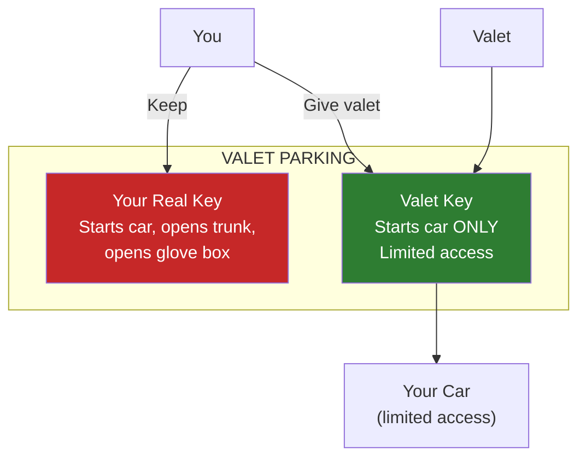
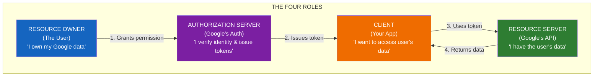
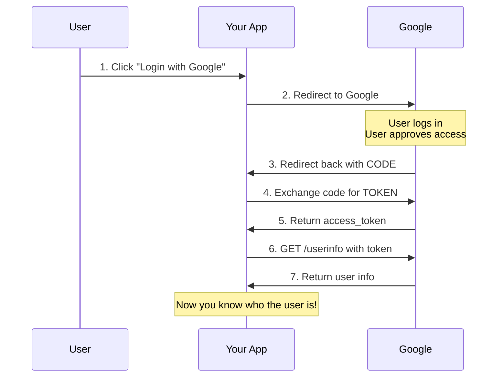

# Lesson 16.1: What IS OAuth2?

> **Duration**: 25 min | **Section**: A - OAuth2 Under the Hood

## 🎯 The Problem

You want users to log in with Google. But what exactly happens when they click "Login with Google"? 

It seems like magic: click button → Google page → back to your app → logged in!

But there's a precise protocol happening underneath. If you don't understand it, you'll:
- Implement it insecurely
- Not know what's broken when it fails
- Miss critical security considerations

> **Scenario**: Your OAuth login works in development but breaks in production. The error says "redirect_uri_mismatch". You have no idea what that means because you copy-pasted code from a tutorial.

## 🧪 Try It: The Naive Mental Model

"OAuth is just... Google handles login and tells me who the user is, right?"

**Not quite.** OAuth2 was designed for a DIFFERENT problem:

```
Original Problem (2007):
- You have a photo printing app
- User wants to print photos from their Flickr account
- User DOESN'T want to give you their Flickr password

Solution:
- User authorizes YOUR APP to access THEIR Flickr photos
- Flickr gives your app a LIMITED ACCESS TOKEN
- Your app uses token to get photos (not password!)
```

OAuth2 is about **AUTHORIZATION** (access to resources), not **AUTHENTICATION** (who you are).

## 🔍 Under the Hood: The Real Analogy

**OAuth2 is like a Valet Key for your car:**



| Valet Key | OAuth2 Token |
|-----------|--------------|
| Can start car | Can access specific resources |
| Can't open trunk | Can't access everything |
| Can be deactivated | Can be revoked |
| Doesn't copy itself | Expires |

## 🔍 The OAuth2 Players



| Role | Who | In Google OAuth |
|------|-----|-----------------|
| Resource Owner | User (Alice) | The person clicking "Login with Google" |
| Client | Your App | Your FastAPI application |
| Authorization Server | Token issuer | accounts.google.com |
| Resource Server | Has user data | googleapis.com |

## 🔍 The OAuth2 Dance (High Level)



**Why the dance?** Security! Each step has a purpose:

| Step | Purpose |
|------|---------|
| 1. Click button | User initiates - prevents CSRF |
| 2. Redirect to Google | User authenticates with Google (not you) |
| 3. Code returned | Short-lived, single-use |
| 4. Exchange code | Your server, with client_secret |
| 5. Get token | Can be used for API calls |
| 6-7. Get user info | Finally know who they are |

## 💥 Where It Breaks: Common Confusions

### Confusion 1: OAuth2 ≠ Authentication

OAuth2 alone doesn't tell you WHO the user is. It gives you ACCESS to their resources.

```python
# OAuth2 gives you this:
access_token = "ya29.a0AfB_byC..."  # Can access Google APIs

# But NOT this:
user_email = "?"  # OAuth2 doesn't guarantee identity!
```

**Solution**: OpenID Connect (OIDC) - adds identity layer (Lesson 16.3)

### Confusion 2: Tokens Are Secrets

```python
# ❌ WRONG: Exposing token in URL or logs
logger.info(f"Got token: {access_token}")

# ✅ RIGHT: Treat as secret
logger.info(f"Got token: {access_token[:10]}...")
```

### Confusion 3: Redirect URI Must Match Exactly

```python
# Registered in Google Console:
# https://myapp.com/callback

# ❌ This will fail:
"https://myapp.com/callback/"  # Trailing slash
"https://www.myapp.com/callback"  # www subdomain
"http://myapp.com/callback"  # http not https

# ✅ Must match exactly:
"https://myapp.com/callback"
```

## ✅ The Core Concepts

### 1. Client ID & Client Secret

```python
# From Google Console (or any provider)
CLIENT_ID = "123456789.apps.googleusercontent.com"  # Public
CLIENT_SECRET = "GOCSPX-abc123..."  # SECRET! Never expose!
```

| | Client ID | Client Secret |
|-|-----------|---------------|
| Public? | Yes, in URLs | NO! Server only |
| Purpose | Identifies your app | Proves it's really your app |
| If leaked | Annoying | CRITICAL - rotate immediately |

### 2. Scopes

Scopes define WHAT your app can access:

```python
# Just basic profile (for login)
scopes = ["openid", "email", "profile"]

# Access user's Google Drive
scopes = ["openid", "email", "https://www.googleapis.com/auth/drive.readonly"]

# Full access (scary! users may refuse)
scopes = ["openid", "email", "https://www.googleapis.com/auth/drive"]
```

**Principle of Least Privilege**: Request only what you need!

### 3. Tokens

```python
# Access Token - use for API calls
access_token = "ya29.a0AfB_..."
# Short-lived (1 hour typically)
# Include in requests: Authorization: Bearer {access_token}

# Refresh Token - get new access tokens
refresh_token = "1//0eZjK..."  
# Long-lived (until revoked)
# Use to get new access_token without user interaction

# ID Token (OIDC) - contains user identity
id_token = "eyJhbGciOiJSUzI1NiIs..."
# JWT with user info (email, name, etc.)
```

## 🎯 Practice

**Mental Exercise**: Map these real-world scenarios to OAuth2 roles:

1. **Scenario**: A calendar app wants to show your Google Calendar events
   - Resource Owner: ?
   - Client: ?
   - What scopes needed: ?

2. **Scenario**: A job site offers "Apply with LinkedIn"
   - Resource Owner: ?
   - Client: ?
   - What data is being accessed: ?

<details>
<summary>Answers</summary>

1. Calendar App:
   - Resource Owner: You (the user)
   - Client: The calendar app
   - Scopes: `calendar.readonly`

2. Apply with LinkedIn:
   - Resource Owner: You (the job seeker)
   - Client: The job site
   - Data: Your LinkedIn profile (name, experience, skills)

</details>

## 🔑 Key Takeaways

- OAuth2 is an **authorization** framework (access to resources)
- Four roles: Resource Owner, Client, Authorization Server, Resource Server
- Client ID is public, Client Secret is SECRET
- Scopes define what access you're requesting
- Tokens are secrets - never log or expose them
- Redirect URI must match EXACTLY

## ❓ Common Questions

| Question | Answer |
|----------|--------|
| Why not just use password? | You'd have to store it. Attack surface! |
| Can users revoke access? | Yes! Google Settings → Security → Third-party apps |
| What if Google is down? | Your auth is down. Trade-off for security. |
| Is OAuth2 only for big providers? | No, you can run your own OAuth2 server (Keycloak, Auth0) |

---

## 📚 Further Reading

- [OAuth 2.0 Simplified](https://www.oauth.com/) - Aaron Parecki's excellent guide
- [RFC 6749](https://tools.ietf.org/html/rfc6749) - The OAuth 2.0 specification

---

**Next**: 16.2 - OAuth2 Flows (Authorization Code, Client Credentials)
