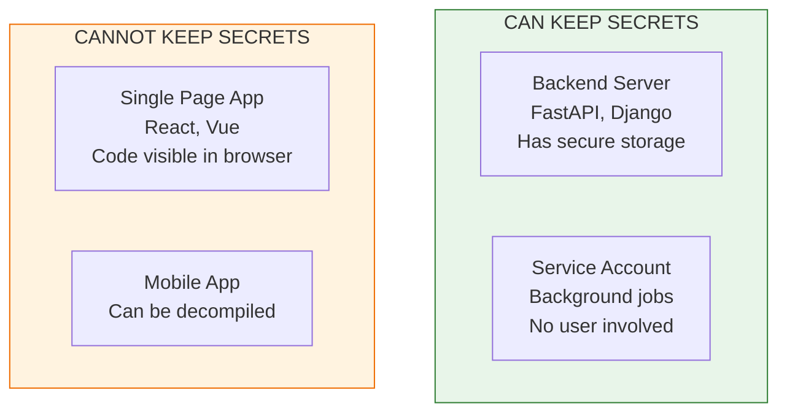
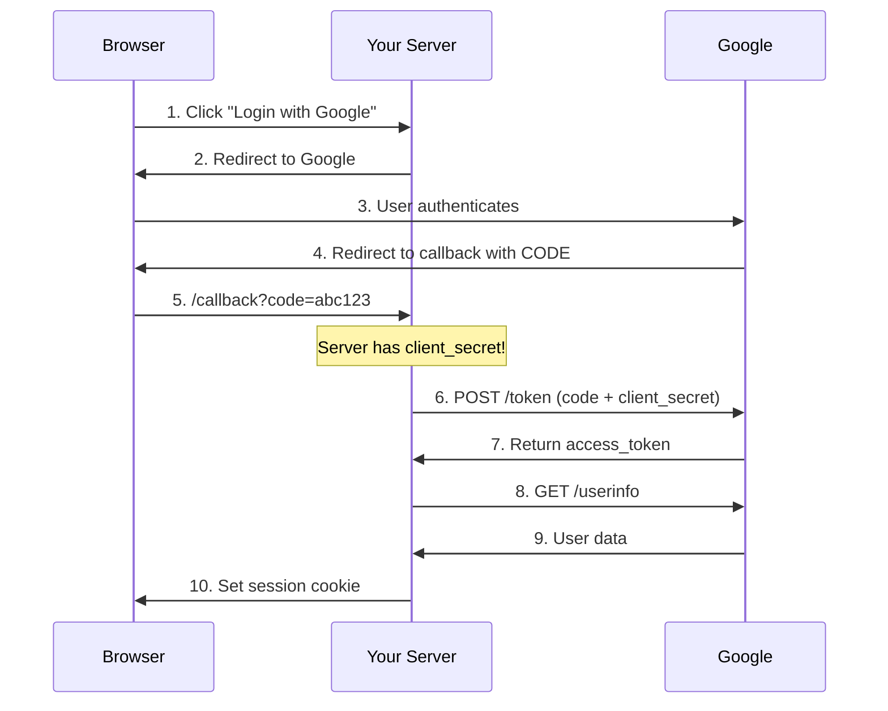
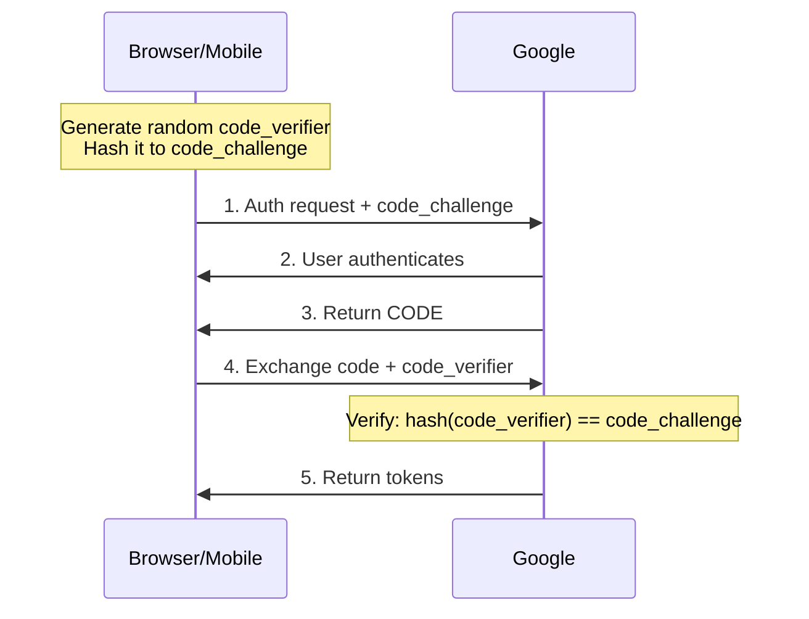
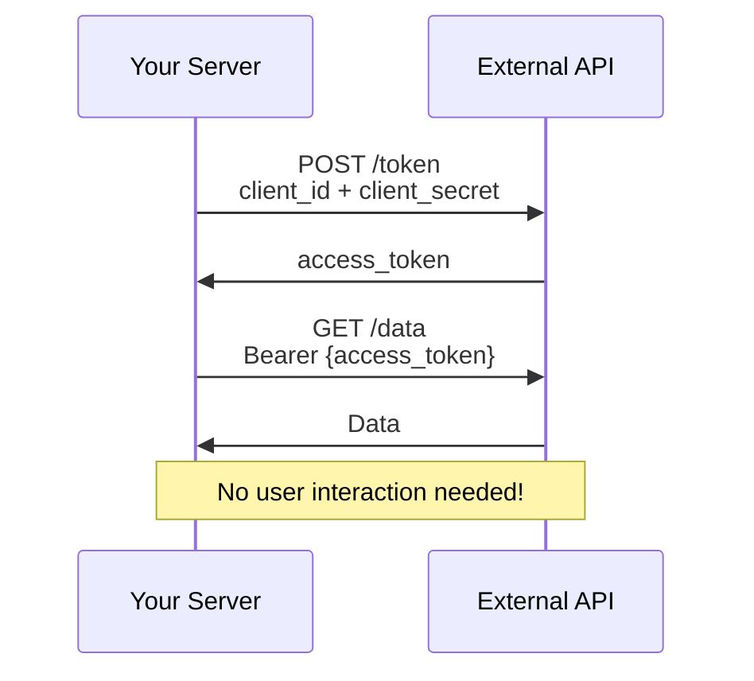
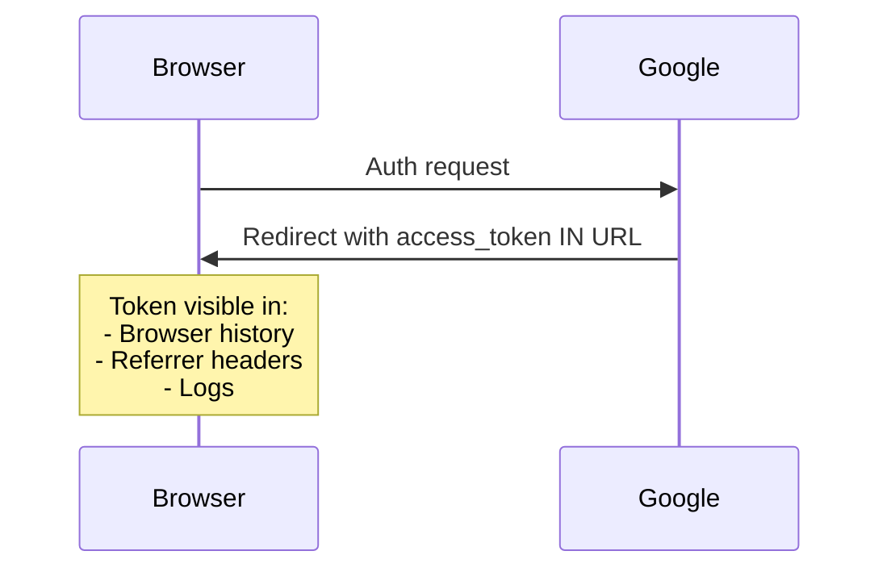
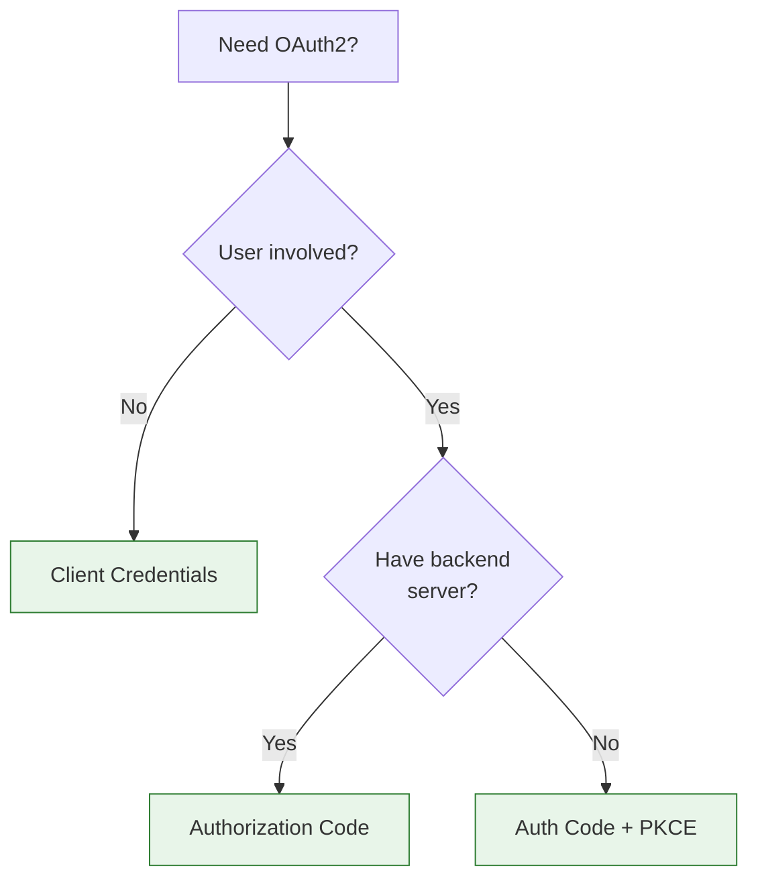

# Lesson 16.2: OAuth2 Flows

> **Duration**: 30 min | **Section**: A - OAuth2 Under the Hood

## 🎯 The Problem

OAuth2 isn't one protocol - it's several "flows" for different scenarios:

| Scenario | Flow |
|----------|------|
| Web app with backend | Authorization Code |
| Single-page app (SPA) | Authorization Code + PKCE |
| Server-to-server | Client Credentials |
| Mobile app | Authorization Code + PKCE |
| Legacy (avoid!) | Implicit |

Using the wrong flow = security vulnerability.

> **Scenario**: You're building a React SPA. You find a tutorial that uses the Implicit flow. Your tokens are exposed in the URL. Attackers can steal them from browser history. You've just created a security hole.

## 🧪 Try It: Understanding Why Flows Exist

"Why can't there be just ONE way to do OAuth2?"

Different clients have different trust levels:



**Key Insight**: A backend server can securely store a `client_secret`. A browser app CANNOT - all code is visible!

## 🔍 Flow 1: Authorization Code (Web Apps with Backend)

**Use when**: You have a backend server that can securely store secrets.



**Why it's secure**:
- `code` is short-lived (10 minutes)
- `code` is single-use
- Token exchange happens server-to-server
- `client_secret` never exposed to browser

### Implementation

```python
from fastapi import FastAPI, Request
from fastapi.responses import RedirectResponse
from authlib.integrations.starlette_client import OAuth
import os

app = FastAPI()
oauth = OAuth()

# Register Google provider
oauth.register(
    name="google",
    client_id=os.environ["GOOGLE_CLIENT_ID"],
    client_secret=os.environ["GOOGLE_CLIENT_SECRET"],  # Secret on server!
    authorize_url="https://accounts.google.com/o/oauth2/v2/auth",
    access_token_url="https://oauth2.googleapis.com/token",
    userinfo_endpoint="https://openidconnect.googleapis.com/v1/userinfo",
    client_kwargs={"scope": "openid email profile"},
)

@app.get("/login/google")
async def login_google(request: Request):
    # Step 2: Redirect to Google
    redirect_uri = request.url_for("google_callback")
    return await oauth.google.authorize_redirect(request, redirect_uri)

@app.get("/callback/google")
async def google_callback(request: Request):
    # Step 6-7: Exchange code for token (happens on server!)
    token = await oauth.google.authorize_access_token(request)
    
    # Step 8-9: Get user info
    user_info = token.get("userinfo")
    # user_info = {"email": "alice@gmail.com", "name": "Alice", ...}
    
    # Create session, return to app
    return {"user": user_info}
```

## 🔍 Flow 2: Authorization Code + PKCE (SPAs & Mobile)

**Use when**: Client can't securely store secrets (browser, mobile app).

**PKCE** = Proof Key for Code Exchange (pronounced "pixy")



**Why PKCE works without client_secret**:

```python
import hashlib
import base64
import secrets

# 1. Client generates random verifier
code_verifier = secrets.token_urlsafe(32)
# "dBjftJeZ4CVP-mB92K27uhbUJU1p1r_wW1gFWFOEjXk"

# 2. Client hashes it to create challenge
code_challenge = base64.urlsafe_b64encode(
    hashlib.sha256(code_verifier.encode()).digest()
).decode().rstrip("=")
# "E9Melhoa2OwvFrEMTJguCHaoeK1t8URWbuGJSstw-cM"

# 3. Client sends challenge with auth request
# 4. When exchanging code, client sends verifier
# 5. Server verifies: SHA256(verifier) == challenge
```

**The trick**: Only the original client knows the `code_verifier`. Even if an attacker intercepts the `code`, they can't exchange it without the verifier!

## 🔍 Flow 3: Client Credentials (Server-to-Server)

**Use when**: No user involved. Your server accessing an API as itself.



### Implementation

```python
import httpx

async def get_api_token():
    """Get token for server-to-server communication."""
    async with httpx.AsyncClient() as client:
        response = await client.post(
            "https://api.example.com/oauth/token",
            data={
                "grant_type": "client_credentials",
                "client_id": os.environ["API_CLIENT_ID"],
                "client_secret": os.environ["API_CLIENT_SECRET"],
                "scope": "read:data",
            }
        )
        return response.json()["access_token"]

async def call_api():
    token = await get_api_token()
    
    async with httpx.AsyncClient() as client:
        response = await client.get(
            "https://api.example.com/data",
            headers={"Authorization": f"Bearer {token}"}
        )
        return response.json()
```

**Use cases**:
- Background jobs accessing APIs
- Microservice-to-microservice auth
- Your server accessing cloud services

## 💥 Where It Breaks: The Deprecated Implicit Flow

**DON'T USE THIS!**



**Why it's dangerous**:
- Token in URL fragment (`#access_token=...`)
- Visible in browser history
- Can leak via Referrer header
- No refresh tokens

**Always use PKCE instead for SPAs!**

## 🔍 Flow Comparison

| Flow | Client Secret? | User Involved? | Use Case |
|------|:--------------:|:--------------:|----------|
| Authorization Code | ✅ Yes | ✅ Yes | Web apps with backend |
| Auth Code + PKCE | ❌ No | ✅ Yes | SPAs, mobile apps |
| Client Credentials | ✅ Yes | ❌ No | Server-to-server |
| Implicit (DEPRECATED) | ❌ No | ✅ Yes | Don't use! |

## 🔍 Decision Flowchart



## 🎯 Practice

**Question**: What flow would you use for each scenario?

1. FastAPI backend serving a React frontend (traditional web app)
2. React SPA calling Google Calendar directly (no backend)
3. Cron job that syncs data from Salesforce API nightly
4. iOS app that needs user's Google Drive access

<details>
<summary>Answers</summary>

1. **Authorization Code** - Backend can store client_secret
2. **Authorization Code + PKCE** - SPA can't store secrets
3. **Client Credentials** - No user, server-to-server
4. **Authorization Code + PKCE** - Mobile app can't store secrets securely

</details>

## 🔑 Key Takeaways

- Different flows for different trust levels
- **Authorization Code**: Web apps with backend (most common)
- **Auth Code + PKCE**: SPAs and mobile apps
- **Client Credentials**: Server-to-server (no user)
- **Implicit**: DEPRECATED - never use!
- Client secret = only for servers that can keep secrets

## ❓ Common Questions

| Question | Answer |
|----------|--------|
| Can I use Auth Code for mobile? | Yes, with PKCE! Native apps use custom URL schemes for callback. |
| Why not just PKCE for everything? | You can! But if you have a backend, Auth Code is simpler. |
| What about Device Flow? | For devices without browsers (TV, CLI). Show code, user enters on phone. |
| Refresh tokens with PKCE? | Yes, but store securely. Mobile: Keychain/Keystore. SPA: memory only. |

---

## 📚 Further Reading

- [OAuth 2.0 for Browser-Based Apps](https://datatracker.ietf.org/doc/html/draft-ietf-oauth-browser-based-apps) - IETF best practices
- [PKCE RFC 7636](https://tools.ietf.org/html/rfc7636) - The PKCE specification

---

**Next**: 16.3 - OIDC (OpenID Connect)
