# Lesson 16.4: OAuth2 Q&A

> **Duration**: 10 min | **Section**: A - OAuth2 Under the Hood (Recap)

## 🎯 Section A Recap

You've learned the fundamentals of OAuth2 and OIDC:


## 📊 Concept Summary

| Concept | Key Insight |
|---------|-------------|
| **OAuth2** | Authorization framework - "let app access my data" |
| **OIDC** | Identity layer on OAuth2 - "who am I?" |
| **Authorization Code** | For apps with backend (can store secret) |
| **PKCE** | For SPAs/mobile (can't store secret) |
| **Client Credentials** | Server-to-server (no user) |
| **ID Token** | JWT with user identity (sub, email, name) |
| **Access Token** | For calling APIs |

## ❓ Frequently Asked Questions

### Q1: Access Token vs ID Token - What's the Difference?


| | ID Token | Access Token |
|-|----------|--------------|
| **Purpose** | Identity (who) | Authorization (what) |
| **Audience** | Your app | Resource server (API) |
| **Format** | Always JWT | JWT or opaque |
| **Lifetime** | Short (1 hour) | Short (1 hour) |
| **Contains** | User claims | Scopes, permissions |
| **Use for** | Creating sessions | Calling APIs |

### Q2: When Do I Need Refresh Tokens?

```python
# Scenario 1: Short sessions (web app)
# User logs in, uses app for 30 minutes, leaves
# NO REFRESH TOKEN NEEDED - just re-authenticate

# Scenario 2: Long sessions or background jobs
# User authorizes, app syncs calendar daily
# REFRESH TOKEN NEEDED

async def get_valid_token(user_id: str) -> str:
    """Get valid access token, refreshing if needed."""
    tokens = await db.get_tokens(user_id)
    
    if tokens.access_token_expired:
        # Use refresh token to get new access token
        new_tokens = await oauth.refresh_token(tokens.refresh_token)
        await db.update_tokens(user_id, new_tokens)
        return new_tokens.access_token
    
    return tokens.access_token
```

### Q3: What's the Difference Between OAuth2 Providers?

| Provider | Quirks |
|----------|--------|
| **Google** | Standard OIDC, great docs, requires verification for sensitive scopes |
| **GitHub** | Not full OIDC (no ID token by default), email might be private |
| **Microsoft** | Full OIDC, complex tenant configuration |
| **Apple** | Requires client_secret JWT, email hidden by default |
| **Auth0** | Full OIDC, customizable, your own identity provider |

### Q4: Should I Use Auth0/Okta or Roll My Own?


| Option | Pros | Cons |
|--------|------|------|
| **DIY OAuth2** | Free, full control | You maintain security |
| **Auth0/Okta** | Managed, features | Cost at scale |
| **Keycloak** | Self-hosted, free | You run infrastructure |

### Q5: How Do I Handle "Login with X" for Multiple Providers?

```python
# Store provider + provider_user_id
class User(Base):
    id: int  # Your internal ID
    email: str
    
class OAuthAccount(Base):
    user_id: int  # FK to User
    provider: str  # "google", "github"
    provider_user_id: str  # sub claim from provider

# On OAuth callback:
async def handle_oauth(provider: str, user_info: dict):
    # Check if OAuth account exists
    oauth_account = await db.get_oauth_account(
        provider=provider,
        provider_user_id=user_info["sub"]
    )
    
    if oauth_account:
        # Existing user
        return await db.get_user(oauth_account.user_id)
    
    # Check if email already registered
    existing_user = await db.get_user_by_email(user_info["email"])
    
    if existing_user:
        # Link new provider to existing user
        await db.create_oauth_account(
            user_id=existing_user.id,
            provider=provider,
            provider_user_id=user_info["sub"]
        )
        return existing_user
    
    # Create new user
    user = await db.create_user(email=user_info["email"])
    await db.create_oauth_account(
        user_id=user.id,
        provider=provider,
        provider_user_id=user_info["sub"]
    )
    return user
```

### Q6: What If a User's Email Changes?

**Never use email as primary identifier!**

```python
# ❌ WRONG
user = db.get_user_by_email(id_token["email"])

# ✅ RIGHT
user = db.get_user_by_provider_id(
    provider="google",
    provider_id=id_token["sub"]  # Stable ID
)
```

The `sub` claim is stable. Email can change!

### Q7: How Do I Revoke Access?

```python
# 1. User revokes via provider (Google Settings)
# - Your refresh token stops working
# - Access token works until expiry

# 2. You revoke programmatically
async def revoke_user_access(user_id: str):
    tokens = await db.get_tokens(user_id)
    
    # Revoke at provider
    await httpx.post(
        "https://oauth2.googleapis.com/revoke",
        data={"token": tokens.refresh_token}
    )
    
    # Delete from your DB
    await db.delete_tokens(user_id)
    await db.delete_sessions(user_id)
```

## 💥 Common Pitfalls

| Pitfall | Problem | Solution |
|---------|---------|----------|
| Not validating ID token | Attacker sends fake token | Always verify signature, iss, aud |
| Using email as user ID | Email changes | Use `sub` claim (stable) |
| Logging tokens | Tokens in logs can be stolen | Never log full tokens |
| Wrong redirect URI | OAuth fails silently | Exact match required |
| No state parameter | CSRF attacks | Always use `state` |
| Implicit flow in 2024 | Tokens in URL | Use PKCE instead |

## 🔑 Key Takeaways

1. **ID Token** = identity for your app. **Access Token** = authorization for APIs.
2. **Refresh tokens** = long-lived access without re-authentication
3. **Use `sub`** as stable user ID, not email
4. **Multiple providers** = OAuth accounts table linking to users
5. **Consider managed auth** (Auth0) if enterprise features needed
6. **Always validate** tokens - signature, issuer, audience

---

## ✅ Self-Check: Section A

Before moving to implementation, verify you understand:

| Level | Question | Can You Answer? |
|-------|----------|-----------------|
| **Know** | What's the difference between OAuth2 and OIDC? | ⬜ |
| **Know** | What's in an ID token? | ⬜ |
| **Understand** | Why use Authorization Code flow vs PKCE? | ⬜ |
| **Understand** | Why validate the `aud` claim? | ⬜ |
| **Apply** | Can you describe the OAuth dance step-by-step? | ⬜ |

---

## 🚀 What's Next: Section B

Now that you understand the protocol, let's implement it:

```mermaid
flowchart LR
    A["Section A<br/>✅ Theory"] --> B["Section B<br/>📍 Implementation"]
    
    style A fill:#E8F5E9
    style B fill:#FFF3E0
```



**Section B: Implementation**
- 16.5: FastAPI + Google OAuth
- 16.6: Adding GitHub OAuth
- 16.7: JWT Validation
- 16.8: RBAC Patterns
- 16.9: Implementation Q&A

---

**Next**: 16.5 - FastAPI + OAuth2
