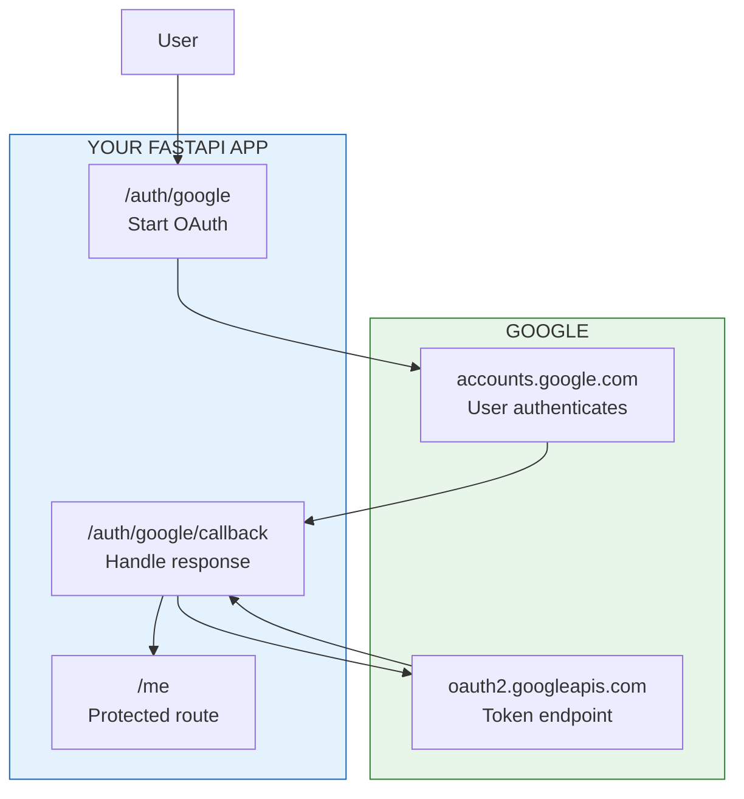

# Lesson 16.5: FastAPI + OAuth2

> **Duration**: 35 min | **Section**: B - Implementation

## 🎯 The Problem

You understand OAuth2 theory. Now you need to implement "Login with Google" in your FastAPI app.

```
User clicks "Login with Google"
    → Redirected to Google
    → User approves
    → Redirected back to your app
    → User is logged in
```

What code makes this happen?

> **Scenario**: You follow a tutorial, copy some code, it works in development. In production, you get `redirect_uri_mismatch`. You don't understand why because you don't understand the pieces.

## 🧪 Setup: Google Cloud Console

Before coding, register your app with Google:

**Step 1: Create OAuth Credentials**

1. Go to [Google Cloud Console](https://console.cloud.google.com/)
2. Create/select a project
3. APIs & Services → Credentials → Create Credentials → OAuth client ID
4. Application type: **Web application**
5. Authorized redirect URIs: `http://localhost:8000/auth/google/callback`

**Step 2: Get Credentials**

```bash
# .env file
GOOGLE_CLIENT_ID=123456789.apps.googleusercontent.com
GOOGLE_CLIENT_SECRET=GOCSPX-abcdefghijklmnop
```

## 🔍 Under the Hood: The Full Implementation



### Complete Implementation

```python
# main.py
from fastapi import FastAPI, Request, HTTPException, Depends
from fastapi.responses import RedirectResponse
from starlette.middleware.sessions import SessionMiddleware
from authlib.integrations.starlette_client import OAuth
import os
from dotenv import load_dotenv

load_dotenv()

app = FastAPI()

# Session middleware for storing OAuth state
app.add_middleware(SessionMiddleware, secret_key=os.environ["SESSION_SECRET"])

# Initialize OAuth
oauth = OAuth()

# Register Google provider
oauth.register(
    name="google",
    client_id=os.environ["GOOGLE_CLIENT_ID"],
    client_secret=os.environ["GOOGLE_CLIENT_SECRET"],
    server_metadata_url="https://accounts.google.com/.well-known/openid-configuration",
    client_kwargs={
        "scope": "openid email profile"
    }
)

# ============= ROUTES =============

@app.get("/")
async def home():
    return {"message": "Welcome! Go to /auth/google to login"}

@app.get("/auth/google")
async def auth_google(request: Request):
    """
    Step 1: Redirect user to Google for authentication.
    """
    # Build callback URL
    redirect_uri = request.url_for("auth_google_callback")
    
    # Redirect to Google with:
    # - client_id
    # - redirect_uri
    # - scope
    # - state (CSRF protection, authlib handles this)
    return await oauth.google.authorize_redirect(request, redirect_uri)

@app.get("/auth/google/callback")
async def auth_google_callback(request: Request):
    """
    Step 2: Google redirects here with authorization code.
    We exchange the code for tokens.
    """
    try:
        # Exchange code for tokens (happens server-side)
        token = await oauth.google.authorize_access_token(request)
    except Exception as e:
        raise HTTPException(400, f"OAuth error: {e}")
    
    # Get user info from ID token
    user_info = token.get("userinfo")
    
    if not user_info:
        raise HTTPException(400, "No user info in token")
    
    # At this point, you have:
    # - user_info["sub"] - Google's unique user ID
    # - user_info["email"] - User's email
    # - user_info["name"] - User's full name
    # - user_info["picture"] - Profile picture URL
    
    # Store in session (or create JWT)
    request.session["user"] = {
        "id": user_info["sub"],
        "email": user_info["email"],
        "name": user_info["name"],
        "picture": user_info.get("picture")
    }
    
    return RedirectResponse(url="/me")

@app.get("/me")
async def get_current_user(request: Request):
    """
    Protected route - returns current user info.
    """
    user = request.session.get("user")
    
    if not user:
        raise HTTPException(401, "Not authenticated. Go to /auth/google")
    
    return {"user": user}

@app.get("/logout")
async def logout(request: Request):
    """
    Clear session.
    """
    request.session.clear()
    return RedirectResponse(url="/")
```

### Requirements

```txt
# requirements.txt
fastapi>=0.104.0
uvicorn>=0.24.0
authlib>=1.2.0
itsdangerous>=2.1.0
httpx>=0.25.0
python-dotenv>=1.0.0
```

### Environment Variables

```bash
# .env
GOOGLE_CLIENT_ID=your-client-id.apps.googleusercontent.com
GOOGLE_CLIENT_SECRET=GOCSPX-your-secret
SESSION_SECRET=your-random-secret-key-at-least-32-chars
```

## 🔍 Step-by-Step Breakdown

### Step 1: Redirect to Google

```python
@app.get("/auth/google")
async def auth_google(request: Request):
    redirect_uri = request.url_for("auth_google_callback")
    return await oauth.google.authorize_redirect(request, redirect_uri)
```

**What happens**:
1. Authlib builds the authorization URL:
   ```
   https://accounts.google.com/o/oauth2/v2/auth?
     client_id=123...&
     redirect_uri=http://localhost:8000/auth/google/callback&
     scope=openid+email+profile&
     response_type=code&
     state=abc123  # CSRF protection
   ```
2. User is redirected to Google
3. State is stored in session for verification

### Step 2: User Authenticates at Google

```
User sees: "Your App wants to access your Google Account"
         - View your email address
         - View your basic profile info
         
         [Cancel]  [Allow]
```

User clicks **Allow**.

### Step 3: Google Redirects Back

Google redirects to your callback:
```
http://localhost:8000/auth/google/callback?
  code=4/0AY0e-g7...&
  state=abc123
```

### Step 4: Exchange Code for Tokens

```python
token = await oauth.google.authorize_access_token(request)
```

**What happens behind the scenes**:
1. Authlib verifies `state` matches (CSRF protection)
2. Makes POST request to Google:
   ```python
   POST https://oauth2.googleapis.com/token
   Content-Type: application/x-www-form-urlencoded
   
   grant_type=authorization_code&
   code=4/0AY0e-g7...&
   client_id=123...&
   client_secret=GOCSPX-...&
   redirect_uri=http://localhost:8000/auth/google/callback
   ```
3. Google returns tokens:
   ```json
   {
     "access_token": "ya29...",
     "id_token": "eyJhbG...",
     "expires_in": 3600,
     "scope": "openid email profile",
     "token_type": "Bearer"
   }
   ```
4. Authlib decodes and validates ID token
5. Returns dict with `userinfo` extracted from ID token

### Step 5: Use the User Info

```python
user_info = token.get("userinfo")
# {
#   "sub": "116463484895585708864",
#   "email": "alice@gmail.com",
#   "email_verified": True,
#   "name": "Alice Smith",
#   "picture": "https://lh3.googleusercontent.com/..."
# }
```

## 💥 Where It Breaks

### Issue 1: redirect_uri_mismatch

```
Error 400: redirect_uri_mismatch
```

**Cause**: The callback URL doesn't match what's registered in Google Console.

```python
# Registered in Google Console:
# https://myapp.com/auth/google/callback

# But your app sends:
# https://www.myapp.com/auth/google/callback  # www mismatch!
# https://myapp.com/auth/google/callback/     # trailing slash!
# http://myapp.com/auth/google/callback       # http vs https!
```

**Fix**: Ensure EXACT match in Google Console.

### Issue 2: State Mismatch

```
Error: State mismatch
```

**Cause**: Session lost between redirect and callback.

**Fixes**:
- Check `SESSION_SECRET` is set
- Check `SessionMiddleware` is added
- Check cookies are working (SameSite, Secure flags)

### Issue 3: Invalid Grant

```
Error: invalid_grant
```

**Cause**: Code already used or expired.

**Fixes**:
- Codes are single-use
- Codes expire in ~10 minutes
- Don't refresh the callback page

## 🎯 Practice

**Add these features**:

1. **Database Integration**: Store users in database

```python
from sqlalchemy.orm import Session
from models import User, OAuthAccount

async def get_or_create_user(db: Session, user_info: dict) -> User:
    # Check if OAuth account exists
    oauth = db.query(OAuthAccount).filter(
        OAuthAccount.provider == "google",
        OAuthAccount.provider_user_id == user_info["sub"]
    ).first()
    
    if oauth:
        return oauth.user
    
    # Create new user
    user = User(
        email=user_info["email"],
        name=user_info["name"]
    )
    db.add(user)
    
    oauth = OAuthAccount(
        user=user,
        provider="google",
        provider_user_id=user_info["sub"]
    )
    db.add(oauth)
    db.commit()
    
    return user
```

2. **JWT Sessions**: Return JWT instead of session cookie

```python
from jose import jwt
from datetime import datetime, timedelta

def create_jwt(user_id: str) -> str:
    payload = {
        "sub": user_id,
        "exp": datetime.utcnow() + timedelta(hours=24)
    }
    return jwt.encode(payload, os.environ["JWT_SECRET"], algorithm="HS256")

@app.get("/auth/google/callback")
async def auth_google_callback(request: Request):
    token = await oauth.google.authorize_access_token(request)
    user_info = token.get("userinfo")
    
    # Create or get user from DB
    user = await get_or_create_user(user_info)
    
    # Return JWT
    return {"token": create_jwt(user.id)}
```

## 🔑 Key Takeaways

- Use `authlib` for OAuth2 - handles security details
- Register exact callback URL in provider console
- Use session middleware for state management
- Exchange code for token happens server-side (secret!)
- User info is in the ID token (`userinfo`)
- Store `sub` as stable user identifier, not email

## ❓ Common Questions

| Question | Answer |
|----------|--------|
| Why authlib over requests? | Handles state, PKCE, token validation automatically |
| Can I use FastAPI's OAuth2? | Yes, but it's lower-level. Authlib is easier for social login. |
| How do I handle production URLs? | Set redirect_uri dynamically or use environment-specific config |
| What about refresh tokens? | Add `access_type=offline` to get refresh token |

---

## 📚 Further Reading

- [Authlib Documentation](https://docs.authlib.org/en/latest/)
- [Google OAuth2 Web Server Flow](https://developers.google.com/identity/protocols/oauth2/web-server)

---

**Next**: 16.6 - GitHub OAuth
