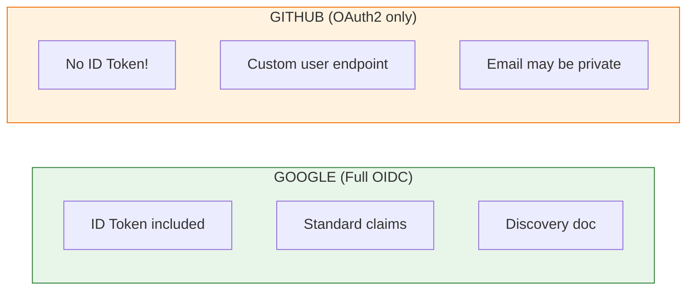

# Lesson 16.6: GitHub OAuth

> **Duration**: 30 min | **Section**: B - Implementation

## 🎯 The Problem

You have Google OAuth working. Now you want to add "Login with GitHub" as a second option.

```
┌─────────────────────────────────┐
│   Login to Your App             │
│                                 │
│   ┌──────────────────────────┐  │
│   │  🔵 Login with Google    │  │
│   └──────────────────────────┘  │
│                                 │
│   ┌──────────────────────────┐  │
│   │  ⚫ Login with GitHub    │  │  ← Add this!
│   └──────────────────────────┘  │
│                                 │
└─────────────────────────────────┘
```

How do you add multiple OAuth providers without duplicating code?

> **Scenario**: You implement GitHub OAuth separately from Google. Now you have two sets of callbacks, two session handling patterns, and bugs when a user has both Google and GitHub accounts with the same email.

## 🧪 Setup: GitHub OAuth App

**Step 1: Register OAuth App**

1. Go to [GitHub Settings → Developer Settings → OAuth Apps](https://github.com/settings/developers)
2. Click **New OAuth App**
3. Fill in:
   - Application name: `My FastAPI App`
   - Homepage URL: `http://localhost:8000`
   - Authorization callback URL: `http://localhost:8000/auth/github/callback`

**Step 2: Get Credentials**

```bash
# .env (add to existing)
GITHUB_CLIENT_ID=Iv1.abcdef123456
GITHUB_CLIENT_SECRET=abcdef123456789...
```

## 🔍 Under the Hood: GitHub vs Google



**Key Differences**:

| Feature | Google | GitHub |
|---------|--------|--------|
| OIDC | ✅ Full | ❌ OAuth2 only |
| ID Token | ✅ Yes | ❌ No |
| User Endpoint | `/userinfo` | `/user` |
| Email | Always available | May be private |
| Standardized | ✅ Yes | ❌ Custom format |

## 🔍 Implementation: Adding GitHub

### Register GitHub Provider

```python
# main.py - add to existing oauth setup

oauth.register(
    name="github",
    client_id=os.environ["GITHUB_CLIENT_ID"],
    client_secret=os.environ["GITHUB_CLIENT_SECRET"],
    authorize_url="https://github.com/login/oauth/authorize",
    access_token_url="https://github.com/login/oauth/access_token",
    api_base_url="https://api.github.com/",
    client_kwargs={"scope": "read:user user:email"},
)
```

### GitHub Routes

```python
@app.get("/auth/github")
async def auth_github(request: Request):
    """Redirect to GitHub for authentication."""
    redirect_uri = request.url_for("auth_github_callback")
    return await oauth.github.authorize_redirect(request, redirect_uri)

@app.get("/auth/github/callback")
async def auth_github_callback(request: Request):
    """Handle GitHub OAuth callback."""
    try:
        token = await oauth.github.authorize_access_token(request)
    except Exception as e:
        raise HTTPException(400, f"OAuth error: {e}")
    
    # GitHub doesn't return userinfo in token
    # We need to call the API
    resp = await oauth.github.get("user", token=token)
    user_data = resp.json()
    
    # GitHub user_data format:
    # {
    #   "id": 1234567,
    #   "login": "alice",
    #   "name": "Alice Smith",
    #   "email": null,  # Might be null if private!
    #   "avatar_url": "https://avatars.githubusercontent.com/..."
    # }
    
    # If email is private, fetch from emails endpoint
    email = user_data.get("email")
    if not email:
        email = await get_github_email(token)
    
    # Store in session (same format as Google)
    request.session["user"] = {
        "id": f"github:{user_data['id']}",  # Prefix with provider
        "email": email,
        "name": user_data.get("name") or user_data["login"],
        "picture": user_data.get("avatar_url"),
        "provider": "github"
    }
    
    return RedirectResponse(url="/me")

async def get_github_email(token: dict) -> str:
    """Fetch primary email from GitHub emails endpoint."""
    resp = await oauth.github.get("user/emails", token=token)
    emails = resp.json()
    
    # Find primary verified email
    for email in emails:
        if email.get("primary") and email.get("verified"):
            return email["email"]
    
    # Fallback to first verified email
    for email in emails:
        if email.get("verified"):
            return email["email"]
    
    raise HTTPException(400, "No verified email found")
```

## 🔍 Unified Multi-Provider Pattern

### The Problem with Separate Handlers

```python
# ❌ BAD: Duplicated logic
@app.get("/auth/google/callback")
async def google_callback(request: Request):
    token = await oauth.google.authorize_access_token(request)
    user_info = token.get("userinfo")
    user = get_or_create_user("google", user_info["sub"], user_info["email"])
    # ... create session

@app.get("/auth/github/callback")
async def github_callback(request: Request):
    token = await oauth.github.authorize_access_token(request)
    resp = await oauth.github.get("user", token=token)
    user_data = resp.json()
    user = get_or_create_user("github", user_data["id"], user_data["email"])
    # ... create session (same code!)
```

### Unified Pattern

```python
# ✅ GOOD: Single user creation function

from dataclasses import dataclass
from typing import Optional

@dataclass
class OAuthUser:
    """Normalized OAuth user data."""
    provider: str
    provider_id: str
    email: str
    name: str
    picture: Optional[str] = None

async def extract_oauth_user(provider: str, token: dict) -> OAuthUser:
    """Extract user info from any OAuth provider."""
    
    if provider == "google":
        user_info = token.get("userinfo")
        return OAuthUser(
            provider="google",
            provider_id=user_info["sub"],
            email=user_info["email"],
            name=user_info.get("name", user_info["email"]),
            picture=user_info.get("picture")
        )
    
    elif provider == "github":
        resp = await oauth.github.get("user", token=token)
        user_data = resp.json()
        
        email = user_data.get("email")
        if not email:
            email = await get_github_email(token)
        
        return OAuthUser(
            provider="github",
            provider_id=str(user_data["id"]),
            email=email,
            name=user_data.get("name") or user_data["login"],
            picture=user_data.get("avatar_url")
        )
    
    else:
        raise ValueError(f"Unknown provider: {provider}")

async def handle_oauth_callback(request: Request, provider: str):
    """Generic OAuth callback handler."""
    oauth_client = getattr(oauth, provider)
    
    try:
        token = await oauth_client.authorize_access_token(request)
    except Exception as e:
        raise HTTPException(400, f"OAuth error: {e}")
    
    # Extract normalized user data
    oauth_user = await extract_oauth_user(provider, token)
    
    # Get or create user in database
    user = await get_or_create_user(oauth_user)
    
    # Create session
    request.session["user"] = {
        "id": user.id,
        "email": user.email,
        "name": user.name,
        "picture": oauth_user.picture
    }
    
    return RedirectResponse(url="/me")

# Routes become simple
@app.get("/auth/{provider}/callback")
async def oauth_callback(request: Request, provider: str):
    if provider not in ["google", "github"]:
        raise HTTPException(400, f"Unknown provider: {provider}")
    return await handle_oauth_callback(request, provider)
```

## 🔍 Database Schema for Multi-Provider

```python
from sqlalchemy import Column, Integer, String, ForeignKey, UniqueConstraint
from sqlalchemy.orm import relationship

class User(Base):
    __tablename__ = "users"
    
    id = Column(Integer, primary_key=True)
    email = Column(String, unique=True, nullable=False)
    name = Column(String)
    
    oauth_accounts = relationship("OAuthAccount", back_populates="user")

class OAuthAccount(Base):
    __tablename__ = "oauth_accounts"
    
    id = Column(Integer, primary_key=True)
    user_id = Column(Integer, ForeignKey("users.id"), nullable=False)
    provider = Column(String, nullable=False)  # "google", "github"
    provider_user_id = Column(String, nullable=False)
    
    user = relationship("User", back_populates="oauth_accounts")
    
    __table_args__ = (
        UniqueConstraint("provider", "provider_user_id", name="unique_oauth_account"),
    )

async def get_or_create_user(oauth_user: OAuthUser, db: Session) -> User:
    """Get existing user or create new one from OAuth data."""
    
    # Check if OAuth account already exists
    oauth_account = db.query(OAuthAccount).filter(
        OAuthAccount.provider == oauth_user.provider,
        OAuthAccount.provider_user_id == oauth_user.provider_id
    ).first()
    
    if oauth_account:
        return oauth_account.user
    
    # Check if user with this email exists (link accounts)
    existing_user = db.query(User).filter(
        User.email == oauth_user.email
    ).first()
    
    if existing_user:
        # Link new OAuth provider to existing user
        oauth_account = OAuthAccount(
            user_id=existing_user.id,
            provider=oauth_user.provider,
            provider_user_id=oauth_user.provider_id
        )
        db.add(oauth_account)
        db.commit()
        return existing_user
    
    # Create new user
    user = User(email=oauth_user.email, name=oauth_user.name)
    db.add(user)
    db.flush()  # Get user.id
    
    oauth_account = OAuthAccount(
        user_id=user.id,
        provider=oauth_user.provider,
        provider_user_id=oauth_user.provider_id
    )
    db.add(oauth_account)
    db.commit()
    
    return user
```

## 💥 Common Issues

### Issue 1: Same Email, Different Providers

```
User signs up with Google (alice@gmail.com)
Later signs up with GitHub (alice@gmail.com)
```

**Solution**: Link accounts by email (as shown above).

### Issue 2: GitHub Email is Private

```json
{"id": 123, "login": "alice", "email": null}
```

**Solution**: Request `user:email` scope and fetch from `/user/emails`.

### Issue 3: Inconsistent User IDs

```python
# ❌ Collision possible
user_id = user_data["id"]  # GitHub: 123, Google: 123

# ✅ Prefix with provider
user_id = f"github:{user_data['id']}"
user_id = f"google:{user_info['sub']}"
```

## 🎯 Practice

**Add Microsoft OAuth**:

1. Register app at [Azure Portal](https://portal.azure.com/)
2. Add to your oauth setup:

```python
oauth.register(
    name="microsoft",
    client_id=os.environ["MICROSOFT_CLIENT_ID"],
    client_secret=os.environ["MICROSOFT_CLIENT_SECRET"],
    server_metadata_url="https://login.microsoftonline.com/common/v2.0/.well-known/openid-configuration",
    client_kwargs={"scope": "openid email profile"},
)
```

3. Add extraction in `extract_oauth_user`:

```python
elif provider == "microsoft":
    user_info = token.get("userinfo")
    return OAuthUser(
        provider="microsoft",
        provider_id=user_info["sub"],
        email=user_info["email"],
        name=user_info.get("name", user_info["email"]),
        picture=None  # Microsoft doesn't include picture in ID token
    )
```

## 🔑 Key Takeaways

- GitHub is OAuth2 only (no OIDC) - needs API call for user info
- GitHub email may be private - fetch from `/user/emails`
- Use unified pattern for multiple providers
- Normalize user data with `OAuthUser` dataclass
- Link accounts by email for multi-provider support
- Prefix provider IDs to avoid collisions

## ❓ Common Questions

| Question | Answer |
|----------|--------|
| What scopes for GitHub? | `read:user user:email` minimum |
| Can user have multiple providers? | Yes, link by email |
| What if emails differ? | User has multiple accounts (different user IDs) |
| How to unlink a provider? | Delete from OAuthAccount table |

---

## 📚 Further Reading

- [GitHub OAuth Documentation](https://docs.github.com/en/developers/apps/building-oauth-apps)
- [GitHub User API](https://docs.github.com/en/rest/users/users)

---

**Next**: 16.7 - JWT Validation
