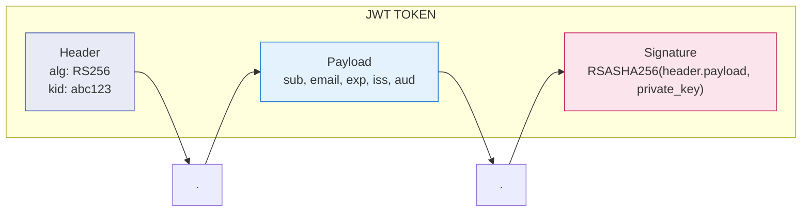
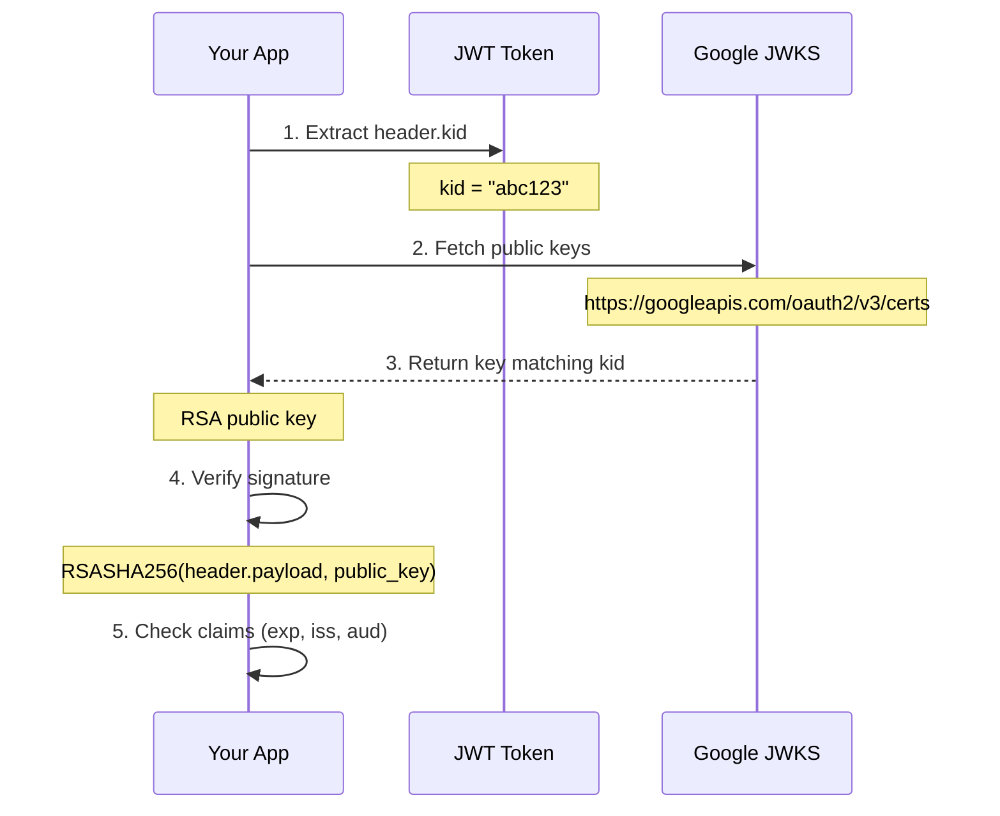

# Lesson 16.7: JWT Validation

> **Duration**: 35 min | **Section**: B - Implementation

## 🎯 The Problem

Your OAuth callback gives you tokens. How do you verify they're legitimate?

```
┌─────────────────┐      ┌──────────────────┐
│  Attacker's     │      │  Your API        │
│  Fake Token     │──X──▶│  Must reject!    │
└─────────────────┘      └──────────────────┘
```

> **Scenario**: An attacker crafts a fake ID token claiming to be `admin@yourcompany.com`. Without proper validation, your API trusts it and grants admin access.

## 🧪 Try It: Naive Approach

```python
import base64
import json

def decode_jwt_naive(token: str) -> dict:
    """Just decode it, trust the content."""
    parts = token.split(".")
    payload = parts[1]
    # Add padding if needed
    payload += "=" * (4 - len(payload) % 4)
    return json.loads(base64.urlsafe_b64decode(payload))

# Decode any token
user_info = decode_jwt_naive(id_token)
print(f"Welcome, {user_info['email']}!")  # 💀 No verification!
```

**Why This Breaks**: Anyone can create a JWT with any claims. The signature exists to prove authenticity!

## 🔍 Under the Hood: JWT Structure

```
eyJhbGciOiJSUzI1NiIsInR5cCI6IkpXVCJ9.eyJzdWIiOiIxMjM0NTY3ODkw...
│                                  │                              │
└─────────Header─────────────────┘└──────────Payload──────────────┘
```



### Critical Claims to Validate

| Claim | Full Name | Validation |
|-------|-----------|------------|
| `iss` | Issuer | Must match expected provider |
| `aud` | Audience | Must be YOUR client_id |
| `exp` | Expiration | Must be in the future |
| `iat` | Issued At | Must be in the past |
| `sub` | Subject | User's unique identifier |
| `nonce` | Nonce | Must match what you sent (OIDC) |

## 🔍 JWT Signature Verification



### JWKS (JSON Web Key Set)

Google's JWKS endpoint returns public keys:

```json
{
  "keys": [
    {
      "kid": "abc123",
      "kty": "RSA",
      "alg": "RS256",
      "n": "very_long_modulus...",
      "e": "AQAB"
    },
    {
      "kid": "def456",
      "kty": "RSA",
      "alg": "RS256",
      "n": "another_modulus...",
      "e": "AQAB"
    }
  ]
}
```

**Why Multiple Keys?** Google rotates keys. The `kid` (key ID) in the JWT header tells you which key to use.

## ✅ Proper Validation with PyJWT

### Installation

```bash
pip install PyJWT cryptography
```

### Implementation

```python
import jwt
import httpx
from jwt import PyJWKClient
from datetime import datetime, timezone
from functools import lru_cache

# Cache JWKS client (keys are cached internally)
@lru_cache(maxsize=4)
def get_jwks_client(jwks_uri: str) -> PyJWKClient:
    """Get JWKS client for a provider."""
    return PyJWKClient(jwks_uri)

class TokenValidationError(Exception):
    """Token validation failed."""
    pass

def validate_google_id_token(token: str, client_id: str) -> dict:
    """
    Validate Google ID token.
    
    Returns decoded claims if valid.
    Raises TokenValidationError if invalid.
    """
    GOOGLE_JWKS_URI = "https://www.googleapis.com/oauth2/v3/certs"
    GOOGLE_ISSUER = "https://accounts.google.com"
    
    try:
        # Get the signing key
        jwks_client = get_jwks_client(GOOGLE_JWKS_URI)
        signing_key = jwks_client.get_signing_key_from_jwt(token)
        
        # Decode and verify
        claims = jwt.decode(
            token,
            signing_key.key,
            algorithms=["RS256"],
            audience=client_id,  # YOUR client_id
            issuer=GOOGLE_ISSUER,
            options={
                "require": ["exp", "iat", "sub", "email"],
                "verify_exp": True,
                "verify_iat": True,
            }
        )
        
        return claims
        
    except jwt.ExpiredSignatureError:
        raise TokenValidationError("Token has expired")
    except jwt.InvalidAudienceError:
        raise TokenValidationError("Token audience does not match client_id")
    except jwt.InvalidIssuerError:
        raise TokenValidationError("Token issuer is not Google")
    except jwt.PyJWKClientError as e:
        raise TokenValidationError(f"Failed to get signing key: {e}")
    except jwt.DecodeError as e:
        raise TokenValidationError(f"Failed to decode token: {e}")
```

### Usage

```python
@app.get("/auth/google/callback")
async def google_callback(request: Request):
    token = await oauth.google.authorize_access_token(request)
    id_token = token.get("id_token")
    
    if not id_token:
        raise HTTPException(400, "No ID token received")
    
    try:
        claims = validate_google_id_token(
            id_token, 
            os.environ["GOOGLE_CLIENT_ID"]
        )
    except TokenValidationError as e:
        raise HTTPException(401, f"Invalid token: {e}")
    
    # Token is verified! Use the claims
    email = claims["email"]
    email_verified = claims.get("email_verified", False)
    
    if not email_verified:
        raise HTTPException(400, "Email not verified")
    
    # Create session...
```

## 🔍 Access Token Validation (OAuth2 Only)

For providers without OIDC (like GitHub), you can't validate the token locally. You must call their API.

```python
async def validate_github_access_token(token: str) -> dict:
    """
    Validate GitHub access token by calling their API.
    
    There's no local validation possible for OAuth2 access tokens.
    """
    async with httpx.AsyncClient() as client:
        resp = await client.get(
            "https://api.github.com/user",
            headers={
                "Authorization": f"Bearer {token}",
                "Accept": "application/json"
            }
        )
        
        if resp.status_code == 401:
            raise TokenValidationError("Invalid or expired token")
        
        if resp.status_code != 200:
            raise TokenValidationError(f"GitHub API error: {resp.status_code}")
        
        return resp.json()
```

## 🔍 Multi-Provider Token Validation

```python
from dataclasses import dataclass
from typing import Optional

@dataclass
class TokenConfig:
    """Configuration for validating provider tokens."""
    jwks_uri: Optional[str]
    issuer: Optional[str]
    has_oidc: bool
    user_endpoint: Optional[str] = None

PROVIDER_CONFIGS = {
    "google": TokenConfig(
        jwks_uri="https://www.googleapis.com/oauth2/v3/certs",
        issuer="https://accounts.google.com",
        has_oidc=True
    ),
    "microsoft": TokenConfig(
        jwks_uri="https://login.microsoftonline.com/common/discovery/v2.0/keys",
        issuer="https://login.microsoftonline.com/{tenant}/v2.0",
        has_oidc=True
    ),
    "github": TokenConfig(
        jwks_uri=None,
        issuer=None,
        has_oidc=False,
        user_endpoint="https://api.github.com/user"
    )
}

async def validate_token(
    provider: str,
    token: str,
    client_id: str,
    id_token: Optional[str] = None
) -> dict:
    """Validate token from any provider."""
    config = PROVIDER_CONFIGS.get(provider)
    if not config:
        raise ValueError(f"Unknown provider: {provider}")
    
    if config.has_oidc and id_token:
        # OIDC: Validate ID token locally
        jwks_client = get_jwks_client(config.jwks_uri)
        signing_key = jwks_client.get_signing_key_from_jwt(id_token)
        
        return jwt.decode(
            id_token,
            signing_key.key,
            algorithms=["RS256"],
            audience=client_id,
            # Note: issuer validation needs special handling for Microsoft
            options={"verify_iss": provider != "microsoft"}
        )
    else:
        # OAuth2 only: Call user endpoint
        async with httpx.AsyncClient() as client:
            resp = await client.get(
                config.user_endpoint,
                headers={"Authorization": f"Bearer {token}"}
            )
            if resp.status_code != 200:
                raise TokenValidationError("Invalid token")
            return resp.json()
```

## 💥 Common Pitfalls

### 1. Not Validating Audience

```python
# ❌ BAD: No audience check
claims = jwt.decode(token, key, algorithms=["RS256"])

# ✅ GOOD: Verify it's for YOUR app
claims = jwt.decode(
    token, key, 
    algorithms=["RS256"],
    audience=YOUR_CLIENT_ID  # Critical!
)
```

### 2. Accepting Expired Tokens

```python
# ❌ BAD: Disabled expiration check
claims = jwt.decode(token, key, options={"verify_exp": False})

# ✅ GOOD: Always verify expiration
claims = jwt.decode(token, key, options={"verify_exp": True})
```

### 3. Hardcoding JWKS Keys

```python
# ❌ BAD: Hardcoded key
PUBLIC_KEY = """-----BEGIN PUBLIC KEY-----
MIIBIjANBgkq...
-----END PUBLIC KEY-----"""

# ✅ GOOD: Fetch from JWKS endpoint (keys rotate!)
jwks_client = PyJWKClient(JWKS_URI)
signing_key = jwks_client.get_signing_key_from_jwt(token)
```

### 4. Accepting Any Algorithm

```python
# ❌ BAD: Algorithm confusion attack possible
claims = jwt.decode(token, key, algorithms=["RS256", "HS256", "none"])

# ✅ GOOD: Only allow expected algorithm
claims = jwt.decode(token, key, algorithms=["RS256"])
```

## 🔍 FastAPI Dependency for JWT Validation

```python
from fastapi import Depends, HTTPException, Header
from typing import Optional

async def get_current_user(
    authorization: Optional[str] = Header(None)
) -> dict:
    """
    Dependency to validate JWT and extract user.
    
    Expects header: Authorization: Bearer <token>
    """
    if not authorization:
        raise HTTPException(401, "Missing Authorization header")
    
    if not authorization.startswith("Bearer "):
        raise HTTPException(401, "Invalid Authorization header format")
    
    token = authorization[7:]  # Remove "Bearer "
    
    try:
        claims = validate_google_id_token(
            token, 
            os.environ["GOOGLE_CLIENT_ID"]
        )
    except TokenValidationError as e:
        raise HTTPException(401, str(e))
    
    return claims

# Usage
@app.get("/api/me")
async def get_me(user: dict = Depends(get_current_user)):
    return {
        "email": user["email"],
        "sub": user["sub"]
    }
```

## 🎯 Practice

1. **Add Token Introspection Endpoint**:

```python
@app.post("/introspect")
async def introspect_token(token: str):
    """Check if a token is valid and return its claims."""
    try:
        claims = validate_google_id_token(token, CLIENT_ID)
        return {
            "active": True,
            "sub": claims["sub"],
            "email": claims["email"],
            "exp": claims["exp"]
        }
    except TokenValidationError:
        return {"active": False}
```

2. **Add Clock Skew Tolerance**:

```python
claims = jwt.decode(
    token,
    key,
    algorithms=["RS256"],
    audience=client_id,
    leeway=30  # Allow 30 seconds of clock skew
)
```

## 🔑 Key Takeaways

- **Never trust unverified JWTs** - always validate signature
- Use `PyJWT` with `PyJWKClient` for proper validation
- Verify: `iss`, `aud`, `exp`, `iat` claims
- Fetch keys from JWKS endpoint (they rotate!)
- Accept ONLY expected algorithms (no "none"!)
- For OAuth2-only providers (GitHub), call their API
- Cache JWKS clients but let them handle key rotation

## ❓ Common Questions

| Question | Answer |
|----------|--------|
| What if JWKS is down? | Use cached keys with reasonable TTL |
| How often do keys rotate? | Google: ~weekly, but always fetch by `kid` |
| Can I validate access tokens? | Only if provider uses JWT access tokens |
| What's the `nonce` for? | Prevents replay attacks in OIDC |

---

## 📚 Further Reading

- [JWT.io Debugger](https://jwt.io/) - Decode and inspect JWTs
- [RFC 7519 - JWT](https://tools.ietf.org/html/rfc7519)
- [PyJWT Documentation](https://pyjwt.readthedocs.io/)

---

**Next**: 16.8 - RBAC Patterns
