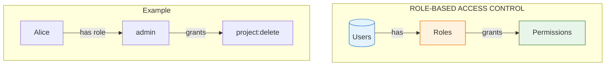
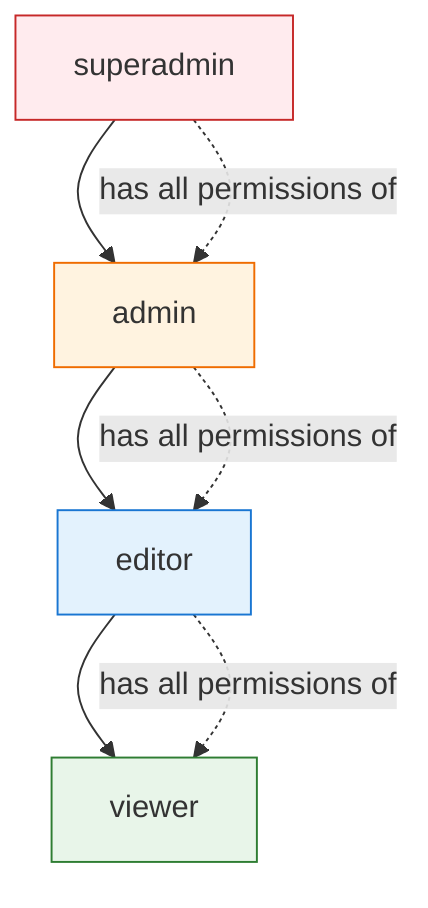

# Lesson 16.8: RBAC Patterns

> **Duration**: 35 min | **Section**: B - Implementation

## 🎯 The Problem

OAuth gives you identity. But knowing WHO someone is doesn't tell you WHAT they can do.

```
✅ OAuth answered: "This is alice@company.com"
❓ Still unknown: "Can Alice delete projects?"
```

> **Scenario**: You have OAuth working. Every employee can log in. But now the intern has the same access as the CTO. You need permissions!

## 🧪 Try It: Naive Approach

```python
# ❌ BAD: Hardcoded email checks everywhere
@app.delete("/api/projects/{project_id}")
async def delete_project(project_id: int, user: dict = Depends(get_current_user)):
    if user["email"] not in ["cto@company.com", "admin@company.com"]:
        raise HTTPException(403, "Not authorized")
    
    # Delete project...
```

**Problems**:
- Emails hardcoded in every endpoint
- Adding new admin = code change + deploy
- No visibility into who has what permissions
- Can't answer: "What can Alice do?"

## 🔍 Under the Hood: RBAC Concepts



### Key Concepts

| Term | Definition | Example |
|------|------------|---------|
| **User** | Authenticated identity | `alice@company.com` |
| **Role** | Named collection of permissions | `admin`, `viewer`, `editor` |
| **Permission** | Single action on a resource | `project:delete` |
| **Assignment** | User → Role mapping | Alice has role "admin" |

### Permission Naming Convention

```
resource:action

Examples:
  project:read
  project:create
  project:delete
  user:invite
  billing:view
  settings:admin
```

## 🔍 Database Schema for RBAC

```python
from sqlalchemy import Column, Integer, String, ForeignKey, Table
from sqlalchemy.orm import relationship

# Many-to-many: Role ↔ Permission
role_permissions = Table(
    "role_permissions",
    Base.metadata,
    Column("role_id", ForeignKey("roles.id"), primary_key=True),
    Column("permission_id", ForeignKey("permissions.id"), primary_key=True),
)

# Many-to-many: User ↔ Role
user_roles = Table(
    "user_roles",
    Base.metadata,
    Column("user_id", ForeignKey("users.id"), primary_key=True),
    Column("role_id", ForeignKey("roles.id"), primary_key=True),
)

class Permission(Base):
    __tablename__ = "permissions"
    
    id = Column(Integer, primary_key=True)
    name = Column(String, unique=True, nullable=False)  # "project:delete"
    description = Column(String)

class Role(Base):
    __tablename__ = "roles"
    
    id = Column(Integer, primary_key=True)
    name = Column(String, unique=True, nullable=False)  # "admin"
    description = Column(String)
    
    permissions = relationship("Permission", secondary=role_permissions)

class User(Base):
    __tablename__ = "users"
    
    id = Column(Integer, primary_key=True)
    email = Column(String, unique=True, nullable=False)
    
    roles = relationship("Role", secondary=user_roles)
    
    def has_permission(self, permission: str) -> bool:
        """Check if user has a specific permission."""
        for role in self.roles:
            for perm in role.permissions:
                if perm.name == permission:
                    return True
        return False
    
    def get_permissions(self) -> set[str]:
        """Get all permissions for this user."""
        permissions = set()
        for role in self.roles:
            for perm in role.permissions:
                permissions.add(perm.name)
        return permissions
```

## 🔍 Permission Check Dependency

```python
from fastapi import Depends, HTTPException
from functools import wraps

def require_permission(permission: str):
    """
    Dependency that checks if user has a permission.
    
    Usage:
        @app.delete("/projects/{id}")
        async def delete(id: int, _: None = Depends(require_permission("project:delete"))):
            ...
    """
    async def check_permission(
        user: User = Depends(get_current_user_from_db)
    ):
        if not user.has_permission(permission):
            raise HTTPException(
                status_code=403,
                detail=f"Missing permission: {permission}"
            )
        return user
    
    return check_permission

# Usage
@app.delete("/api/projects/{project_id}")
async def delete_project(
    project_id: int,
    user: User = Depends(require_permission("project:delete"))
):
    # User definitely has project:delete permission
    await db.delete_project(project_id)
    return {"status": "deleted"}

@app.get("/api/projects")
async def list_projects(
    user: User = Depends(require_permission("project:read"))
):
    # User has project:read permission
    return await db.get_projects()
```

## 🔍 Role Hierarchy Pattern

Some systems need role inheritance:



```python
ROLE_HIERARCHY = {
    "superadmin": ["admin"],
    "admin": ["editor"],
    "editor": ["viewer"],
    "viewer": []
}

def get_all_roles(role_name: str) -> set[str]:
    """Get role and all inherited roles."""
    roles = {role_name}
    for child_role in ROLE_HIERARCHY.get(role_name, []):
        roles |= get_all_roles(child_role)
    return roles

# superadmin gets: {superadmin, admin, editor, viewer}
# admin gets: {admin, editor, viewer}
# editor gets: {editor, viewer}
```

## 🔍 Resource-Level Permissions (ABAC)

Sometimes you need permissions on specific resources:

```
"Alice can edit PROJECT 123, but not PROJECT 456"
```

```python
class ResourcePermission(Base):
    """Permission on a specific resource."""
    __tablename__ = "resource_permissions"
    
    id = Column(Integer, primary_key=True)
    user_id = Column(Integer, ForeignKey("users.id"), nullable=False)
    resource_type = Column(String, nullable=False)  # "project"
    resource_id = Column(Integer, nullable=False)   # 123
    permission = Column(String, nullable=False)     # "edit"

async def can_access_project(
    user: User, 
    project_id: int, 
    permission: str,
    db: Session
) -> bool:
    """Check if user can access a specific project."""
    
    # Check global permission first
    if user.has_permission(f"project:{permission}"):
        return True
    
    # Check resource-specific permission
    resource_perm = db.query(ResourcePermission).filter(
        ResourcePermission.user_id == user.id,
        ResourcePermission.resource_type == "project",
        ResourcePermission.resource_id == project_id,
        ResourcePermission.permission == permission
    ).first()
    
    return resource_perm is not None
```

## 🔍 Complete FastAPI Example

```python
from fastapi import FastAPI, Depends, HTTPException
from sqlalchemy.orm import Session

app = FastAPI()

# ===== Dependencies =====

async def get_db():
    """Database session dependency."""
    db = SessionLocal()
    try:
        yield db
    finally:
        db.close()

async def get_current_user(
    token_claims: dict = Depends(get_current_user_from_token),
    db: Session = Depends(get_db)
) -> User:
    """Get user from database with roles loaded."""
    user = db.query(User).options(
        joinedload(User.roles).joinedload(Role.permissions)
    ).filter(
        User.email == token_claims["email"]
    ).first()
    
    if not user:
        raise HTTPException(404, "User not found")
    
    return user

class PermissionChecker:
    """Reusable permission check dependency."""
    
    def __init__(self, permission: str):
        self.permission = permission
    
    async def __call__(self, user: User = Depends(get_current_user)) -> User:
        if not user.has_permission(self.permission):
            raise HTTPException(
                403, 
                f"Permission denied. Required: {self.permission}"
            )
        return user

# ===== Endpoints =====

@app.get("/api/me/permissions")
async def get_my_permissions(user: User = Depends(get_current_user)):
    """List all permissions for current user."""
    return {
        "email": user.email,
        "roles": [r.name for r in user.roles],
        "permissions": list(user.get_permissions())
    }

@app.get("/api/projects")
async def list_projects(
    user: User = Depends(PermissionChecker("project:read")),
    db: Session = Depends(get_db)
):
    """List projects (requires project:read)."""
    return db.query(Project).all()

@app.post("/api/projects")
async def create_project(
    project: ProjectCreate,
    user: User = Depends(PermissionChecker("project:create")),
    db: Session = Depends(get_db)
):
    """Create project (requires project:create)."""
    new_project = Project(**project.dict(), owner_id=user.id)
    db.add(new_project)
    db.commit()
    return new_project

@app.delete("/api/projects/{project_id}")
async def delete_project(
    project_id: int,
    user: User = Depends(PermissionChecker("project:delete")),
    db: Session = Depends(get_db)
):
    """Delete project (requires project:delete)."""
    project = db.query(Project).get(project_id)
    if not project:
        raise HTTPException(404, "Project not found")
    db.delete(project)
    db.commit()
    return {"status": "deleted"}

# ===== Admin Endpoints =====

@app.post("/api/admin/users/{user_id}/roles")
async def assign_role(
    user_id: int,
    role_name: str,
    admin: User = Depends(PermissionChecker("user:manage_roles")),
    db: Session = Depends(get_db)
):
    """Assign role to user (requires user:manage_roles)."""
    user = db.query(User).get(user_id)
    role = db.query(Role).filter(Role.name == role_name).first()
    
    if not user or not role:
        raise HTTPException(404, "User or role not found")
    
    user.roles.append(role)
    db.commit()
    
    return {"status": "role assigned"}
```

## 💥 Common Pitfalls

### 1. Checking Role Instead of Permission

```python
# ❌ BAD: Tightly coupled to role names
if "admin" in user.roles:
    allow_delete()

# ✅ GOOD: Check capability, not title
if user.has_permission("project:delete"):
    allow_delete()
```

### 2. Not Loading Roles Eagerly

```python
# ❌ BAD: N+1 queries
user = db.query(User).get(user_id)
for role in user.roles:  # Query 1
    for perm in role.permissions:  # Query 2, 3, 4...

# ✅ GOOD: Eager loading
user = db.query(User).options(
    joinedload(User.roles).joinedload(Role.permissions)
).get(user_id)  # Single query
```

### 3. Storing Permissions in JWT

```python
# ❌ BAD: Permissions in token (can be outdated)
token_payload = {
    "sub": user.id,
    "permissions": ["project:delete"]  # What if we revoke?
}

# ✅ GOOD: Fetch fresh permissions from DB
user = db.get_user(token["sub"])
if user.has_permission("project:delete"):
    ...
```

### 4. No Default Role

```python
# ❌ BAD: New users have no permissions
user = User(email=oauth_user.email)
db.add(user)  # User can't do anything!

# ✅ GOOD: Assign default role
viewer_role = db.query(Role).filter(Role.name == "viewer").first()
user = User(email=oauth_user.email)
user.roles.append(viewer_role)
db.add(user)
```

## 🎯 Practice

1. **Create a Seeder Script**:

```python
def seed_rbac(db: Session):
    """Seed default roles and permissions."""
    
    # Create permissions
    permissions = [
        Permission(name="project:read", description="View projects"),
        Permission(name="project:create", description="Create projects"),
        Permission(name="project:edit", description="Edit projects"),
        Permission(name="project:delete", description="Delete projects"),
        Permission(name="user:invite", description="Invite users"),
        Permission(name="user:manage_roles", description="Manage user roles"),
    ]
    
    for perm in permissions:
        db.merge(perm)  # Insert or update
    
    db.commit()
    
    # Create roles
    viewer = Role(name="viewer", description="Can view resources")
    viewer.permissions = [p for p in permissions if "read" in p.name]
    
    editor = Role(name="editor", description="Can edit resources")
    editor.permissions = [p for p in permissions if p.name.endswith(("read", "create", "edit"))]
    
    admin = Role(name="admin", description="Full access")
    admin.permissions = permissions
    
    for role in [viewer, editor, admin]:
        db.merge(role)
    
    db.commit()
```

2. **Add Permission to Response Headers**:

```python
@app.middleware("http")
async def add_permissions_header(request: Request, call_next):
    response = await call_next(request)
    
    if hasattr(request.state, "user"):
        permissions = request.state.user.get_permissions()
        response.headers["X-User-Permissions"] = ",".join(permissions)
    
    return response
```

## 🔑 Key Takeaways

- RBAC: Users → Roles → Permissions
- Check **permissions**, not roles in code
- Use consistent naming: `resource:action`
- Eager-load roles to avoid N+1 queries
- Don't store permissions in JWTs (they can change)
- Always assign a default role to new users
- Consider role hierarchy for complex systems

## ❓ Common Questions

| Question | Answer |
|----------|--------|
| RBAC vs ABAC? | RBAC: role-based. ABAC: attribute-based (more flexible, more complex) |
| Store permissions in JWT? | No - permissions can change, JWT can't be revoked |
| How many roles? | Start simple (3-5), add as needed |
| Role per user? | Avoid - leads to permission explosion |

---

## 📚 Further Reading

- [OWASP Access Control Cheat Sheet](https://cheatsheetseries.owasp.org/cheatsheets/Access_Control_Cheat_Sheet.html)
- [NIST RBAC Model](https://csrc.nist.gov/projects/role-based-access-control)

---

**Next**: 16.9 - OAuth Implementation Q&A
