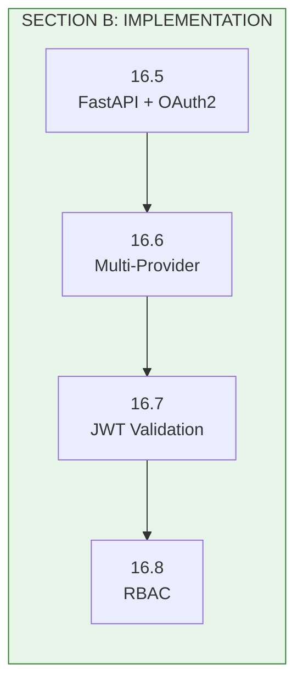
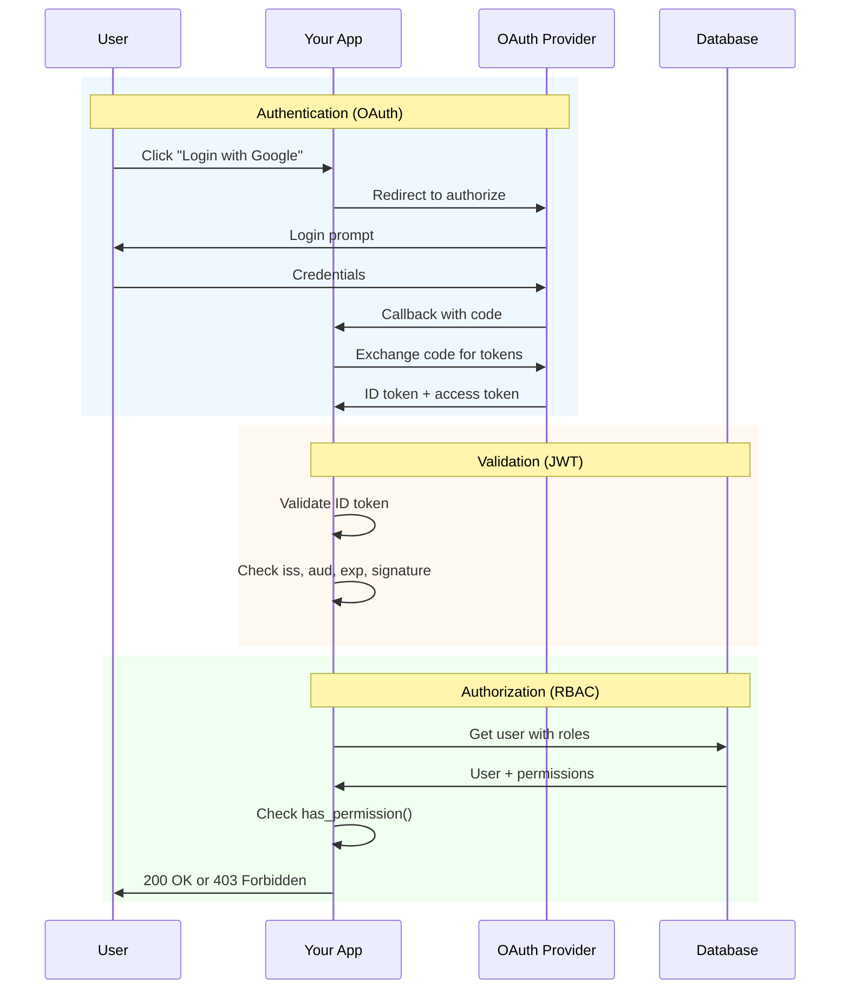

# Lesson 16.9: OAuth Implementation Q&A

> **Duration**: 25 min | **Type**: Section B Recap

## 📍 Section B Summary



You now know how to:

| Lesson | Skill | Key Pattern |
|--------|-------|-------------|
| 16.5 | Google OAuth | `authlib` + FastAPI |
| 16.6 | Multi-Provider | Unified `OAuthUser` dataclass |
| 16.7 | JWT Validation | `PyJWT` + JWKS |
| 16.8 | RBAC | Users → Roles → Permissions |

## 🔍 Complete Flow Diagram



## ❓ Frequently Asked Questions

### OAuth Setup

| Question | Answer |
|----------|--------|
| Which OAuth library? | `authlib` for Python - handles all flows |
| Google vs GitHub setup? | Google: OIDC (ID token included). GitHub: OAuth2 only (API call needed) |
| Local dev redirect URI? | Use `http://localhost:8000/auth/callback` |
| Production callback? | Must match EXACTLY in provider console |

### Token Handling

| Question | Answer |
|----------|--------|
| Where to store tokens? | Session (server-side) or secure HTTP-only cookie |
| Access token lifespan? | Usually 1 hour (Google), varies by provider |
| Refresh tokens? | Store securely, use to get new access tokens |
| ID token validation? | Always validate: signature, iss, aud, exp |

### Multi-Provider

| Question | Answer |
|----------|--------|
| Same email, different providers? | Link accounts by email |
| User ID format? | Prefix with provider: `google:123`, `github:456` |
| Microsoft different? | Uses tenant-specific issuer |
| Add new provider? | Register, add to `extract_oauth_user()` |

### RBAC

| Question | Answer |
|----------|--------|
| Store permissions in JWT? | No - can't be revoked, can become stale |
| Check role or permission? | Always check permission (more flexible) |
| Default role? | Assign `viewer` or similar on signup |
| Role hierarchy? | Optional - simpler to start flat |

## 💥 Common Pitfalls

### 1. Callback URL Mismatch

```python
# ❌ FAILS: URL doesn't match provider console
redirect_uri = "http://localhost:8000/callback"
# Console has: http://localhost:8000/auth/google/callback

# ✅ WORKS: Exact match
redirect_uri = request.url_for("auth_google_callback")
# Generates: http://localhost:8000/auth/google/callback
```

### 2. Missing State Validation

```python
# ❌ VULNERABLE: No state check (CSRF attack possible)
@app.get("/auth/callback")
async def callback(code: str):
    token = await oauth.google.authorize_access_token(request)

# ✅ SECURE: authlib handles state automatically
@app.get("/auth/callback")
async def callback(request: Request):
    # authlib validates state from session
    token = await oauth.google.authorize_access_token(request)
```

### 3. Trusting Unvalidated JWT

```python
# ❌ DANGEROUS: No signature verification
import base64, json
payload = token.split(".")[1]
user_info = json.loads(base64.b64decode(payload))

# ✅ SAFE: Full validation
from jwt import PyJWKClient
signing_key = jwks_client.get_signing_key_from_jwt(token)
user_info = jwt.decode(token, signing_key.key, algorithms=["RS256"], audience=CLIENT_ID)
```

### 4. Hardcoded Admin Emails

```python
# ❌ UNMAINTAINABLE: Deploy to add admin
ADMINS = ["alice@company.com", "bob@company.com"]
if user.email in ADMINS:
    allow_admin_action()

# ✅ FLEXIBLE: Database-driven RBAC
if user.has_permission("admin:*"):
    allow_admin_action()
```

### 5. Checking Roles Instead of Permissions

```python
# ❌ BRITTLE: Tied to role names
if "admin" in [r.name for r in user.roles]:
    can_delete = True

# ✅ FLEXIBLE: Check capability
if user.has_permission("project:delete"):
    can_delete = True
```

### 6. N+1 Query for Permissions

```python
# ❌ SLOW: Multiple database queries
user = db.query(User).get(user_id)
for role in user.roles:  # Query
    for perm in role.permissions:  # More queries
        ...

# ✅ FAST: Single query with joins
user = db.query(User).options(
    joinedload(User.roles).joinedload(Role.permissions)
).get(user_id)
```

### 7. Storing Tokens Insecurely

```python
# ❌ VULNERABLE: Token in localStorage (XSS attack)
localStorage.setItem("access_token", token)

# ✅ SECURE: Server-side session
request.session["user"] = {"id": user.id, "email": user.email}
# Or HTTP-only cookie (not accessible to JavaScript)
```

### 8. No Default Role for New Users

```python
# ❌ BROKEN: New user has zero permissions
user = User(email=email)
db.add(user)

# ✅ WORKING: Assign default role
viewer = db.query(Role).filter(Role.name == "viewer").first()
user = User(email=email)
user.roles.append(viewer)
db.add(user)
```

## 🔑 Key Takeaways

### OAuth2

- OAuth2 = **authorization** (access to resources)
- OIDC = **authentication** (identity verification)
- Always validate ID tokens before trusting claims
- Use `authlib` for Python OAuth implementations

### JWT Validation

- Validate: signature, issuer, audience, expiration
- Fetch keys from JWKS endpoint (they rotate!)
- Accept ONLY expected algorithm (prevent alg=none attack)
- Use `PyJWT` with `PyJWKClient`

### Multi-Provider

- Normalize user data with dataclass
- Link accounts by email
- Prefix user IDs with provider name
- GitHub needs API call (no OIDC)

### RBAC

- Users → Roles → Permissions
- Check **permissions**, not roles
- Eager-load to avoid N+1
- Never store permissions in JWT

## 🏆 Module 16 Independence Check

| Level | Question | You Should Know |
|-------|----------|-----------------|
| **Know** | What is OAuth2? | Authorization framework with 4 roles |
| **Know** | What is OIDC? | Identity layer adding ID tokens |
| **Know** | What is RBAC? | Users → Roles → Permissions |
| **Understand** | Why not store passwords? | Liability, breaches, maintenance |
| **Understand** | Why validate JWTs? | Prevent forged tokens |
| **Apply** | Implement Google OAuth | `authlib` + FastAPI |
| **Apply** | Validate ID token | `PyJWT` + JWKS |
| **Apply** | Add permission checks | `Depends(require_permission())` |
| **Analyze** | OAuth2 vs OIDC tradeoffs | OAuth2 simpler, OIDC gives identity |
| **Analyze** | When token validation fails | Check iss, aud, exp, key rotation |
| **Create** | Multi-provider system | Unified extraction + account linking |
| **Create** | Full RBAC system | Schema + dependencies + seeder |

## 🎯 Capstone Project Checklist

Your OAuth implementation should have:

- [ ] OAuth with at least 2 providers (Google + GitHub)
- [ ] JWT validation with proper claims checking
- [ ] RBAC with at least 3 roles
- [ ] Permission-based endpoint protection
- [ ] Account linking by email
- [ ] Session management
- [ ] Logout functionality
- [ ] Error handling for all OAuth failures

## 📚 Module 16 References

### Official Documentation

- [OAuth 2.0 Specification (RFC 6749)](https://tools.ietf.org/html/rfc6749)
- [OpenID Connect Core](https://openid.net/specs/openid-connect-core-1_0.html)
- [JWT Specification (RFC 7519)](https://tools.ietf.org/html/rfc7519)

### Libraries

- [Authlib Documentation](https://docs.authlib.org/)
- [PyJWT Documentation](https://pyjwt.readthedocs.io/)
- [FastAPI Security](https://fastapi.tiangolo.com/tutorial/security/)

### Provider Guides

- [Google OAuth2 for Web](https://developers.google.com/identity/protocols/oauth2/web-server)
- [GitHub OAuth Apps](https://docs.github.com/en/developers/apps/building-oauth-apps)
- [Microsoft Identity Platform](https://docs.microsoft.com/en-us/azure/active-directory/develop/)

### Security

- [OWASP OAuth Security](https://cheatsheetseries.owasp.org/cheatsheets/OAuth_Cheat_Sheet.html)
- [JWT Best Practices](https://datatracker.ietf.org/doc/html/rfc8725)

---

## 🎉 Module 16 Complete!

You've mastered OAuth & Identity:

1. **OAuth2 Protocol** - Delegation without sharing passwords
2. **OIDC** - Identity verification with ID tokens
3. **Implementation** - FastAPI + authlib + multi-provider
4. **JWT Validation** - Secure token verification
5. **RBAC** - Role-based access control

**Your RAG apps can now**:
- Let users log in with Google, GitHub, or any OIDC provider
- Securely verify user identity
- Control who can access what features
- Scale permissions without code changes

---

**Congratulations!** You've completed Module 16: OAuth & Identity 🎊
