# Lesson 16.10: Module 16 Review

> **Duration**: 15 min | **Type**: Module Review

## 🧠 OAuth Mental Model

**Delegate authentication to trusted providers. You receive verified identity, not passwords.**

```mermaid
flowchart LR
    subgraph Before["❌ WITHOUT OAUTH"]
        U1["User"] --> PW["Your Password DB"]
        PW --> HASH["Hashing"]
        HASH --> RESET["Reset Flow"]
        RESET --> MFA["MFA"]
        MFA --> BREACH["💀 Breach Risk"]
    end
    
    subgraph After["✅ WITH OAUTH"]
        U2["User"] --> GOOGLE["Google/GitHub"]
        GOOGLE --> TOKEN["Verified Token"]
        TOKEN --> YOU["Your App"]
        YOU --> DONE["✅ Secure"]
    end
    
    style Before fill:#FFEBEE,stroke:#C62828
    style After fill:#E8F5E9,stroke:#2E7D32
```

## 📚 What We Learned

### Section A: OAuth2 Under the Hood

| Lesson | Key Concept | One-Liner |
|--------|-------------|-----------|
| 16.0 | Password Problem | Storing passwords = liability |
| 16.1 | OAuth2 Basics | Authorization framework with 4 roles |
| 16.2 | OAuth2 Flows | Auth Code (backend), PKCE (frontend), Client Creds (server) |
| 16.3 | OIDC | Identity layer: ID tokens with standard claims |
| 16.4 | Section A Q&A | Access token ≠ ID token |

### Section B: Implementation

| Lesson | Key Concept | One-Liner |
|--------|-------------|-----------|
| 16.5 | FastAPI + OAuth2 | `authlib` + Google OAuth |
| 16.6 | Multi-Provider | Unified `OAuthUser` + account linking |
| 16.7 | JWT Validation | PyJWT + JWKS, verify signature/claims |
| 16.8 | RBAC | Users → Roles → Permissions |
| 16.9 | Section B Q&A | 8 common pitfalls to avoid |

## 🔑 Core Concepts Summary

| Concept | Definition | Key Point |
|---------|------------|-----------|
| **OAuth2** | Authorization framework | "Let this app access my data" |
| **OIDC** | OAuth2 + identity | Adds ID token with user claims |
| **JWT** | Token format | Header.Payload.Signature |
| **RBAC** | Access control | Users → Roles → Permissions |

## 🔍 The Complete Flow

## ✅ Independence Check

| Level | Question | Can You Answer? |
|-------|----------|-----------------|
| **Know** | What are the 4 roles in OAuth2? | Resource Owner, Client, Auth Server, Resource Server |
| **Know** | What's in an ID token? | sub, email, name, iss, aud, exp |
| **Understand** | Why use OAuth instead of passwords? | Security liability, delegate to trusted providers |
| **Understand** | Why validate JWT signatures? | Prevent forged tokens |
| **Apply** | Implement Google OAuth in FastAPI | `authlib`, redirect, callback, session |
| **Apply** | Add permission checks | `Depends(require_permission("..."))` |
| **Analyze** | When to use PKCE vs Auth Code? | PKCE for public clients (SPA/mobile) |
| **Analyze** | Why check permissions not roles? | More flexible, roles can change |
| **Create** | Multi-provider auth system | Unified OAuthUser, link by email |
| **Create** | Full RBAC implementation | DB schema, dependencies, seeder |

## 💡 Key Takeaways

### OAuth2 & OIDC

1. **OAuth2** = authorization (access to resources)
2. **OIDC** = authentication (who you are)
3. **Authorization Code flow** for apps with backends
4. **PKCE** for SPAs and mobile apps
5. **ID tokens** contain user identity claims

### JWT Validation

6. **Always validate** signature, issuer, audience, expiration
7. Fetch keys from **JWKS endpoint** (keys rotate!)
8. Accept **only expected algorithms** (no "none"!)
9. Use `PyJWT` with `PyJWKClient`

### Implementation

10. Use `authlib` for Python OAuth
11. **Normalize user data** across providers
12. **Link accounts by email** for multi-provider
13. GitHub is OAuth2-only (needs API call for user info)

### RBAC

14. **Users → Roles → Permissions**
15. Check **permissions**, not roles in code
16. **Eager-load** roles to avoid N+1 queries
17. **Never store permissions in JWT** (can become stale)
18. Assign **default role** to new users

## 🎯 Module Project Checklist

Your OAuth implementation should include:

- [ ] OAuth with Google provider
- [ ] OAuth with GitHub provider
- [ ] Account linking by email
- [ ] JWT validation for ID tokens
- [ ] User creation/lookup in database
- [ ] RBAC with at least 3 roles
- [ ] Permission-based endpoint protection
- [ ] Session management
- [ ] Logout functionality
- [ ] Error handling for OAuth failures

## 📚 Further Reading

### Specifications

- [RFC 6749 - OAuth 2.0](https://tools.ietf.org/html/rfc6749)
- [RFC 7519 - JWT](https://tools.ietf.org/html/rfc7519)
- [OpenID Connect Core](https://openid.net/specs/openid-connect-core-1_0.html)

### Libraries

- [Authlib Documentation](https://docs.authlib.org/)
- [PyJWT Documentation](https://pyjwt.readthedocs.io/)
- [FastAPI Security](https://fastapi.tiangolo.com/tutorial/security/)

### Provider Guides

- [Google OAuth2](https://developers.google.com/identity/protocols/oauth2)
- [GitHub OAuth Apps](https://docs.github.com/en/developers/apps/building-oauth-apps)
- [Microsoft Identity Platform](https://docs.microsoft.com/en-us/azure/active-directory/develop/)

### Security

- [OWASP OAuth Cheat Sheet](https://cheatsheetseries.owasp.org/cheatsheets/OAuth_Cheat_Sheet.html)
- [JWT Best Practices (RFC 8725)](https://datatracker.ietf.org/doc/html/rfc8725)
- [OWASP Access Control Cheat Sheet](https://cheatsheetseries.owasp.org/cheatsheets/Access_Control_Cheat_Sheet.html)

---

## 🎉 Module 16 Complete!

You've mastered OAuth & Identity:

✅ **OAuth2 Protocol** - Delegation without sharing passwords  
✅ **OIDC** - Identity verification with ID tokens  
✅ **Implementation** - FastAPI + authlib + multi-provider  
✅ **JWT Validation** - Secure token verification  
✅ **RBAC** - Role-based access control  

**Your GenAI apps can now**:
- Let users log in with Google, GitHub, or any OIDC provider
- Securely verify user identity
- Control who can access what features
- Scale permissions without code changes

---

**Next Module**: [Module 12: Redis & Caching](../Module-12-Redis/) (Optional)
