# Module 16: OAuth & Identity

> **Duration**: 1 Week | **Lessons**: 11

## 🎯 Module Overview

You're storing user passwords. You implement password reset, account recovery, email verification, password hashing, MFA. That's a LOT of security surface. One mistake = breach. Headlines. What if users could log in with Google? GitHub? You don't store passwords. You don't handle security. You just verify "Google says this is alice@gmail.com."

## 🧠 Mental Model

```mermaid
flowchart LR
    subgraph Traditional["❌ TRADITIONAL AUTH"]
        U1["User"] --> PW["Your Password DB"]
        PW --> HASH["Hashing"]
        HASH --> VERIFY["Verification"]
        VERIFY --> RESET["Reset Flow"]
        RESET --> MFA["MFA"]
    end
    
    subgraph OAuth["✅ OAUTH"]
        U2["User"] --> PROVIDER["Google/GitHub"]
        PROVIDER --> TOKEN["Token"]
        TOKEN --> YOU["Your App"]
        YOU --> DONE["✅ Done!"]
    end
    
    style Traditional fill:#FFEBEE,stroke:#C62828
    style OAuth fill:#E8F5E9,stroke:#2E7D32
```

**The Key Insight**: Delegate authentication to providers users already trust. You receive a verified identity, not a password.

## 📋 Prerequisites

- FastAPI basics (Module 6)
- HTTP fundamentals (requests, responses, headers)
- Basic understanding of tokens/sessions
- Python async/await

## 🗂️ Module Structure

| Section | Lessons | Focus |
|---------|:-------:|-------|
| A: OAuth2 Under the Hood | 16.0 - 16.4 | Protocol fundamentals, flows, OIDC |
| B: Implementation | 16.5 - 16.9 | FastAPI integration, JWT, RBAC |

## 📚 Lessons

### Section A: OAuth2 Under the Hood

| # | Lesson | Duration | What We're Solving |
|:-:|--------|:--------:|-------------------|
| 16.0 | The Password Problem | 10 min | Why storing passwords is dangerous |
| 16.1 | What IS OAuth2? | 25 min | Authorization framework fundamentals |
| 16.2 | OAuth2 Flows | 30 min | Authorization Code, Client Credentials |
| 16.3 | OIDC (OpenID Connect) | 25 min | Identity layer on top of OAuth2 |
| 16.4 | OAuth2 Q&A | 10 min | Access vs ID tokens, refresh tokens |

### Section B: Implementation

| # | Lesson | Duration | What We're Solving |
|:-:|--------|:--------:|-------------------|
| 16.5 | FastAPI + OAuth2 | 35 min | Google OAuth with authlib |
| 16.6 | GitHub OAuth | 30 min | Multi-provider authentication |
| 16.7 | JWT Validation | 25 min | Verify ID tokens, extract claims |
| 16.8 | RBAC Patterns | 30 min | Roles and permissions |
| 16.9 | OAuth Implementation Q&A | 10 min | Auth0 vs self-hosted, revoking access |
| 16.10 | Module 16 Review | 15 min | OAuth mental model, independence check |

## 🎯 Module Project

**Add Social Login to Your App:**
- "Login with Google" button
- "Login with GitHub" button  
- Store user profile in database
- Implement role-based access control
- Protected routes based on roles

## ✅ Independence Check

| Level | Question |
|-------|----------|
| **Know** | What's the difference between OAuth2 and OIDC? |
| **Understand** | Why use Authorization Code flow instead of storing passwords? |
| **Apply** | Can you add Google OAuth to a FastAPI app? |
| **Analyze** | When would you use Client Credentials flow vs Authorization Code? |
| **Create** | Can you design a multi-tenant auth system with roles? |

## 🔗 External Resources

- [OAuth 2.0 Specification (RFC 6749)](https://tools.ietf.org/html/rfc6749)
- [OpenID Connect Spec](https://openid.net/connect/)
- [Google OAuth2 Documentation](https://developers.google.com/identity/protocols/oauth2)
- [GitHub OAuth Documentation](https://docs.github.com/en/developers/apps/building-oauth-apps)
- [Authlib Documentation](https://docs.authlib.org/)
- [FastAPI Security Guide](https://fastapi.tiangolo.com/tutorial/security/)

---

**Previous**: [Module 15: Kubernetes](../Module-15-Kubernetes/README.md)
