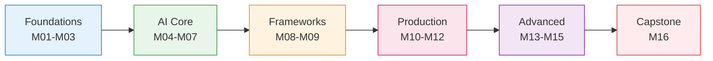
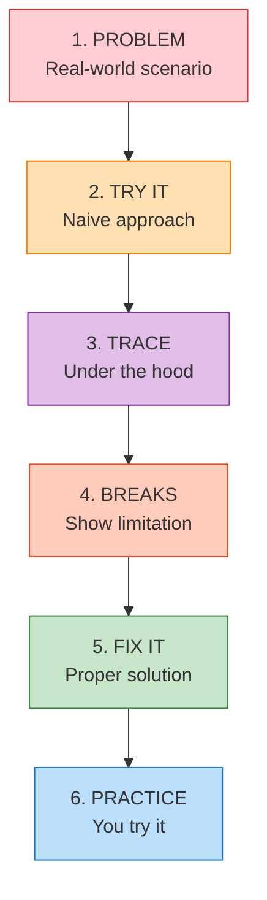

# Course Overview

Welcome to the **GenAI Python Course** — the most comprehensive hands-on course for building production-ready AI applications with Python.

---

## 🎯 Course Goals

By the end of this course, you will be able to:

1. **Build AI Applications** — Create chatbots, RAG systems, and AI agents from scratch
2. **Deploy to Production** — Docker, Kubernetes, cloud platforms, CI/CD pipelines
3. **Think Like an AI Engineer** — Understand the "why" behind every decision
4. **Handle Real Challenges** — Rate limiting, cost optimization, error handling

---

## 📊 Course Structure

### Phase 1: Foundations (Modules 01-03)
- Python programming essentials
- Developer tools (Git, Docker, VS Code)
- Data handling and API integration

### Phase 2: AI Core (Modules 04-07)
- AI/ML fundamentals and LLM architecture
- OpenAI API integration
- FastAPI for AI applications
- Prompt engineering mastery

### Phase 3: Frameworks (Modules 08-09)
- LangChain for chain composition
- LangGraph for agent workflows
- Memory, tools, and RAG basics

### Phase 4: Production (Modules 10-12)
- Production hardening
- MLOps and monitoring
- Data infrastructure (PostgreSQL, Redis, Celery)

### Phase 5: Advanced (Modules 13-15)
- RAG deep dive and optimization
- Advanced techniques (Graph RAG, Multi-modal)
- Cloud deployment (AWS, GCP, Azure)

### Phase 6: Capstone (Module 16)
- 5 complete projects
- Portfolio building
- Career preparation

---

## ⏱️ Time Investment

| Track | Pace | Duration |
|-------|------|----------|
| 🐢 Casual | 2-3 hrs/week | ~12 months |
| 🚶 Steady | 5-7 hrs/week | ~6 months |
| 🏃 Intensive | 15+ hrs/week | ~2-3 months |

!!! tip "Recommendation"
    For best retention, aim for the **Steady** pace. Consistency beats intensity.

---

## 🧭 How to Navigate

### Sequential Learners
Start from Module 01 and progress linearly. Each module builds on previous concepts.

### Experienced Developers
Jump to specific modules based on your needs:

- **Know Python?** → Start at Module 04 (AI Fundamentals)
- **Know AI basics?** → Start at Module 08 (LangChain)
- **Want production skills?** → Jump to Module 10 (Production)

### Reference Users
Use the search (Ctrl+K) to find specific topics. Each lesson is self-contained.

---

## 🔧 Required Tools

| Tool | Purpose | Required? |
|------|---------|-----------|
| Python 3.11+ | Core language | ✅ Yes |
| VS Code | Editor | ✅ Yes |
| Docker | Containerization | ✅ Yes |
| Git | Version control | ✅ Yes |
| OpenAI API Key | AI models | ✅ Yes |

---

## 📖 Lesson Structure

Every lesson follows the **Will Sentance methodology**:

---

## 🎓 Getting Help

- **Search** — Use Ctrl+K to search any topic
- **Diagrams** — Visual explanations throughout
- **Code Examples** — All code is tested and runnable
- **Q&A Sections** — Common questions answered

---

## 🚀 Ready to Start?

### First Time Here?
[Start with Module 01 →](Module-01/README.md)

### Know Python Already?
[Jump to AI Fundamentals →](Module-04/README.md)

