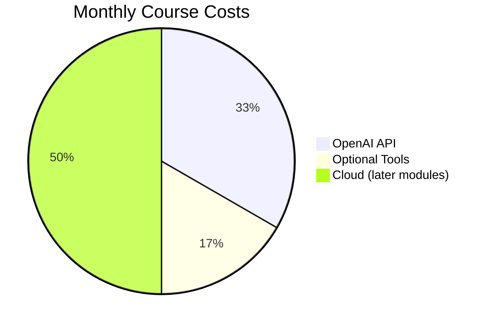

# Prerequisites

This page outlines what you need before starting the course, and what's helpful but optional.

---

## ✅ Required

### Hardware

| Component | Minimum | Recommended |
|-----------|---------|-------------|
| **RAM** | 8 GB | 16 GB+ |
| **Storage** | 20 GB free | 50 GB+ SSD |
| **CPU** | 4 cores | 8+ cores |
| **Internet** | Stable connection | Broadband |

!!! note "No GPU Required"
    We use cloud-based AI models (OpenAI, etc.), so you don't need a powerful GPU. A basic laptop works fine!

### Software

- **Operating System**: Windows 10+, macOS 11+, or Linux (Ubuntu 20.04+)
- **Python 3.11+**: Will be installed in Module 01
- **Git**: Will be installed in Module 02
- **Docker Desktop**: Will be installed in Module 02
- **VS Code**: Will be installed in Module 01

### Accounts

| Service | Purpose | Cost |
|---------|---------|------|
| **GitHub** | Code hosting | Free |
| **OpenAI** | AI API access | Pay-as-you-go (~$5-20/month) |

---

## 📚 Helpful Background (Not Required)

These will make learning faster, but we teach everything from scratch:

### Programming Experience

- [x] Basic understanding of any programming language
- [x] Familiarity with command line/terminal
- [x] Experience with text editors

### Conceptual Knowledge

- [x] What AI/ML means at a high level
- [x] Basic understanding of APIs
- [x] Familiarity with JSON format

!!! tip "Complete Beginner?"
    That's perfectly fine! Module 01 starts from absolute zero. Just be prepared to invest extra time in the early modules.

---

## 💰 Cost Breakdown

| Item | Typical Cost | When Needed |
|------|-------------|-------------|
| OpenAI API | $5-20/month | Module 05+ |
| Pinecone (free tier) | $0 | Module 13+ |
| Cloud credits | $0-50/month | Module 15+ |

!!! success "Free Tier Friendly"
    Most tools have generous free tiers. You can complete 80% of the course without spending anything beyond OpenAI API costs.

---

## 🧪 Self-Assessment

### Can You...

- [ ] Open a terminal/command prompt?
- [ ] Navigate folders using a file explorer?
- [ ] Install software on your computer?
- [ ] Create an account on a website?
- [ ] Follow written instructions carefully?

**If you checked all boxes**, you're ready to start!

**If you're unsure**, don't worry — Module 01 covers everything step-by-step.

---

## 🚀 Next Steps

### Ready to Begin?
[Go to Setup Guide →](setup.md)

### Want to Browse First?
[View Course Overview →](overview.md)

