# 🚀 GenAI Python Course

**Master Generative AI Development - From First Principles to Production**

Welcome to the most comprehensive hands-on course for building production-ready AI applications with Python.

## 🎯 What You'll Learn

This course takes you from **zero to deploying production AI systems**. You'll understand not just *how* to use AI tools, but *why* they work and *when* to use them.

### The Learning Journey

```mermaid
graph LR
    A[🐧 Linux & Terminal] --> B[🔀 Git & Version Control]
    B --> C[🐍 Python Core]
    C --> D[🐘 PostgreSQL]
    D --> E[🐳 Docker]
    E --> F[⚡ FastAPI]
    F --> G[🤖 LLM APIs]
    G --> H[📚 RAG Systems]
    H --> I[🔗 LangGraph Agents]
    I --> J[☁️ AWS Deployment]
    J --> K[📊 LLMOps]
    K --> L[⚡ Redis & More]
```

## 📚 Course Modules

| Module | Topic | What You'll Build |
|:------:|-------|-------------------|
| 01 | **Linux & Terminal** | Master the command line |
| 02 | **Git & Version Control** | Collaborate like a pro |
| 03 | **Python Core** | Rock-solid foundations |
| 04 | **PostgreSQL** | Database mastery |
| 05 | **Docker** | Containerize everything |
| 06 | **FastAPI** | Build blazing APIs |
| 07 | **LLM APIs** | Chat with AI models |
| 08 | **RAG Systems** | Retrieval-Augmented Generation |
| 09 | **LangGraph Agents** | Autonomous AI agents |
| 10 | **AWS Deployment** | Ship to the cloud |
| 11 | **LLMOps** | Monitor & optimize AI |
| 12 | **Redis** | Caching for speed |
| 13 | **Celery** | Background tasks |
| 14 | **pgvector** | Vector search at scale |
| 15 | **Kubernetes** | Container orchestration |
| 16 | **OAuth** | Secure authentication |

## 🧠 Teaching Philosophy

This course follows the **"Hard Parts"** methodology inspired by Will Sentance:

> *"Solve problems via first-principles reasoning, not trial-and-error."*

Every lesson follows this pattern:

1. **🎯 PROBLEM** - Start with a real challenge
2. **🔨 TRY IT** - Attempt the obvious solution
3. **🔍 TRACE** - Understand what's happening under the hood
4. **💥 BREAKS** - See where the naive approach fails
5. **✅ FIX IT** - Learn the proper solution
6. **🏋️ PRACTICE** - Apply it yourself

## 🏁 Getting Started

Ready to begin? Head to the first module:

👉 [**Module 01: Linux & Terminal**](./Module-01-Linux-and-Terminal/README.md)

---

*Built with ❤️ for developers who want to truly understand AI development.*
